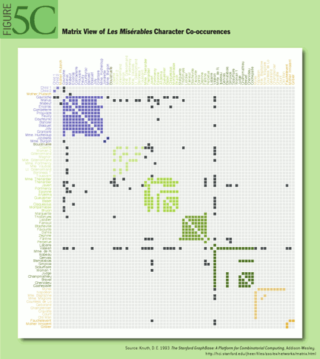

# Week 1

Okay, the main goal of this specialization is to teach you how to design, evaluate, and develop interactive visualizations to help people generate insights and then communicate these insights to other people as effectively as possible.

So, what all these areas have in common when we talk about the use of visualization is the basic idea of transforming data into something that enhances the comprehension of what is described by the data.

There are many definitions of information visualization out there. The one that I'm providing here comes from one of the most popular books explaining what information visualization is and it's called Readings in Information Visualization Using Vision to Think. And the definition is the following, the use of computer-supported, interactive, visual representations of abstract data to amplify cognition.

* computer based
* graphical/visual representations
* abstract data
* interactive
* amplify cognition

#### Computer based, Graphical representations

Let's take a look at what the key concepts of the definitions are. The first one is that it's computer based. So, this means that we are concerned with visualization methods that transform data into a visual representation using computers. The second one is that we are using visual representations. The third one is that we are mostly concerned with visualizing abstract data, and I'm going to elaborate on that a little longer later on. The next one is that it's interactive, and the example that I've just shown hopefully gives you a sense of what interactive means, it means that the user can interact with the visual representation. The last one is that the main goal is to amplify cognition.

#### Abstract Data

The next one is a little trickier. Abstract Data. What does it mean? Well, first of all it means that we are talking about representing visually data that doesn't necessarily have a very natural or obvious visual representation. One way to think about it is to think about the difference between visualizing physical data or physical objects or phenomena versus data that is not necessarily physical.

So, this is when one of the major issues in information visualization. In most of the cases, there is no obvious visual representation and you as a visualization designer have the very hard task to decide what's the best representation for something that is abstract.

#### Interactivity

The next concept is the idea that the visual representation is interactive. Users can interact with the visual representation by interacting with a computer.

More specifically, the idea here is that users can change what is visualized, but also how things are visualized.

#### Amplifying cognition

So what does it mean for a tool to amplify cognition? We can define this in many different ways. One way I like to describe this is that using a tool to amplify cognition means to solve problems better.

So amplify cognition means producing tool that help people think better.

So a concept related to this one is the idea of **cognitive artifact**. What is a cognitive artifact? It's a tool that humans have built to help humans think better.  It makes it easier to think about the problem and solve the problem.

And this way, you don't have to keep all the information in your mind as you're trying to solve this problem. That's a very important aspect. It shows you that in order to solve a problem, some elements that you should actually store in memory, you're storing them in the world.

So that's a very powerful concept. Let me state this again. So in order to solve a problem, you are using some cognitive artifacts that are not in your mind. They are in the world, to record information so that you can access this information when it's needed, but you don't have to retain it in your mind all the time. That's an extremely powerful concept. And it's related to another concept that is called **distributed cognition**. What does distributed cognition mean? It means that our cognitive system is not exclusively made of our brain, our mind, and our sensors. It's also made of the artifacts and the environment that we have around us and we use to store and manipulate information. So this concept is extremely powerful and it's very important in visualization. _Because visualization is a way for us to store information out of our mind and make it accessible through our eyes and also through manipulation with interactive systems_.

##### Game of 15 x Tic Tac Toe : problems isomorph

In the Game of 15, the pieces for the game are the nine digits, one two three four five six seven eight and nine. Each player takes a digit in turn and once a digit is taken, it can't be used by the other player. The first player to get three digits that sum to 15, wins.

Well, players alternately plays a X or the symbol O in one of nine spaces arranged in a rectangular array like the one that you see in the image. Once a space has been taken, it cannot be changed by either player. The first player to get three symbols in a straight line, wins.

So, you may have noticed that the second game is easier to play than the first game. Is even easier to describe, right? _So, it turns out that these two games are exactly the same and this concept is called problem Isomorph, an idea that has been developed by Nobel Prize winner, Herbert Simon_. If you look at this array, this is the array:

| 4 | 8 | 2 |
| 3 | 5 | 7 |
| 8 | 1 | 6 |

that I've shown to you to describe the tic-tac-toe game and I put the numbers that we use in the Game of 15 in the cells of this array. Now, if you think about it, playing tic-tac-toe and the Game of 15 is exactly the same thing. Because every time you are able to fill out a row, a column or a diagonal, the sum of the numbers is 15. But again, playing the game in tic-tac-toe is much easier than in the Game of 15. Why is that? Once again, because in the second example in the second game, _we have some visual representation that helps us store some of the information in the world rather than having all this information in our mind. Ultimately, this makes reasoning about the problem much easier._

#### Why visualize data?

Why visualize data at all? Why do we do that? 

To answer this question, I want to go back to the diagram that I've shown you at the beginning. Let me go to the diagram again. 

So we have data. **Data** is **encoded visually** using a computer to create a **visual representation**. This visual representation is **perceived** by one or more humans. And these users can **interact** with the data and with the visualization, to reason about the data and the problem described by the data. 

Now, I want to add a couple of elements to this diagram that help us explain and understand why we visualize data, why is it desirable. The first element is the idea that _data is a description of some phenomenon of interest_, right? Why do we use data? Why do we visualize data? Not because we are interested in the data itself, we do it because it's an abstract representation of some reality or some phenomena we are interested in. That's very important. 

So the ultimate interest is using data as a way to understand some phenomena. That's very important. Connected to that, is _the idea that the user who is using the visualization and interacting with the visualization has some goals that refer to these phenomena. And also has some mental models of what this phenomenon is about and how it works_. So in general, people who are using visualization, come with some pre-existing knowledge and some goal related to better understanding some phenomena. _And visualization systems use data, visual representations, and interaction to help people understand some phenomena better_.

#### Purposes of Visualization &mdash; visualization classes

Now, let's talk about purpose. What are the main purposes of visualization? Why do people use it or may want to use it? Okay, so there's one common characterization of information visualization purposes, and we have three main classes. 

* explanatory visualization
* exploratory visualization
* confirmatory visualization. 

Explanatory visualization means that the main purpose of the visualization is to explain something to somebody else. So the idea is that their is someone who has some message or some idea that needs to be **communicated visually through data visualization**. And this person needs to design a visualization that is appropriate for explanation.

The second one is exploratory. What does it mean? Well, it means that in this case, there is a person who needs to extract information out of data and doesn't really know what the content of this data is. _So the idea is that the main purpose of visualization, in this case, is to help the person answer questions and generate new hypotheses_. 

The last one, which is somewhat similar, is confirmatory. What does it mean? Well, _the difference, here, between confirmatory and exploratory is that the person who is using visualization here has some hypothesis or question in mind that needs to be checked out_. So I all ready have a hypothesis, but I want to check whether my hypothesis actually holds in the data. And I use visualization, for instance, some charts, to verify whether my hypothesis is correct or not.

One important thing to say is that the main purpose of explanatory visualization is to communicate something to somebody else. So there is always an audience of some sort. So this why we group this into a communication category.

Whereas, exploratory and confirmatory analysis, most of the time, are about analyzing data. So there is a person who wants to reach some objectives by analyzing data.

* explanatory visualization  ---- **COMMUNICATION**
* exploratory visualization  \
                              +-- **ANALYSIS**
* confirmatory visualization / 

Examples: "How Americans think About Global Warming in 6 charts".

Exploratory: Very often, the output of exploratory analysis, is the generation of new questions. This is typical of exploratory analysis. We start with some answers, and, sorry, we start with some questions, and what we produce is not only answers to these questions, but also new questions or new hypotheses. 

#### Why graphical representation?

Another important question is why use graphical representations? Well, there are a number of ways to answer this question. _And the first way is that humans are actually visual animals_. It is estimated that up to 30 percent of the cortex of the brain is devoted to vision, and we have two big pairs of eyes and we are incredibly good at extracting and processing formation that comes from our environment. So, humans are inherently visual animals, and we are very, very good at processing visual information. 

The second way to answer that, requires asking another question. And the question is, if not graphically what are other ways to communicate information? So here, I'm listing three main ways to communicate information: 

* verbally 
* numerically 
* graphically

Well, one thing that stands out when I'm trying to communicate information verbally is that _we are forced to process this information sequentially_. That's a big, big difference. 

Whereas, when we are observing a chart, we are actually _consuming and processing this information in a parallel fashion, all at once_. We don't need to go through it sequentially, necessarily. The same in principle is true also for the table, but the problem with the table is that there is not much to see, there is not much to perceive , we have to process numbers that don't match directly, visually to some quantities.

#### Problems with Summary Statistics

Statistics are summaries of information that is contained in the data so that we can communicate the most important information. So, that's a very useful communication tool because, by providing some few numbers some pure statistics, we can communicate important information that is contained in the data. The problem though with statistics is that they aggregate information and remove a lot of details.

#### Why use interaction?

What is the advantage of interacting with visual representations? Well, there are a number of advantages, but the most important one, probably, is that when people analyze data visually, they have a number of different questions. And not all questions can be answered by looking at one single visual representation. So, having a system that can change as we interact with it and helps us answer different questions that we may have is extremely useful. 

So, in general, interaction is very useful because it helps the user answer a multitude of questions that will be almost impossible to answer in one single chart. 

an interesting area of research in visualization is how to do visualization with other devices and other interaction modes. 

#### Assesssing the quality of a visualization

How do you assess the quality of a visualization? How do you know that one visualization is better than another? That's a very important question. So, isn't that subjective? I show visualization to some people and some people like A, whereas some other people like B. Isn't that just about what people like? People have different tastes. Well, not necessarily. So, the thing is that some visual representations are actually much better than others at communicating some information. So, if your goal is to communicate information to somebody else effectively, some visual representations are clearly better because they are easier to interpret, and easier and faster, and more accurate to read.

Designing effective visualizations requires two main steps. 

* The first one is knowing the design space. 

That's a problem I see all the time. When you are asked to design a visual representation to communicate some data, you typically come up with a first idea, a first design. But if you don't know enough of the design space, it's very hard for you to create alternatives. But _being able to create a certain number of alternatives is a crucial skills for visualization design_, because if you don't do that, if you don't know how to do that, it won't be possible for you to actually see different solutions and start assessing them. So, skill number one is being able to explore the design space effectively. 

* The second skill linked to this one is being able to actually compare the solutions in an effective way. _You have to be able to predict whether a given visual representation is actually going to be more effective than another. And how do you do that? There are many ways, but the most important skill is to understand how human perception works_. And in particular, how human perception of graphical representation works. 

So, the rest of the course is going to provide you with exactly these two main tools: knowing the design space, knowing what visual representations are available for a certain type of data and problems, and learning enough about human perception that you can start reasoning about whether and why a given visual representation may be more effective than another.

### READING

https://queue.acm.org/detail.cfm?id=1805128

The goal of visualization is to aid our understanding of data by leveraging the human visual system's highly tuned ability to see patterns, spot trends, and identify outliers. Well-designed visual representations can replace cognitive calculations with simple perceptual inferences and improve comprehension, memory, and decision making. By making data more accessible and appealing, visual representations may also help engage more diverse audiences in exploration and analysis. The challenge is to create effective and engaging visualizations that are appropriate to the data.

Creating a visualization requires a number of nuanced judgments. One must determine which questions to ask, identify the appropriate data, and select effective visual encodings to map data values to graphical features such as position, size, shape, and color. The challenge is that for any given data set the number of visual encodings—and thus the _space of possible visualization designs_—is extremely large. To guide this process, computer scientists, psychologists, and statisticians have studied how well different encodings facilitate the comprehension of data types such as numbers, categories, and networks. For example, _graphical perception experiments find that spatial position (as in a scatter plot or bar chart) leads to the most accurate decoding of numerical data and is generally preferable_ to visual variables such as angle, one-dimensional length, two-dimensional area, three-dimensional volume, and color saturation.

bear in mind that all visualizations share a common "DNA"—a set of mappings between data properties and visual attributes such as position, size, shape, and color—and that customized species of visualization might always be constructed by varying these encodings.

#### Time-Series Data

Time-series data—sets of values changing over time—is one of the most common forms of recorded data. 

##### Index Charts

With some forms of time-series data, raw values are less important than relative changes. Consider investors who are more interested in a stock's growth rate than its specific price. Multiple stocks may have dramatically different baseline prices but may be meaningfully compared when normalized. An index chart is an interactive line chart that shows percentage changes for a collection of time-series data based on a selected index point.

###### Stacked Graphs

Other forms of time-series data may be better seen in aggregate. By stacking area charts on top of each other, we arrive at a visual summation of time-series values—a stacked graph. This type of graph (sometimes called a stream graph) depicts aggregate patterns and often supports drill-down into a subset of individual series. 

A stacked graph does not support negative numbers and is meaningless for data that should not be summed (temperatures, for example). Moreover, stacking may make it difficult to accurately interpret trends that lie atop other curves. Interactive search and filtering is often used to compensate for this problem.

##### Small Multiples

In lieu of stacking, multiple time series can be plotted within the same axes, as in the index chart. Placing multiple series in the same space may produce overlapping curves that reduce legibility, however. An alternative approach is to use small multiples: showing each series in its own chart.

While we are considering time-series data, note that small multiples can be constructed for just about any type of visualization: bar charts, pie charts, maps, etc. This often produces a more effective visualization than trying to coerce all the data into a single plot.

##### Horizon Graphs

What happens when you want to compare even more time series at once? The horizon graph is a technique for increasing the data density of a time-series view while preserving resolution. Consider the four graphs shown in figure 1D. The first one is a standard area chart, with positive values colored blue and negative values colored red. The second graph "mirrors" negative values into the same region as positive values, doubling the data density of the area chart. The third chart—a horizon graph—doubles the data density yet again by dividing the graph into bands and layering them to create a nested form. The result is a chart that preserves data resolution but uses only a quarter of the space. Although the horizon graph takes some time to learn, it has been found to be more effective than the standard plot when the chart sizes get quite small.

#### Statistical Distributions

Other visualizations have been designed to reveal how a set of numbers is distributed and thus help an analyst better understand the statistical properties of the data. Analysts often want to fit their data to statistical models, either to test hypotheses or predict future values, but an improper choice of model can lead to faulty predictions. Thus, one important use of visualizations is exploratory data analysis: gaining insight into how data is distributed to inform data transformation and modeling decisions. Common techniques include the histogram, which shows the prevalence of values grouped into bins, and the box-and-whisker plot, which can convey statistical features such as the mean, median, quartile boundaries, or extreme outliers. In addition, a number of other techniques exist for assessing a distribution and examining interactions between multiple dimensions.

##### Stem-and-Leaf Plots

For assessing a collection of numbers, one alternative to the histogram is the stem-and-leaf plot. It typically bins numbers according to the first significant digit, and then stacks the values within each bin by the second significant digit. This minimalistic representation uses the data itself to paint a frequency distribution, replacing the "information-empty" bars of a traditional histogram bar chart and allowing one to assess both the overall distribution and the contents of each bin

##### Q-Q Plots

Though the histogram and the stem-and-leaf plot are common tools for assessing a frequency distribution, the Q-Q (quantile-quantile) plot is a more powerful tool. The Q-Q plot compares two probability distributions by graphing their quantiles against each other. If the two are similar, the plotted values will lie roughly along the central diagonal. If the two are linearly related, values will again lie along a line, though with varying slope and intercept.

Figure 2B shows the same Mechanical Turk participation data compared with three statistical distributions. Note how the data forms three distinct components when compared with uniform and normal (Gaussian) distributions: this suggests that a statistical model with three components might be more appropriate, and indeed we see in the final plot that a fitted mixture of three normal distributions provides a better fit. Though powerful, the Q-Q plot has one obvious limitation in that its effective use requires that viewers possess some statistical knowledge.

#### Hierarchies

While some data is simply a flat collection of numbers, most can be organized into natural hierarchies. 

Special visualization techniques exist to leverage hierarchical structure, allowing rapid multiscale inferences: micro-observations of individual elements and macro-observations of large groups.

##### Node-link Diagrams

The word tree is used interchangeably with hierarchy, as the fractal branches of an oak might mirror the nesting of data. If we take a two-dimensional blueprint of a tree, we have a popular choice for visualizing hierarchies: a node-link diagram.

An alternative visualization scheme is the dendrogram (or cluster) algorithm, which places leaf nodes of the tree at the same level. Thus, in the diagram in figure 4B, the classes (orange leaf nodes) are on the diameter of the circle, with the packages (blue internal nodes) inside. Using polar rather than Cartesian coordinates has a pleasing aesthetic, while using space more efficiently.

We would be amiss to overlook the indented tree, used ubiquitously by operating systems to represent file directories, among other applications (see figure 4C). Although the indented tree requires excessive vertical space and does not facilitate multiscale inferences, it does allow efficient interactive exploration of the tree to find a specific node. In addition, it allows rapid scanning of node labels, and multivariate data such as file size can be displayed adjacent to the hierarchy.

##### Adjacency Diagrams

The adjacency diagram is a space-filling variant of the node-link diagram; rather than drawing a link between parent and child in the hierarchy, nodes are drawn as solid areas (either arcs or bars), and their placement relative to adjacent nodes reveals their position in the hierarchy. The icicle layout in figure 4D is similar to the first node-link diagram in that the root node appears at the top, with child nodes underneath. Because the nodes are now space-filling, however, we can use a length encoding for the size of software classes and packages. This reveals an additional dimension that would be difficult to show in a node-link diagram.

The sunburst layout, shown in figure 4E, is equivalent to the icicle layout, but in polar coordinates. Both are implemented using a partition layout, which can also generate a node-link diagram. Similarly, the previous cluster layout can be used to generate a space-filling adjacency diagram in either Cartesian or polar coordinates.

##### Enclosure Diagrams

The enclosure diagram is also space filling, using containment rather than adjacency to represent the hierarchy. Introduced by Ben Shneiderman in 1991, a treemap recursively subdivides area into rectangles. As with adjacency diagrams, the size of any node in the tree is quickly revealed. The example shown in figure 4F uses padding (in blue) to emphasize enclosure; an alternative saturation encoding is sometimes used. Squarified treemaps use approximately square rectangles, which offer better readability and size estimation than a naive "slice-and-dice" subdivision. Fancier algorithms such as Voronoi and jigsaw treemaps also exist but are less common.

By packing circles instead of subdividing rectangles, we can produce a different sort of enclosure diagram that has an almost organic appearance. Although it does not use space as efficiently as a treemap, the "wasted space" of the circle-packing layout, shown in figure 4G, effectively reveals the hierarchy. At the same time, node sizes can be rapidly compared using area judgments.

#### Networks

In addition to organization, one aspect of data that we may wish to explore through visualization is relationship. For example, given a social network, who is friends with whom? Who are the central players? What cliques exist? Who, if anyone, serves as a bridge between disparate groups? Abstractly, a hierarchy is a specialized form of network: each node has exactly one link to its parent, while the root node has no links. Thus node-link diagrams are also used to visualize networks, but the loss of hierarchy means a different algorithm is required to position nodes.

_Mathematicians use the formal term graph to describe a network_. A central challenge in graph visualization is computing an effective layout. Layout techniques typically seek to position closely related nodes (in terms of graph distance, such as the number of links between nodes, or other metrics) close in the drawing; critically, unrelated nodes must also be placed far enough apart to differentiate relationships. Some techniques may seek to optimize other visual features—for example, by minimizing the number of edge crossings.

##### Force-directed Layouts

A common and intuitive approach to network layout is to model the graph as a physical system: nodes are charged particles that repel each other, and links are dampened springs that pull related nodes together. A physical simulation of these forces then determines the node positions; approximation techniques that avoid computing all pairwise forces enable the layout of large numbers of nodes. In addition, interactivity allows the user to direct the layout and jiggle nodes to disambiguate links. Such a force-directed layout is a good starting point for understanding the structure of a general undirected graph. In figure 5A we use a force-directed layout to view the network of character co-occurrence in the chapters of Victor Hugo's classic novel, Les Misérables. Node colors depict cluster memberships computed by a community-detection algorithm.

##### Arc diagrams

An arc diagram, shown in figure 5B, uses a one-dimensional layout of nodes, with circular arcs to represent links. Though an arc diagram may not convey the overall structure of the graph as effectively as a two-dimensional layout, with a good ordering of nodes it is easy to identify cliques and bridges. Further, as with the indented-tree layout, multivariate data can easily be displayed alongside nodes. The problem of sorting the nodes in a manner that reveals underlying cluster structure is formally called seriation and has diverse applications in visualization, statistics, and even archaeology.

###### Matrix Views

Mathematicians and computer scientists often think of a graph in terms of its adjacency matrix: each value in row i and column j in the matrix corresponds to the link from node i to node j. Given this representation, an obvious visualization then is: just show the matrix! Using color or saturation instead of text allows values associated with the links to be perceived more rapidly.

The seriation problem applies just as much to the matrix view, shown in figure 5C, as to the arc diagram, so the order of rows and columns is important: here we use the groupings generated by a community-detection algorithm to order the display. While path following is harder in a matrix view than in a node-link diagram, matrices have a number of compensating advantages. As networks get large and highly connected, node-link diagrams often devolve into giant hairballs of line crossings. In matrix views, however, line crossings are impossible, and with an effective sorting one quickly can spot clusters and bridges. Allowing interactive grouping and reordering of the matrix facilitates even deeper exploration of network structure.

#### Conclusion

[...] the DNA underlying all visualizations remains the same: the principled mapping of data variables to visual features such as position, size, shape, and color. 