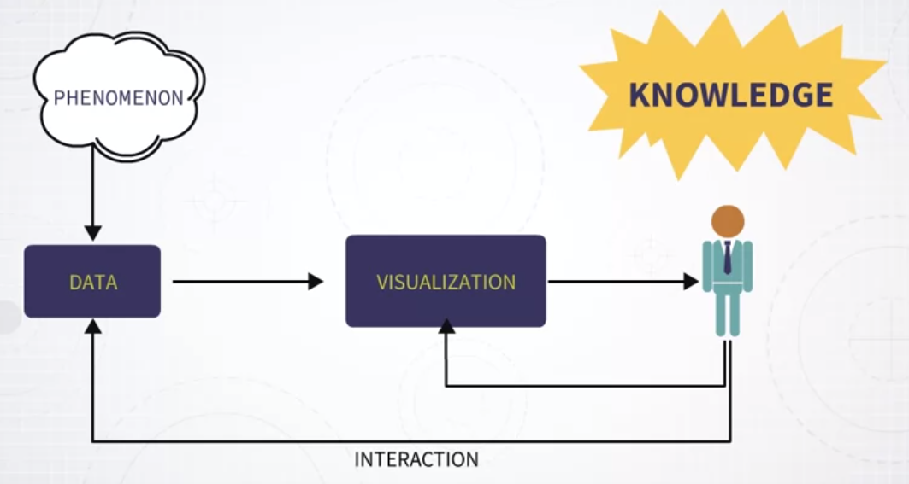
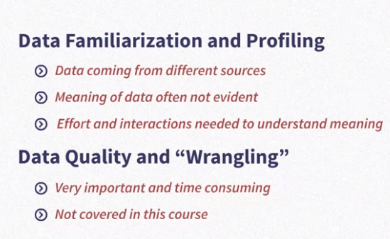

# Week 2

### Reflecting on Data

Data &mdash; this is the definition that Merriam-Webster gives. Factual information such as measurements or statistics, used as a basis for reasoning, discussion or calculation. I really like this definition because it includes the idea that we use data as a basis for reasoning, discussion and calculation. 

And Wikipedia also has a very long description of what data is. And in particular, I really like this sentence. Data as a general concept refers to the fact that some existing information or knowledge, is represented or coded in some form suitable for better usage or processing. 

So this is what I described in the previous model, the idea that data visualization is about taking some data, finding a measure of presentation, and interacting with data and visualization. But the ultimate goal is to understand the phenomenon that is described by data, and the ultimate purpose is to generate useful knowledge.

So now more precisely, I want to describe what is the role that data plays in the visualization process. And to do that I will keep using the same diagram, but with a small difference. So rather than going directly from data to visualization, and in the middle having visual encoding, here, I introduce an additional element which is transform data.

DATA COLLECTION > DATA TRANSFORMATION > VISUAL ENCODING

How does one decide how to visualize data? Once I receive a data set, how do I know what is the appropriate visual representation for this data set? That's a very important question.

So, one very useful tool to start reasoning about what may be an appropriate visual representation for a given dataset, is the concept of data abstraction.

### Data Abstraction

Is the idea that you can describe data in ways that help you decide what encoding methods are available and appropriate for this information. [...] knowing what type of information, what type of data you have, helps you make choices about what visual representations are available and appropriate. Now, I want to use the important concept of data abstraction. So what is the abstraction? Data abstraction is a method to describe data in ways that help you decide what operations and encoding methods are available and also appropriate. So, referring back to the previous diagram, since we have data transformation and data encoding, data abstraction is a method that helps you figure out what transformations are possible, and what visual representations are also possible with the data that you have. 

[For example,] Why a bar chart? Because a bar chart can accommodate categorical information, a set of categories with associated values. 

So, another ways to describe data abstraction is that it's a way to recognize common structures in data, that necessarily come from different domains. Every single dataset describes a particular phenomenon, and comes from a particular domain. But we need a way to abstract away from the domain. So that the common structures help us define what visual representations are available and appropriate. 

[social media connections, interactions between molecules and proteines, criminal organization:] all of these cases describe data that come from very different domains, and probably with very different purposes and goals. But what they have in common is that they all can be described as networks. So, here we are doing an operation of data abstraction. We all know that all these different datasets coming from different domains, can be described with the same structure, a network. 

Abstracting away from the domain to identify characteristics that are useful to decide what visual representations are available and appropriate. 

So typically, when people start studying how to create effective visual representations, they ask me, "How can I visualize this?" They come with some dataset, and the first question is, how can I visualize this? And my answer typically is another question. Which is, "What type of data do you have?" That's the first step that you need. You need to identify what kind of data you have, and this is called data abstraction.

### Dataset types: tables and networks

The first thing to realize is that every single dataset can be described as a collection of items, where each of these items has a number of attributes that describe characteristics of these items. So typically we have items that are collected within this dataset, and we have attributes that describe characteristics of these items. So it's very important to keep in mind, every dataset is a collection of items, and the items are described by attributes.

Now, a first step in data abstraction is to distinguish between two broad classes of dataset types. The first one is tables and the second one is networks and trees. 

The second dataset type is networks and trees. In networks, we have nodes, we have links that connect nodes. And we can have, in general, attributes that define or describe characteristics of nodes and links. 

### Attribute Types

we define three main types of attributes: 

* categorical, 
* ordinal, and 
* quantitative. L

So, a categorical attribute is an attribute that contains values that describe categories. And these categories don't have any particular order. 

The second one is ordinal. An ordinal attribute is very similar to categorical in the sense that the values of a categorical attribute are categories, but the main difference here is that these categories can be ordered. Ordering them is meaningful. One thing to notice here, though, is that even though these values can be ordered, we just don't know what the "distance" among these categories is. So, it's not really meaningful to perform any arithmetic operation between these categories. 

The last one is quantitative. In a quantitative attribute, the values represent some measured quantity. These are all numbers that describe a measurement of something. In this case, the distance between values is meaningful and it can be computed. And in general, with quantitative attributes, you can perform any kind of arithmetic operation among them. 

### Attribute Semantics

The next step in data abstraction is to identify what we call Attribute Semantics. What does Semantics means? Well, it means, basically, the meaning of some attributes. So there are a number of predefined Semantics that are useful, very useful to identify. The first one is Spatial and Temporal Semantics. 

Another important characteristic for attribute types is also to identify these three specific cases, whether the attribute is Sequential, Diverging, or Cyclic. 

One last useful characteristic to identify is whether an attribute is Hierarchical. 

Summary:

* Dataset Type: Tables, and Networks with Trees. 
* Attribute Type: Categorical, Ordinal, and Quantitative. 
* Additional attribute characteristics:
  - Spatial and Temporal. 
  - Sequential, Diverging, and Cyclic
  - Hierarchical

Remember: not necessarily if you see a number then this attribute is quantitative, is quantitative only if it measure something.

### Data Abstraction to Data Visualization

Why is it useful to identify attribute types? Well, the idea here is that knowing what kind of attribute and an attribute is, is going to give you guidance in selecting appropriate graphical visual representations. 

Some examples:

* the first one is an example showing you that in a line chart,it's inappropriate to use unordered attributes. 
* categorical attributes when they are mapped in a chart like this one can be reordered in any way we like.So, one thing that is useful to know when we have categorical attributes is that categorical attributes can be reordered. 
* we have attributes that describe geographical information, we know that one visual representation that is available to us is a map. Now, as we will see in the future, using a map is not necessarily always the best solution when we want to visualize spatial data, but for sure what we know is that if we have spatial information, a spatial attribute, we know that using a spatial visual representation like a map is one of the available options, so, it's very useful. 
* Last one, say that we want to visualize information that come from an attribute that we know to be quantitative and diverging -> diverging color scale.

### Data Profiling

As we have seen, performing data abstraction is a very useful exercise to make decisions about what are appropriate visual representations for your data. Now before we conclude, I want to make it clear that data abstraction is not the only process or the only method that you typically have to use in a data visualization project. 

So, connected to data abstraction is the idea that you have to become familiar with your data set. [...] sometimes you just don't know what is the real meaning of a given attribute type. Data can come from many different sources, the meaning may actually not be evident at all. And typically what happens is that either you need to do some research on your own or if you have a client you will need to talk with your client who is providing data to you, to understand in a much more deeper sense, what is the meaning of every single attribute. So, this activity is often called data profiling. I also like the term data familiarization because you have to become familiar with your data. And I want to make sure that you realize that in practice what happens is that this activity takes some time and also requires interacting with other people who have the knowledge, a much deeper knowledge than you, of what is the meaning of the attributes that are contained in your data set. 

### Quick Recap

Let me conclude with an overview of the main concepts that I introduced in this lesson. The first thing that we discussed is what is data. So, reasoning about what is data is useful. Just to better understand what we mean by data. Everything we discuss in this course is related to data. So, it's important to think about what it means. Another element that we have seen in this context is, what roles data plays in the data visualization process in the pipeline. How data is collected, then it's transformed, and finally, encoded into a visual representation. Then we focused on the idea of data abstraction. And I explain that data abstraction is an activity that is useful to abstract away from the specifics of the domain. So, even if data comes from different domains and describes very different phenomena, there are common characteristics that can be identified, and these characteristics are useful to decide what visual representations are appropriate for your data. Then more specifically, I said that every single dataset out there can be described as a collection of items, where these items have a number of attributes, where the attributes are common characteristics of these items. Then I introduce the idea of dataset types and I talked more specifically about two dataset types, tables and networks, together with trees which are hierarchical structures. And finally, I introduce different attribute types. In particular, categorical attribute types, ordinal attribute types, and quantitative attribute types. And then finally, I also explain that within these three categories, we can identify additional useful characteristics. For instance, whether an attribute is spatial or temporal, whether it is hierarchical, whether it is diverging, or cyclic, and so on. So, this concludes our lesson.

* What is data?
* Data in visualization (collection, transformation, visualization)
* Data abstraction
* Datasets = Items + Attributes
* Dataset Types
* Attribute types