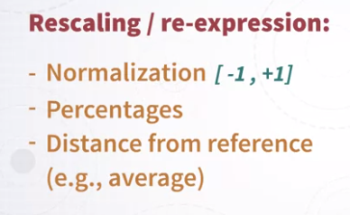
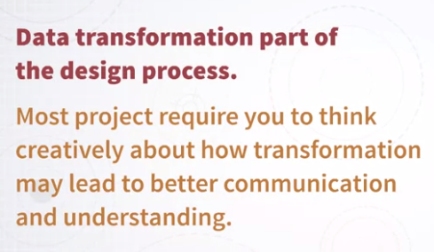
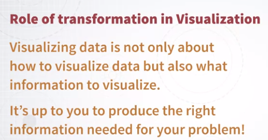

# Week 3

### Fundamental graphs and data transformation

We defined what data is, and what data abstraction is, and why it's needed. 

The focus here now is to go from data, to visual representation. So, I will walk you through three main steps. 

* The first one is introducing the idea of going from data abstraction to graph design. 
* The second one is, the introduction of a number of fundamental graphs, and their variations. 
* And then we will conclude with a section on data transformation. 

So, part of the problem in data visualization is not only how to visualize something, but also what kind of transformation of the original data is needed, to create the visual representation that you need to solve the problem.

### How to visualize?

How do I go from data to a visual representation that helps you answer some important questions that you have about the data? 

one of the first things that you have to figure out is how do I transform all this information into a visual representation? This is a very complex step. So, one way I like to describe this is that we can break the problem down into two steps. 

* The first step is to decide what to visualize -- select and transform 
* the second step is about deciding how to visualize it -- choosing or designing an appropriate representation. 

Why did I put choose and design? Because choosing is exclusively about selecting an existing format that is appropriate for the goal that you have in mind. designing is more in general trying to create a novel representation for the problem that you have. 

### Fundamentals Graphs

This is a preview of the graphs I'm going to talk about. 

* The bar chart, 
* the scatter plot, 
* the matrix,
* the line chart and 
* the symbol map. 

Why do I do that? There are a number of reasons but most importantly because 

* they are widely adopted, 
* they are very effective and  
* they are very useful. 

A second reason is that they solve a very large percentage of visualization problems. It's really surprising how many problems out there can be solved by one of these five graphs or variants over these graphs. And maybe even more important these are an amazing training ground before you are able to discuss and design more sophisticated graphs. So, I find that they are from the pedagogical standpoint extremely useful. And as you will see they will allow us to reason about graphical configurations and graphical communication.

### Data Transformation

we have two steps: 

1. selection and transformation, 
2. choosing or designing an appropriate representation.

What is selection? The idea here is that, when you are designing a new visualization, you are virtually, all the time, starting from data set, a table that contains multiple attributes. But every single representation represents only a small fraction of these attributes, a small subset of attributes. This means in turn, that every time you are designing a new visual representation, you also have to choose which attributes are going to be used for these visual representation. This process or this step is called selection, selecting which attributes you need to create the representation that you want to create. 

#### transformations on attributes that have an hierarquical structure
transformations related to attributes that encode information on time and date. in this case, it's very common to have aggregation at different levels according to at what level of details you want to conduct your analysis. So times and dates have these interesting properties that they have a hierarchical structure. So you can go from seconds to minutes to hours, days, weeks, months, years, and so on. You can imagine this as being different **resolutions**, you can conduct your analysis at different levels of resolution. And you can imagine that this also has an impact on the way this information is visualized. 

There's never one single resolution that is optimal. It depends on the specific question that you have and on the specific project you’re working on. So it’s very important to keep in mind when you have time and deeds to look at what is the impact of using different resolutions which ultimately translating to different aggregation levels.

The same thing happens when you are analyzing and visualizing spacial data or geographical data. For instance, you can go from analysis at the zip code level, in a city, to a county, to the state, and so on. And in general, every time you have spacial data, you have the option of conducting your analysis and creating visual presentations at different levels of resolution.

Another very common type of transformation that happens when you have spatial data or more precisely geographical data, is going from the name of a location to the geographical coordinates. Or the other way around, going from the geographical coordinates to the name of this location. This is very, very common and is called typically geo-coding and decoding, very common.

#### Binning
Another useful transformation is when you want to transform one quantitative attribute into an ordinal one. How do you do that? Through an operation that is called binning. What does it mean? It means that you take the quantities, and you bin them into a number of categories, and then you sort them according to their values. In this case, you are effectively transforming a quantitative attribute into an ordinal one. 

#### Re-expressing a quantitative attribute

Another transformation that is common is the idea of rescaling or re-expressing a given quantitative attribute, typically through normalization. What is normalization? So if your attribute has a given minimum and maximum value, you can represent the same range using a different scale. 

Another one is transforming quantitative values into percentages. There are many situations where calculating percentages makes comparison between values easier. 

Or sometimes, rather than using the values, you want to use the distance of the values from a reference point. A very common situation is you have all the quantities in an attribute, you calculate the average value and you want to re-express them in terms of distance from the average value. This is also very useful.

you have to think about transformation as part of the design process. That's very, very, very important. Creating the right, effective visual representation for a given problem is not only about finding the right graphical format, but also finding the right information. It's almost never the case that you can take the original data and represent it as it is. You need some intermediary transformations. And part of the problem for a designer is to figure out what is the best transformation to achieve, to create a visual representation that is effective. 

So, visualizing data, keep in mind, visualizing data is not only about **how to visualize data**, but also **what information to visualize**. That's a very, very important message to keep in mind.

