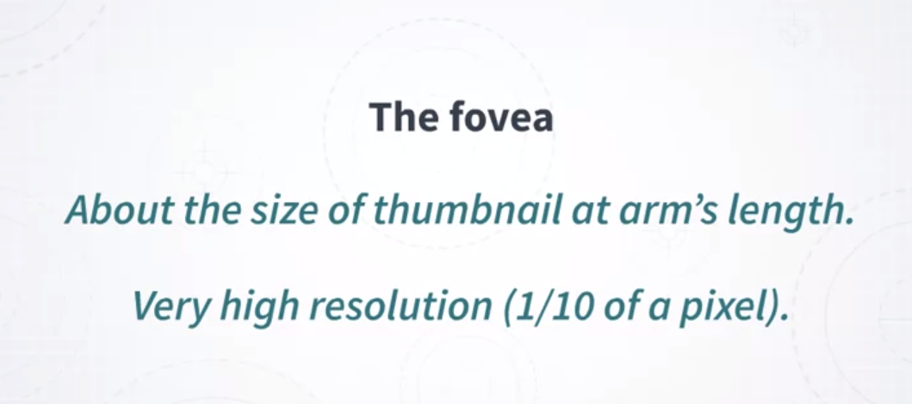
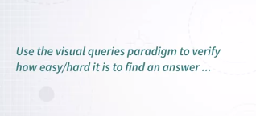
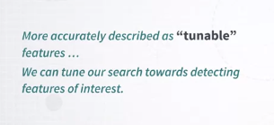

# Applied Perception &mdash Week 1

From patterns of light to... thought.

### What is “Applied Perception”? Why Study It?

Let's start by answering two important questions. First, what is applied perception for visualization? And why study it? I think these are two very important questions that we need to answer from the very beginning. Well, first of all, we need a consideration. Information visualization is about transforming data into a visual representation so that a human can extract useful information out of it. In the previous course, we talked mostly about how to transform data into a visual representation. 

But now we need to talk about how humans perceive this information, because the more we know about humans extract information out of visual representations, the more equipped we are with useful information to design effective visualizations. Now, I want to briefly talk about a very important issue here. The issue here is that the effectiveness of a visual representation is not really arbitrary. It's mostly dependent on how the brain works. So, when we talk about visualization, you may be tempted to say, "Or maybe this visualization is better than another visualization, only because I like it and you don't like it." So, it could be described as a matter of subjective preference or taste. 

Why subjective preference and taste do play an important role? Here we are concerned with the fact that when we talk about effectiveness, effectiveness is largely dependent on how the brain works. So, understanding how perception works is going to help you make informed decisions about visualization design, which is really important. 

Let me give you a very simple example coming from Colin Ware's book, Information Visualization: Perception for Design. 

These are two graphs, they try to convey exactly the same information, but I think everyone can readily see that the graph on the left is way easier to interpret than the graph on the right. So, that's an example of the same information displayed in a different way, but in one way is much easier to understand than another and it doesn't really depend on subjective preferences. 

Why is this important for a visualization designer? Well, it's really important because you as a visualization designer, are constantly trying to do two main things. The first one is to ideate visual representations that are appropriate for the problem that you're trying to solve. The second one is that you're constantly evaluating the solutions that you are creating. It's literally never the case that the first visual representation that you create or think about is the best one. So, you're always juggling between ideating something and evaluating something. That's a very common set of operations taking place in visualization design. 

Related to that, in visualization design, one problem in visualization design is that, the space of solutions is normally very large. So, if you don't have a way to guide your search in this space of large solutions through some relevant knowledge, you won't be able to very quickly converge to something that works well. 

Think about it. If you don't know how to traverse the space, you're going to have a very hard time converging towards something that is potentially very effective. So, this type of knowledge is very much needed. So, let me try to describe this a little bit more precisely. What I want to introduce here, is the concept of task.

Why is this important? Well, because a moment ago, I just said that in visualization design, we have to think about effectiveness, and knowledge of visual perception is useful because it helps you as a designer to figure out what is effective and what is not effective. 
 

But in order to talk about effectiveness, we have to define the idea of task. Effectiveness cannot exist if we don't tie a visualization design to the concept of a specific task that somebody needs to carry out. So, that's a very important concept. In turn, you as a visualization designer, you are constantly trying to figure out whether a given representation is better than another visual representation. What is really important is to keep in mind that you can only say that the visualization is better than another when you talk about a specific goal or task that somebody needs to accomplish.

That's very important. So, in summary, when somebody asks you, which visualization is better between A and B? I think what you should ask in turn is, to accomplish what? 

Because if you don't ask this question, you won't be able to talk about effectiveness. That's a very important concept. So, in general, your goal as a visualization designer once one or more tasks have been defined, is to predict what works and what does not work, right? Also explain possibly why something works and why it doesn't work. That's the main objective of this course. 

The idea here is that, if you know more about how the brain and the visual system works, you will be much better at predicting and explaining why something works or it doesn't work. 

So, we now can say that the main goal of this course of Applied Perception of Visualization is to study human perceptual and cognitive processing to make informed decisions about visualization design. 

Before I conclude, I just want to clarify what I mean by "informed decisions." I want to do that by giving you an example. Say that you have a map and you want to represent information through color and you have two main questions. The first one is how many colors can an average person distinguish on a map? If you have to convey information about 40 or 50 different categories or concepts, do you actually have 30 or 50 colors available? How do you answer it, this question? You have to know how the visual processing system works.

Once I know how many different colors I can use in a map, I still have another problem. Which colors should I choose? Ideally, I want to choose colors that are as distinguishable as possible. So, how do we know which colors to use. Well, once again, that's a question that you can answer only if you know how the visual processing system works. 

So, let me conclude by giving you a very brief summary of what we're going to cover in this course. First, we're going to cover the visual and cognitive system. So, how the eyes and the brain work and how they process information coming from the world. Second, we're going to talk about the effectiveness of visual channels. So, how every single visual property that can be used to represent data can be used effectively and how effective it is at conveying information. Finally, we will cover color in two weeks. Why color? Because color is very complex and at the same time very important in visualization

### Human Visual Processing System

How does the human visual processing system works? Now, I want to walk you through a model of what happens when the light enters our eyes and how it is processed by the eye and the brain. In order to do that, we have to start from the eye itself. I'm going to describe only the very essential parts of the eye. 

Of course the eye is much more complex than what I'm going to describe. So, light is coming from the world through either sources of light or surfaces that are reflecting light coming from other sources. So, at any given time what we see in front of us, is the effect of light coming through our eyes. Now, the eye as a number of structures. First of all, there is the cornea, which is basically a lens through which the light comes inside the eye. We also have a pupil, that is basically like a camera that can open or shrink and according to how much light is coming in. So gets larger and larger when the light is dimmer and dimmer and it gets smaller and smaller when there is more light. Now, when the light is reflected through the cornea, it's actually reflected to the back part of the eye to a region that is called retina. The retina is the place that is of the eye that is in contact with the optic nerve. The retina again which is the back of the eye is full of photoreceptors. What is a photoreceptor? Well, it's kind of cell that transforms signals coming from the eye to signals that go to the brain. 

Now, let's look more closely at the content of the retina. The retina is packed with these photoreceptors which you can think of like light sensors. There are two main types of sensors, there are rods and cones. Rods and cones are complimentary. Rods are necessary and they are active in low light conditions whereas cones are active and necessary in normal light conditions. 

Now, an interesting aspect of the retina is that the resolution that humans have in the surface of the retina changes according to the location. More precisely, there is a small region of the retina that is called the fovea. 

This is a region of the retina, that has a much much higher resolution than the rest. How large is the fovea? Well, one way to figure out to get a sense of how large the size of the fovea is, is to basically look at the size of your thumbnail in front of you at arm's length and when you focus your attention on it, the size of your thumbnail is roughly the size of the fovea in your eye. Okay. You can try. The resolution is enormous in this very small region. 

Just to give you an example, in a normal monitor, there are lots of pixels and around 40 pixel per centimeter and the kind of resolution that humans can have is about one tenth of one pixel so, it's incredibly high in these specific region. Of course, is not the same in the rest of the eye. So, this is a diagram that shows you how the resolution changes in different regions of the of the retina. As you can see, resolution is incredibly high in the area around the fovea but it decreases very very sharply as you move out of this central region of the eye.

So now, light comes in, it's initially reflected by the lens that we have in our eyes, goes to the retina, the retina as this non-uniform distribution of cons and rods and of resolution. Now, these information is captured by the sensors and transmitted to the brain through the optic nerve. What happens next? So, here I'm going to very briefly talk about a model of processing of visual information, taken from Colin Ware's book. The same book that I mentioned a moment ago. 

So, this is an idealized version of what happens when light comes in. So, light comes through the eye. First of all what happens, is that there is what is called Feature Perception. This is happening at the first stage of processing. There are very important properties at this stage. The first one is that, the detection of these low-level features is incredibly fast and it's parallel. What do I mean by parallel? It means that it doesn't really depend on where these features are, they are perceived all at once. They are also stored in a sort of buffer that is called <mark>Iconic Memory</mark>, where information is very briefly stored and it's very transitory. It means that it stays there for a very brief moment. 

Whatever is captured in the Iconic Memory, is then transferred in a second stage through another processing step. 

In this processing steps, the low-level features are aggregated together to create patterns. So, at this stage, this stage is characterized by a number of factors. First of all, perception of these patterns is sequential is no longer parallel and because of that, is much much slower. Second, the perception of these patterns is highly influenced by attention. Whereas in stage one, whether something is perceived or not is much less influenced by whether something is attending to something or not. 

In the third and final stage, the patterns that have been detected through the processes stage one, are transformed into objects that are retained in the working memory. 

This is a very small number of objects, the estimate is that we can't really store more than six or seven objects or more precisely what is called chunks of information, at any given time. This information as I said, is stored in what is called the Working Memory. The memory that we need in order to reason about certain thoughts. I want to conclude by highlighting a very important aspect of this whole process. The important aspect is the fact that, at any given time our eyes receive an incredibly large amount of information. 

But, this information is processed through many stages and reduced enormously and simplified enormously. So, even if we perceive, even if we have a lot of in incoming information from our eyes and our sensors at any given time, the visual processing system does its best to reduce this disinformation as much as possible and retain only what is important for the given task. In the next video, we're going to discuss this aspect in much more detail.

### Saccadic Eye Movement

In the previous videos, we introduce two important concepts. The first one, is the idea that our eyes see in a high resolution only on a very small section of the field of view. This is because the high resolution is only in the part of the area that we call fovea and the rest is much much lower resolution. The second thing, is that very, very little information of the proportion of the information that is entering our eyes is actually stored in our memories. As we said before, this is a very lossy process, most of the information is lost and we capture only what is important. 

So, finally, we can say that we only actually see a very small portion of the world that is in front of us, and yet we always have the feeling that we have full awareness of it. Why is that? I think it's very important to stop and reflect a little moment about this little disconnection between the fact that we actually see and store so little but we perceive that we have everything in our mind and in our brain. So, let's analyze this problem for a moment. So, there are two important reasons. Of course, this doesn't cover all the possible reasons, but two important reasons I want to mention, why we have this perception, despite the fact that a lot of information is lost. 

The first one, is that <mark>we move our eyes extremely fast, to sample the area around the focus of attention, so that we can get more information in high resolution around it. This is what is called saccadic eye movement</mark>, which we are going to analyze in a moment. The second aspect is that visual perception is highly driven by human attention. In turn, this means that, at any given time, the information that we're gathering from the world is actually the information that we need in order to carry out the tasks that we are carrying out. Because of that, we perceive that we do have the information that is needed when it is needed. But that's the only information we retain. <mark>The only formation we retain is the information that is needed to carry out the tasks that we are performing</mark>. This has a lot of consequences. 

But let's first cover the part about saccadic eye movement. Okay. So, even though we don't perceive it, the way our eyes actually sample the world is through a series of jerky movements that are called saccadic eye movements. 

<mark>So, what happens is that when we fixate a given area, our eyes are actually quickly moving around this area to gather more information about it. The brain is actually stitching all these pieces of information together.</mark> 

From Wikipedia

Humans and many animals do not look at a scene in fixed steadiness; instead, the eyes move around, locating interesting parts of the scene and building up a mental, three-dimensional 'map' corresponding to the scene (as opposed to the graphical map of avians, that often relies upon detection of angular movement on the retina).[citation needed] When scanning immediate surroundings or reading, human eyes make saccadic movements and stop several times, moving very quickly between each stop. The speed of movement during each saccade cannot be controlled; the eyes move as fast as they are able.[4] One reason for the saccadic movement of the human eye is that the central part of the retina—known as the fovea—which provides the high-resolution portion of vision is very small in humans, only about 1–2 degrees of vision, but it plays a critical role in resolving objects.[5] By moving the eye so that small parts of a scene can be sensed with greater resolution, body resources can be used more efficiently.

Let me show you a video that gives you a sense of this movement. Because, we are actually, we don't consciously control or even sense that we have this movement but our eyes are actually moving really, really fast and twitching between small deviation and another around the focus of attention, to sample the world around the focus of attention. So, let's watch this video for a moment and then I'll comment a little longer on it. Okay. So, here we have the video.

So, as you can see, the eye is moving really, really fast around the area of interest. So, what happens during a saccadic eye movement is a number of things. The first one is, as I said, that the eyes are very quickly twitching around the area of interests. The second thing is that, during this movement, the image is temporarily suppressed. So, while the eye is moving during a saccadic movement, we are temporarily blind but we just don't perceive that. Finally, all these images are assembled together in the brain. Again, we're just not conscious about it, what we perceive is reality around us. Which is pretty remarkable. Pretty amazing. So, I want to conclude this video with a quote.

This comes from Steven Few Book Show Me the Numbers. I think it really well characterizes what is happening here. What Steven says is, "We don't see images with our eyes, we see them with our brains." I think that's a very, very useful quote to remember what happens when we are gathering information visually from the world.

### Role of Attention In Visual Perception

The second important fact that we need to keep in mind, and I mentioned before, is that attention plays a really big role on visual perception. So, there are a number of facts. 

First, we only retain a very small portion of the information that is entering our eye, but what is retained in our memory and what is processed by our visual processing system is very highly dependent on what we are attending to. What we are attending to in turn, depends on the task, on what we are trying to accomplish, which of course, is very relevant for visualization design. Because when we are designing a visualization, we are typically designing a visualization to help people accomplish some communication task. So, that's very important. 

Here, I want to introduce a new concept. The concept of **inattentional blindness**. What is an inattentional blindness? Well, it's a concept introduced by vision scientists when they started noticing the idea that related to how powerful attention is in visual perception. The idea is the following: it's very easy to be blind to very big changes if we do not attend ["atentar"? "pay attention"?] to the visual information that changes. So, maybe this is still a little bit vague. In order to make it more concrete, I want to show you an example in a video. This is a video reproducing a classic experiment in vision science. What is the experiment about? Well, it's one among many different experiments that have being developed or examples that have been developed to show the problem or the effect of inattentional blindness. In this video, you're going to see a person asking some information to another person and then these two persons are temporarily interrupted by two guys coming over with a painting or something else. So, they are temporarily blocking the view, and without this person noticing it, the person who is asking for information is changing. Sometimes the new person showing up is very different and despite that, most people don't recognize the difference. They don't notice it. So, let's watch the video first, and then I have a few more comments on inattentional blindness. 

(video starts)
Excuse me. I'm looking for the Skyline. Then, we break the two up, walking through them holding a large sheet of wood. Now watch as I replace Vin. You might think people would notice the switch, but almost half the time they didn't. Of course, that means more than half the time they did. We only tried the experiment nine times, and by no means was it good science. But we were surprised four people didn't notice the switch. In Simon's original experiment, seven out of 15 people didn't either. So, what determines whether or not you can figure out the switch? 

<mark>When you look at another person, you encode what's relevant for what you're doing right then</mark>, in that case, giving directions, and you don't pay attention to the details that are irrelevant, say what color their shirt is or exactly how tall they are. As long as you are able to make sense of the meaning of the scene and roughly the main categories of that person, say their height, their age, what race they are, what sex they are, as long as those important things don't change, the meaning of the scene really hasn't changed and you're not going to notice that anything is different. Scientists have documented inattentional change blindness since the 1970s. While they allow you to focus your attention, this failure to see every detail can prove costly. Drivers often cause accidents because they overlook quick changes to their environments, such as pedestrians or cyclists. Faulty memories can wreck havoc during eyewitness testimony. <mark>The goal of vision isn't to build a photograph or a complete model of the world in your mind, the goal of vision is to make sense of the meaning of the world around you.</mark> Being aware of our limitations can help us adapt and compensate for them, allowing us to do things that prevent the really negative consequences that can happen due to failures of awareness. For example, Simon thinks that people might be willing to put away their cell phone when driving if they just understood the limits to their attention. Juries might realize that eyewitness testimony is far from ideal, and the next time you and a friend are fighting about the details at a past event, it's likely you're both wrong. Now, that's something to remember.

(video ends) 

Okay. So, I hope the concept of inattentional blindness is now a little clearer. Before we move on, I want to ask you a question. Did you notice any difference between this video and the previous video? I guess you didn't. You want to try? Is there anything different in the new video? Well, in this video, I'm wearing a watch, but in the previous video, I'm not wearing a watch. Maybe you should go back and check. I'm pretty sure that most of you didn't actually notice, until I ask. So, this is another example of inattentional blindness. <mark>You won't notice the difference until you have a reason to attend to the information that is needed in order to perceive the difference.</mark> I want to conclude with a couple of quotes again. So, the first one that I really like is the idea that the world is its own memory. 

What does it mean? Well, it means that most of the information that we need to carry out a task or solve a given problem is not in our head, is in the world. But the way cognition and visual perception work is that we can look for this information when is needed. So, there is another quote that I want to give you. This is from Collin Ware's book, and the book is called "Visual Thinking for Design", a fantastic book. 

The quote is, "It's more accurate to say that we are conscious of the field of information to which we have rapid access rather than we are immediately conscious of the world." Once again, I think this is a really important concept to keep in mind. 

So, why is this important for visualization design? I think there are a couple of important ideas here. The first one is that when we design a visual representation, we have to guide the attention of the viewer in a way that is useful to achieving the goal that we want people to be able to achieve. 

So, the more explicit you are in how you are directing attention through your design, the better your design is going to be. If you just don't care and don't even think about it, it's likely that you're going to have problems with your design. In turn, as a visualization designer, you have to be aware of how your choices as a designer are going to affect attention. 

<mark>So, if you inadvertently attract attention of the viewer to pieces of information that are not important for achieving the goal that you want your viewers to achieve, then you are in trouble. </mark> So, in summary, it's very important in visualization design to be mindful of the effect of attention and how your design actually affects attention.