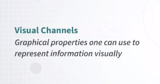

# Applied Perception &mdash Week 1

From patterns of light to... thought.

### What is “Applied Perception”? Why Study It?

Let's start by answering two important questions. First, what is applied perception for visualization? And why study it? I think these are two very important questions that we need to answer from the very beginning. Well, first of all, we need a consideration. Information visualization is about transforming data into a visual representation so that a human can extract useful information out of it. In the previous course, we talked mostly about how to transform data into a visual representation. 

But now we need to talk about how humans perceive this information, because the more we know about humans extract information out of visual representations, the more equipped we are with useful information to design effective visualizations. Now, I want to briefly talk about a very important issue here. The issue here is that the effectiveness of a visual representation is not really arbitrary. It's mostly dependent on how the brain works. So, when we talk about visualization, you may be tempted to say, "Or maybe this visualization is better than another visualization, only because I like it and you don't like it." So, it could be described as a matter of subjective preference or taste. 

Why subjective preference and taste do play an important role? Here we are concerned with the fact that when we talk about effectiveness, effectiveness is largely dependent on how the brain works. So, understanding how perception works is going to help you make informed decisions about visualization design, which is really important. 

Let me give you a very simple example coming from Colin Ware's book, Information Visualization: Perception for Design. 

These are two graphs, they try to convey exactly the same information, but I think everyone can readily see that the graph on the left is way easier to interpret than the graph on the right. So, that's an example of the same information displayed in a different way, but in one way is much easier to understand than another and it doesn't really depend on subjective preferences. 

Why is this important for a visualization designer? Well, it's really important because you as a visualization designer, are constantly trying to do two main things. The first one is to ideate visual representations that are appropriate for the problem that you're trying to solve. The second one is that you're constantly evaluating the solutions that you are creating. It's literally never the case that the first visual representation that you create or think about is the best one. So, you're always juggling between ideating something and evaluating something. That's a very common set of operations taking place in visualization design. 

Related to that, in visualization design, one problem in visualization design is that, the space of solutions is normally very large. So, if you don't have a way to guide your search in this space of large solutions through some relevant knowledge, you won't be able to very quickly converge to something that works well. 

Think about it. If you don't know how to traverse the space, you're going to have a very hard time converging towards something that is potentially very effective. So, this type of knowledge is very much needed. So, let me try to describe this a little bit more precisely. What I want to introduce here, is the concept of task.

Why is this important? Well, because a moment ago, I just said that in visualization design, we have to think about effectiveness, and knowledge of visual perception is useful because it helps you as a designer to figure out what is effective and what is not effective. 
 

But in order to talk about effectiveness, we have to define the idea of task. Effectiveness cannot exist if we don't tie a visualization design to the concept of a specific task that somebody needs to carry out. So, that's a very important concept. In turn, you as a visualization designer, you are constantly trying to figure out whether a given representation is better than another visual representation. What is really important is to keep in mind that you can only say that the visualization is better than another when you talk about a specific goal or task that somebody needs to accomplish.

That's very important. So, in summary, when somebody asks you, which visualization is better between A and B? I think what you should ask in turn is, to accomplish what? 

Because if you don't ask this question, you won't be able to talk about effectiveness. That's a very important concept. So, in general, your goal as a visualization designer once one or more tasks have been defined, is to predict what works and what does not work, right? Also explain possibly why something works and why it doesn't work. That's the main objective of this course. 

The idea here is that, if you know more about how the brain and the visual system works, you will be much better at predicting and explaining why something works or it doesn't work. 

So, we now can say that the main goal of this course of Applied Perception of Visualization is to study human perceptual and cognitive processing to make informed decisions about visualization design. 

Before I conclude, I just want to clarify what I mean by "informed decisions." I want to do that by giving you an example. Say that you have a map and you want to represent information through color and you have two main questions. The first one is how many colors can an average person distinguish on a map? If you have to convey information about 40 or 50 different categories or concepts, do you actually have 30 or 50 colors available? How do you answer it, this question? You have to know how the visual processing system works.

Once I know how many different colors I can use in a map, I still have another problem. Which colors should I choose? Ideally, I want to choose colors that are as distinguishable as possible. So, how do we know which colors to use. Well, once again, that's a question that you can answer only if you know how the visual processing system works. 

So, let me conclude by giving you a very brief summary of what we're going to cover in this course. First, we're going to cover the visual and cognitive system. So, how the eyes and the brain work and how they process information coming from the world. Second, we're going to talk about the effectiveness of visual channels. So, how every single visual property that can be used to represent data can be used effectively and how effective it is at conveying information. Finally, we will cover color in two weeks. Why color? Because color is very complex and at the same time very important in visualization

### Human Visual Processing System

How does the human visual processing system works? Now, I want to walk you through a model of what happens when the light enters our eyes and how it is processed by the eye and the brain. In order to do that, we have to start from the eye itself. I'm going to describe only the very essential parts of the eye. 

Of course the eye is much more complex than what I'm going to describe. So, light is coming from the world through either sources of light or surfaces that are reflecting light coming from other sources. So, at any given time what we see in front of us, is the effect of light coming through our eyes. Now, the eye as a number of structures. First of all, there is the cornea, which is basically a lens through which the light comes inside the eye. We also have a pupil, that is basically like a camera that can open or shrink and according to how much light is coming in. So gets larger and larger when the light is dimmer and dimmer and it gets smaller and smaller when there is more light. Now, when the light is reflected through the cornea, it's actually reflected to the back part of the eye to a region that is called retina. The retina is the place that is of the eye that is in contact with the optic nerve. The retina again which is the back of the eye is full of photoreceptors. What is a photoreceptor? Well, it's kind of cell that transforms signals coming from the eye to signals that go to the brain. 

Now, let's look more closely at the content of the retina. The retina is packed with these photoreceptors which you can think of like light sensors. There are two main types of sensors, there are rods and cones. Rods and cones are complimentary. Rods are necessary and they are active in low light conditions whereas cones are active and necessary in normal light conditions. 

Now, an interesting aspect of the retina is that the resolution that humans have in the surface of the retina changes according to the location. More precisely, there is a small region of the retina that is called the fovea. 

This is a region of the retina, that has a much much higher resolution than the rest. How large is the fovea? Well, one way to figure out to get a sense of how large the size of the fovea is, is to basically look at the size of your thumbnail in front of you at arm's length and when you focus your attention on it, the size of your thumbnail is roughly the size of the fovea in your eye. Okay. You can try. The resolution is enormous in this very small region. 

Just to give you an example, in a normal monitor, there are lots of pixels and around 40 pixel per centimeter and the kind of resolution that humans can have is about one tenth of one pixel so, it's incredibly high in these specific region. Of course, is not the same in the rest of the eye. So, this is a diagram that shows you how the resolution changes in different regions of the of the retina. As you can see, resolution is incredibly high in the area around the fovea but it decreases very very sharply as you move out of this central region of the eye.

So now, light comes in, it's initially reflected by the lens that we have in our eyes, goes to the retina, the retina as this non-uniform distribution of cons and rods and of resolution. Now, these information is captured by the sensors and transmitted to the brain through the optic nerve. What happens next? So, here I'm going to very briefly talk about a model of processing of visual information, taken from Colin Ware's book. The same book that I mentioned a moment ago. 

So, this is an idealized version of what happens when light comes in. So, light comes through the eye. First of all what happens, is that there is what is called Feature Perception. This is happening at the first stage of processing. There are very important properties at this stage. The first one is that, the detection of these low-level features is incredibly fast and it's parallel. What do I mean by parallel? It means that it doesn't really depend on where these features are, they are perceived all at once. They are also stored in a sort of buffer that is called <mark>Iconic Memory</mark>, where information is very briefly stored and it's very transitory. It means that it stays there for a very brief moment. 

Whatever is captured in the Iconic Memory, is then transferred in a second stage through another processing step. 

In this processing steps, the low-level features are aggregated together to create patterns. So, at this stage, this stage is characterized by a number of factors. First of all, perception of these patterns is sequential is no longer parallel and because of that, is much much slower. Second, the perception of these patterns is highly influenced by attention. Whereas in stage one, whether something is perceived or not is much less influenced by whether something is attending to something or not. 

In the third and final stage, the patterns that have been detected through the processes stage one, are transformed into objects that are retained in the working memory. 

This is a very small number of objects, the estimate is that we can't really store more than six or seven objects or more precisely what is called chunks of information, at any given time. This information as I said, is stored in what is called the Working Memory. The memory that we need in order to reason about certain thoughts. I want to conclude by highlighting a very important aspect of this whole process. The important aspect is the fact that, at any given time our eyes receive an incredibly large amount of information. 

But, this information is processed through many stages and reduced enormously and simplified enormously. So, even if we perceive, even if we have a lot of in incoming information from our eyes and our sensors at any given time, the visual processing system does its best to reduce this disinformation as much as possible and retain only what is important for the given task. In the next video, we're going to discuss this aspect in much more detail.

### Visual Queries

In this module, I want to introduce the concept of Visual Queries, very important concept, very useful for visualization design and evaluation. So, what do we mean by visual queries? Let's give a definition first. 

It's acts of attention driving our eyes movement to find the information we need to accomplish a task. So, every time we use some kind of graphics or visualization, we typically use it to accomplish a specific task and this task translates into eye movements and ways to gather information out of the graphics and process it so that you can accomplish this task.

It's very important in visualization design to explicitly consider what are the tasks and what are the visual queries that are associated to these tasks. Once again, **what do I mean by visual queries? What are the ways, the eyes are moving to extract the information that is needed?** Let me give you an example. So, this is the map of London, and, the subway system in London. Let's say that you are in London, you're visiting London, and you need to go from one place to another. Very common problem. More specifically, let's say that you are in a hotel near Ealing in West London and you need to reach a pub near Clapham common. So, that's a task. The task is I want to go from this location to this other location, and, you want to solve the problem of finding the best way to go from origin to destination, by looking at the map. So, in a way you have to translate your goal into a number of what we call visual queries. So, let me say we do most of these things pretty much effortlessly, but when you start analyzing what happens when you're trying to do that you start recognizing that there are designs that promote this kind of tasks and designs that may hinder these kind of tasks. So, more specifically, let's say that you're now associated to this goal you have a number of questions. So, for instance, which trains connect the two points or what is the fastest route or what is the route that requires fewer number of changes or what is the route that minimizes the amount of work that I have to make? Or some other questions. Let's focus on the first one which trains connect the two points? That's the most fundamental one. So, you have a map in front of you, you have to go from point A to point B and your first goal is to understand, to learn what are the single train sorry that connects these two points? Okay. You have the map in front of you. The first thing that you have to do is to figure out where the start point and end point are, right? So, let's say that you already solved this task, you know where the starting station is and you know where the ending station is. So, let me zoom in to make this clearer. We know where the starting point is and you know where the endpoint is. Now, think about for a moment what it takes to solve this problem, visually. You want to find at least one route that brings you from the origin to the destination. Try to think about what you are trying to do visually in order to solve this problem. Well, I guess typically, what I expect people to do is to start from one of the two points, right? And then observe what are the lines that start from this point, what is the color? You follow the line with your eyes. At this point you may also jump to the other point, say the destination and see if there is a line there that is the same color of the line that you have at the origin. In our case as you can see they don't have the same color, so now what you have to find these some line that they have in common, and then trace it with your eyes, and then understand where you have to change your train and so on. 

So, this is a little example that gives you a sense of the fact that when we are trying to solve a problem visually, we are basically solving this problem by going through a number of visual queries. Once again, what is a visual query? Searching with your eyes the information that you need in order to solve the problem. 

So, what is the main lesson for design here? <mark>The main lesson is that it's very useful for visualization design, first of all to explicitly consider what is the task that your viewer is trying to accomplish and second translating this task in a number of visual queries that they most probably are going to execute on top of your graphics.</mark> The more you know about this, the more precisely you can specify that, the easier it's going to be for you to ideate designs that support the type of tasks that your users are supposed to accomplish. So, that's a very important point.

So, let me give you an example. Let's say that you're designing graphics for a specific goal, I'll give you an example in a moment, and you want to define, you want to decide which between two designs are best or say you come up with one design and you're not completely satisfied, and you want to generate a better one. So, let me show you an example of how this works. Here, I'm showing you a little problem that stems from the idea of analyzing data that describes restaurant inspections and their grades in New York City. Let's say that I came up with these graph, what does this graph say? Well, we have different types of restaurant types say American, Chinese, Pizza, Italian, Latin, and so on. My goal is to see if the distribution of grades across different cuisines is different. This is exactly what I'm trying to visualize with this graph. Every single cuisine type, cuisine description has internally the distribution of the various grades A, B, C, P, and Z. Now, think about what you as a viewer, what kind of problem are you trying to solve visually. Well, the way I would describe that is that you are trying to see if the shape of these bars, the differences between these bars internally within each cuisine is the same in proportion to those that you see in the other cuisines. But now, if you reflect about it for a moment, that's a very hard task to do, because you basically have to see whether our proportion of bars within one of the cuisines is similar to the proportion of other bars that have very different sizes. So, you can't really compare the sizes directly, you are trying to mentally compute the proportion and then compare the proportions across cuisines, which is really hard to do. By the way that's a visual query. So, one way to make this easier is to change the vertical axis, the y-axis as you can see here, what we are visualizing is the actual raw numbers. So, how many restaurants there are in each category of that type, of that grade. But, what if I change the y-axis and now I use proportion. So, now I slightly change the graph is very similar but the main difference is that now rather than using raw counts, I'm using proportions within each cuisine. So, it's a little change but with a big effect. What is the biggest effect? Well, the biggest effect is that now it makes sense to compare the actual height of each bar across all cuisines and comparing the height of the bars is way, way easier then mentally calculate proportions and try to compare these proportions across all the cuisines, all the panels. So, this is just another little example. 

Let me remind you what the ingredients are here. <mark>The main ingredients are figuring out what the main tasks that your viewers or users want to accomplish are and then translate these into what visual queries are necessary when they are trying to solve this problem or accomplish this task with your current design</mark>. If you're comparing two or more designs trying to figure out if some queries are more easier to execute with one design or the other. But once again, if you don't make it explicit what a visual query is, you won't be able to make this comparison. So, this ends this lesson and as we will see later on, we will provide much more information about how to decide whether one design is better than another in terms of what kind of graphical components it uses.

### What We Can Easily See

After introducing the concept of visual queries and showing you that some designs may be better than others at supporting some visual queries, you may ask yourself, what is it that makes some visual representations easier to use and better to accomplish certain tasks? So, I'm not going to fully answer this question here because that's going to be the main focus of next week. But here, I just want to touch upon a very important concept. **The idea that the way our visual system, the human visual system is organized, makes some visual features much easier to detect, to observe than others**. 

So, what are these features? Before I say that, I just want to show you an example. So, say that you have a very long list of numbers, like the one that you have in front of you, and I ask you to count or even just detect all the times that there is a, the number three in this list. So, think about how you are trying to solve this problem. I guess what you're trying to do is to read from left to right, top to bottom or something similar. A way of scanning the old set of numbers and trying to figure out every time there is a three to mark it. So, that's a very inefficient way of doing that, and the reason why it's inefficient is because it's represented in this way. But if I represent the same thing this way where I highlight with colors, all the threes that are available there, all in a sudden, this task can be executed much faster. Why is that? It may seem a trivial question but it's not. Why is that that if I ask you to count the number of threes with this visual representation is much harder than doing the same thing with this visual representation. 

Well, the trick is exactly in what I was trying to say before. **The idea is that our visual processing system can tune in into certain features and not into some others.** In particular, in our brain, in the early stages of information processing that go from our eyes and optic nerve to our brain, we have detectors that are tuned or they are tuned to detect certain type of information, and they can [can't?] detect effectively all type of information. There are things that these part of our brain, these neutrons can do very well and some others that they can't do very well, and as you can imagine, knowing which ones work best and what kinds of receptors we have, it's very useful to decide what kind of designs work best. So, in particular, after information goes through our eyes and through our retina into our optic nerve, it reaches two main regions of our brain that are labeled as V1 and then followed by V2. As I said already, in V1 there are receptors that are specifically tuned to detect certain types of visual information and there are many types of receptors. Some of them are tuned to detect certain types of form, some are there to detect certain types of colors, some detect orientation, some detect motion, some detect depth and so on. 

So, these neurons have been studied for a very long time, and as I said, they are tuned to detect very specific kinds of information. After they are detected from V1, this information is channeled through V2 that is, again, another area of our brain that processes information very early in the stage of processing and it's able to identify even more complex types of patterns.

So, what happens is that when we are looking at the world or a picture in front of us, these neurons are firing louder and louder when the pattern that they are tuned to detect is present. So, when these patterns are present in your field view, they fire louder and they send a stronger signal.

Another important characteristic of the way these processing is organized, is that its parallel. What do I mean by parallel? It means that there are neurons, these neurons are able to analyze information in a parallel fashion. So, think about every single image that is entering our eye, is not processed linearly by looking at every single location of the view that we have in front of us. All the locations are processed all at the same time by the neurons that are in V1 and in V2. Why am I saying that? Well, I'm saying that because the fact that this processing is parallel, makes it extremely efficient. So, the visual features that are detected by these early stages of vision has been historically called **preattentive features**. Now, for a number of reasons, vision researchers realized later on after doing a lot of research in the space that the word preattentive is not completely accurate. Why is it not accurate? Well, **the idea was that we could detect these features independently from the mechanisms of attention, and later on we discovered that attention actually does play a major role**. But that's not something I want to dig too much deeper here. One thing to keep in mind though, is that these features can be described as features that we can tune on. So, if they are present in front of us, we can tune our attention to detecting these specific features. That's a very important characteristic.

So, I don't want to dig too much deeper on preattentive features here because we are going to talk about them once again in the next module, and we're going to dig much deeper on what preattentive features are and how preattentive processing works, and how the effectiveness of these feature changes according to some contextual factors. The only piece of information that you have to remember from this module is the idea that we do have these receptors, they are very efficient and there are some visual characteristics that we can detect very efficiently, whereas there are some other visual characteristics that our brain is not capable of processing as efficiently as when we have preattentive features.

### Recapitulation of Key Concepts

Before we conclude, I want to briefly recapitulate the key concepts that we covered in this module. 

First of all, we started with talking about visualization effectiveness, in the idea that studying human vision, applied human vision, helps us figure out how to make certain visual representations more effective. <mark>A key concept here is the fact that once we know or we understand better how human vision works, we can extract objective facts about whether something works better than something else, is not a matter of subjective taste. Some things in human vision and in visualization are objectively better than some others.</mark> That's a very important concept. 

Then, I started introducing the visual processing system, and one important characteristic out of this old system is the fact that the system discards a lot of information. So, we have a lot of information coming to our eyes. We always have the subjective feeling that we have a lot of information coming in, but in reality what happens is that most of this information is discarded, as I've demonstrated through a number of examples. Most of the information is discarded, and we retain only what is needed in order to accomplish a task. 

So, this is even more important or more relevant if we consider the fact that our eyes are structured in a way that we see areas in high resolution that is very small, that's the area that we call Fovea. But we also saw that our eyes can move very efficiently. So, even if we have a very high resolution in a very small portion of our field of view, we can move our eyes to detect information from different regions, and glue it together in a way that we have a sense that we can see the world in front of us at a very high resolution. We can continuously sample the world, and stitch together these pieces of information. 

Another thing we briefly touched upon is the role of attention on focus and what is retained. Attention plays a major role. That's by the way the reason why it's important for a designer to keep in mind what the task is that a person is trying to accomplish and what the visual queries are. Because attention is playing a major role on what information we attend to, and what information we retain in our memory. Very important. 

The last one is the idea of visual queries, the fact that considering explicitly what visual queries are is a useful tool for visualization design. 

Finally, the idea that there are some low-level vision processing that enables us to detect some visual characteristics very efficiently, whereas some others are not processed very efficiently by our brain. Which is something that we are going to discuss in much more details in the next module. 

So, I want to conclude with **three main guidelines** that are based on all the information that we have seen so far. The first one is motto or statement that I borrowed from Professor Tamara Munzner, who teaches visualization at the University of British Columbia. In her book on visualization design, she gives these guideline. **Eyes beat memory.** 

What does it mean? Well, it means that as we have seen, our eyes can move very efficiently. So, it's easy for us to gather information from a static image in front of us because we can move our eyes very efficiently. So, what is the consequence of that? The consequence is that if you want to show some information, it's advisable, it's a good idea to try to visualize as much information as possible because moving our eyes is much more efficient than moving our body. So, this is important for example, in interactive systems where sometimes in order to see some information that is hidden, we use interaction. So, this means that we need to use our body in order to see some information. Think about scrolling something or zooming in to something or panning an image, every time we do that, we are doing something that is much slower than moving our eyes. So, in general, we should try as much as possible to visualize as much information in one picture without scrolling, zooming or panning if we want to make sure that our readers or users are able to compare or detect pieces of information from different locations in the image. So, that's why eyes beat memory. That's a very important message.
[não seria também porque é melhor mostrar uma informação explícita do que fazer com que o usuário armazene informações que foram mostradas para então usar outras informações, fazer cálculos até chegar à informação desejada?]

The second one is what I said before, the idea that making tasks and visual queries explicit in your design process is a very useful tool. 

In particular, is very important for you to ask yourself, what are the questions that the viewer has? What are the visual queries that are associated to these questions? So, that's my second guideline. 

The last guideline is to leverage the pre-attentive or tunable features that are available for visualization design. In order to use these guideline fully, you will have to first see our next set of videos on visualization, on visual channels that one can use or a designer can use for visualization design. So, this concludes this all module.

We touched upon a lot of information regarding how the human visual processing system works. Before concluding, we need to switch our attention to another important concept. So, let me take a step back for a moment. So, what we are trying to do here is to map information that is in the data to information that can be conveyed graphically. Before I provide more information to you about how to do that, you need to acquire a necessary language to describe information in the data. So, before we move on to the next module, we have to cover information about how to acquire the necessary language to describe data, so that it's going to be easier for you later on to decide what are the best visual channels or visual characteristics to represent the type of information that is included in your data.

### Mapping Between Data Properties

So, one important idea behind visualization is the idea that every single visualization can be described as a mapping between data properties and visual properties. 

Let's start with an example to explain that. So, this is a simple dataset, mostly a list coming from sales data of a company. This company sells a lot of different products and these products belong to different categories, and this list that you see on the left is all the categories of products that they sell. For each category, we calculated the total amount of sales that they made during the last year. So, this is a list last year, products and the total amount of sale for each product. How do you visualize that? Well, one way to visualize that is by using a bar chart. What is a bar chart? Well, it's just a chart that, again, it's a sort of list, but for every element of the list there is an associated bar that shows with the length of the bar the quantity that is represented in the table that I've just shown to you. 

So, when you look at a visual representation like this one what you can do is to identify the symbols and think about how these symbols [marks?] represent objects of interest [data items?], objects that come from the visual representation. So, in this case, the objects are the categories of products and the symbols are bars. But, you also have graphical properties associated to the symbols. In this graphical properties represent properties of the objects. So, let's go back to the same graph. What do you see here? So, you have for every single bar represents one category. 

So, the symbol bar represents categories, and now you have that different visual channels or visual properties represent a number of different properties that are included in the data. So, in particular here, we can see that the categories are represented in terms of the position that they have in the list and the values that are associated to the categories are represented by the length of the bars. So, here we are using two visual properties, the position of the elements in the list to represent the elements, the categories, and the length of the bar to represent the quantity.

So, these visual properties are actually the visual channels, what we call visual channels. So, visual channels are graphical properties that one can use to represent information visually. It turns out that there are many other possible visual properties, graphical properties that one can use in visualization to represent information. In the previous examples, I mentioned position and length of a bar, but there are many many other visual properties that one can use. Here is a summary table of some of the most popular properties that one can use. 

I've taken this table from the PhD thesis of Eamonn Maguire, who actually created a lot of really interesting and nice visuals to show how visualization works, and this is a summary table, as I said, that represents all the main visual properties that one can use. So, I want to walk you through some of them. For instance, we have size. One can use size to represent quantity. The bigger something is the more quantity it represents. One can use color intensity. So, the brighter something is and the higher the value it represents, or say, the slope of a line can represent a quantity, or different color, what we call color hues, which is basically the name of the colors, can represent different categories, and so on. So, there are many different visual channels and the main idea is that visual channels can be used to represent information that is contained in the data. Before I conclude, I want to give you another practical example. So, here is another graph taken from the famous Gapminder tool created by Hans Rosling to basically represent the temporal evolution of human conditions around the world. This specific graph is a scatter plot and it basically represents the relationship between income in different countries and life expectancy. Every single bubble here represents one country and the color represents different regions in the world and size of the bubble represents the population size. So, here, if you think about it, we have many different channels used at once. So, the symbols are the bubbles and each bubble, as I said, represents one country. But, now we have associated these bubbles a number of different visual properties. So, what are these properties? There is the X position of the bubble, there is the Y position of the bubble. These are already two visual channels, X position and Y position, then we have the size of the bubble. This is yet another channel that represents population size, and then we have color that represents different regions in the world. So, once again, these are examples of visual channels.

Visual channels are graphical properties one can use to represent information visually.
