# Applied Perception &mdash Week 2

### Effectiveness of Visual Channels

After covering the concept of expressiveness, now we need to talk about effectiveness. What is effectiveness? Effectiveness is about how well a given channel can represent certain type of information. 

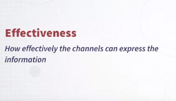

Okay, a very important thing to say about effectiveness is that effectiveness can be designed according to a number of different parameters. And here, there is a list of possible parameters that we can use to define effectiveness more precisely. So what does it mean for a channel to be effective? Well, a channel can be effective if it can represent information accurately. For instance, If a channel is used to represent a quantity, how well can one extract information about quantity by looking at visual information expressed by this channel? Another concept is discriminability. So basically how many different values I can identify in a given channel. Another one is salience, how easy it is to single out information by using one or more channels. Or how easy it is to attract the user, or the reader, or the viewer using one of these channels, attract attention using one of these channels. Another one is separability. If I encode information with more than one channel at the same time, like for instance, in the example that I gave you using the scatter plot and the get minder project. I explained to you that each dot, each bubble encodes information with a number of different channels. In that case, we had, for instance, color and size of the same kind. How do color and size interact, okay? Or other pairs of channels? And the last one is grouping, how easy it is for a given channel to represent information about groups. The idea that some elements are group together formed a group. So we will go through each of these properties individually and going to explain much more in detail what they mean. I'm going to give you a few examples and as I said I'm going to provide many, many more details about what they actually mean. 

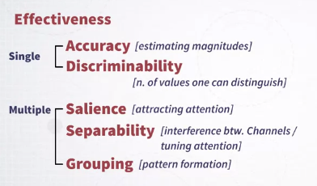

So let's start with accuracy. Accuracy is a very important property. Accuracy means how accurately a given channel can express quantitative information. Information about magnitude.

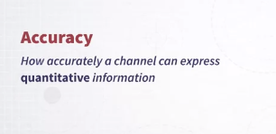

In order to do that I first have to introduce the concept of psychophysics. So what is psychophysics? Psychophysics is a branch of physics and psychology that basically studies the relationship between the physical intensity of a signal and the perceived sensation from a human being, okay? 

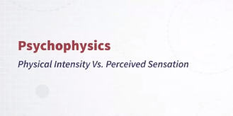

Let me give you an example. Let's say that there is an experiment where the scientist is turning a knob to change the physical intensity of a given signal. Let's say, for instance an audio signal that's somebody's listening to and we have the volume of the signal. Or say, a light, or the intensity of the light is manipulated, is controlled by this knob, okay? On the other side of the experiment, there is a person who's actually observing this light or listening to the volume of this sound. And every time the knob is turned, the experimenter asks the subject how much bigger is the volume, or the light compared to the previous value, okay? So now, by doing this kind of experiment, what the experimenter can do is to find a relationship between how much difference there is between the physical intensity of the signal that can be measured by some physical measurements technology, and the perceived intensity from the human subject. So this is exactly what Fechner did by inventing the whole idea of psychophysics. As I said before, the idea of studying what is the relationship between physical intensity and perceived intensity of a signal. 

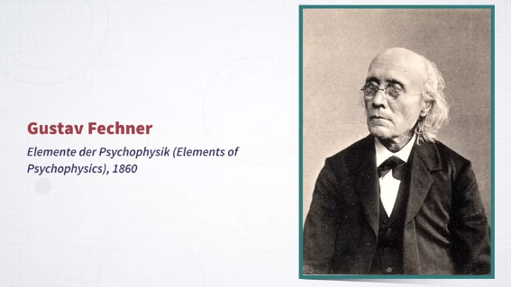

So Fechner invented the whole idea of psychophysics that was in the late 19th century. And in particular, he ran a number of experiments and the most important result that he found, or the foundations of his theory is that the relationship between the physical intensity and the perceived intensity of a signal always follows a power law. So what is a power law? It's basically a mathematical equation or a model that describes the relationship between these two variables, physical intensity and perceived intensity, as a power equation, okay? So in the equation that you see in this image, we have the physical intensity represented by the I. And the perceived intensity represented by the S symbol. And as you can see the mathematical relationship is I to a given number represents the perceived sensation. And that's a power law, okay? You can also see a graph here. <mark>And in this graph, you see examples of curves that have been experimentally generated through experiments in psychophysics.</mark> And here are some of the signals that have been studied. So we have for instance, the brightness of a light, the depth of something, the area of something, the length of something, the color saturation of something, and so on. And as you can see these curves, while belonging to the same categories of mathematical objects, they are all power laws, right? They are obtained from equations that have different exponents, okay? **In particular what you can see is that with some of these curves, if for some of these curves we have under-estimation of the signal, whereas with some other curves with over-estimation of the signal.**

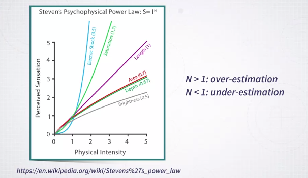

What do I mean by under and over-estimation? It means that when the physically intensity is changed, the way it is perceived maybe when it's under-estimated the sensation that is perceived is actually smaller than the change that has been made on the physical intensity. And the opposite happens when we have over estimation. So why is this important for visualization? Well, because we are studying visual channels, each visual channel can be expressed In terms of this power loss. And it's important for us to know whether a given channel is visually underestimated or overestimated. In particular, in this graph, you can see for instance that brightness, if you use brightness of something to represent a quantity, you can expect under estimation. Whereas if you use length of something, you can expect over estimation. And of course this is very important in the use of visual channels for visual encoding.

### Experiments in "Graphical Perception"

When we talk about accuracy of visual channels, we also have to talk about experiments in graphical perception. What are these experiments? Well, over the years visualization researchers have been running lots of experiments to understand effectiveness of visual channels. 

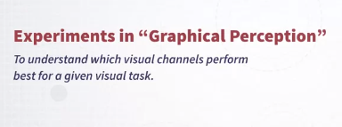

And in particular, we have to talk about the work of Cleveland and McGill. So what does these researchers do? Well, they run very seminal study trying to understand how effectively certain number of channels can represent quantitative information. 

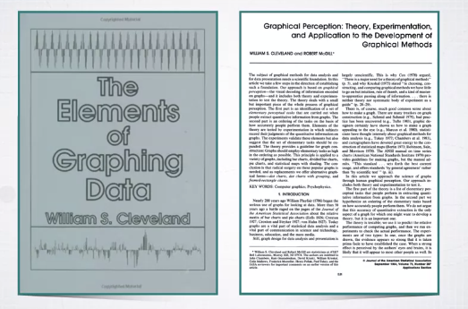

How did they do that? Well, they did it through a very interesting experiment.

In the experiment, they have shown different types of charts, like the one that you see in front of you here, a simple bar chart. And then, marking the elements of this chart with a little dot and asking the subjects to estimate how much bigger one was compared to the other. 

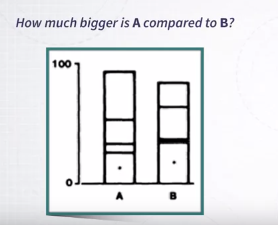

So imagine that I'm showing this chart to you, and I ask you how much bigger is B compared to A. And then, you give me an estimate, say, 50% bigger, 40% bigger, and so on. 

<mark>So what they did was to run this experiment with different types of visual tasks, and using different types of charts</mark>. In this case, you see that we have five different types.

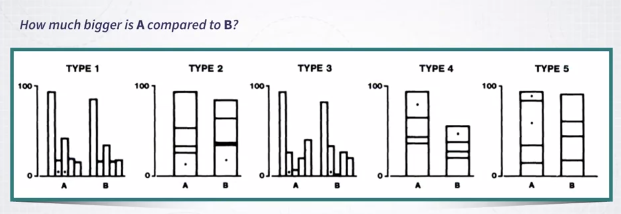

And they always ask for different types and different information, different data to estimate how much bigger is one compare to the other. But if you look carefully, these different types actually introduce, use slightly different ways of representing information, representing quantities. So in the first one, Type 1, we have the length of the bar is used as a way to represent information. And these bars are one next to another, okay? In Type 2, it's exactly the same thing, but the bars are wider. In Type 3, it's exactly the same, but the bars are much more far apart. In Type 4, you see that the dots are only on the segments that are on top. **So what is important here to note is that even though in these two bars we are representing quantity by the length of the bars, these bars are actually not aligned. And because of that, we expect the estimate to be worse, to be harder to make.**

And the same is true four Type 5, with the difference these two segments of bars are actually not separated, but were at one on top of the others. So the main question of the experimenters here was is there a difference between these types? If I ask my subjects, a sufficiently large number of subjects, to make estimates about how much larger is one element compared to the other, do I get different estimates? <mark>And it turns out that, yes, it does lead to different estimates</mark>. So this is the chart that you see below represents the result of the study.

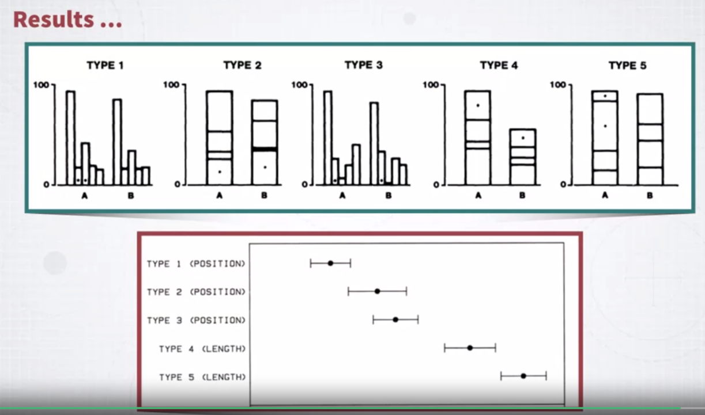

And the dots represent the average amount of error across all the participants. And as you can see, Type 1 is the one that leads to the best estimate. Followed by Type 2, then Type 3, then Type 4, and Type 5. And as you can see, Type 4 and Type 5, which are those in which the estimate is due to the length of bars that are not aligned, perform much worse than the rest.

So why is this important and useful? Well, it's important and useful because it gives you a first guideline on what to do when you are encoding information with different channels. In this case, we can say that if we are representing quantitative information with the length of a bar, the encoding is more effective when the bars are aligned than when they are not aligned. The same type of experiments has been performed with different channels. There is another one that Cleveland and McGill performed that includes a different channel.

So in this experiment, they have been comparing the length of the aligned bars to the angles or areas represented in pie charts. So think about how the same information is encoded in a pie chart and a bar chart.

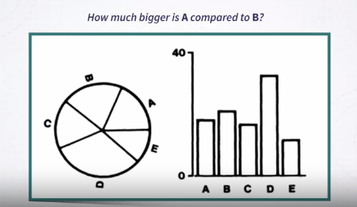

In bar charts, we're using the length of the bar to represent quantity. Whereas in a pie-chart, we're using the angle and the area.

Okay, so they perform exactly the same type of experiments. And the results showed that representing information with the length of aligned bars is much, much more effective than representing information with the angle and area of a pie chart. 

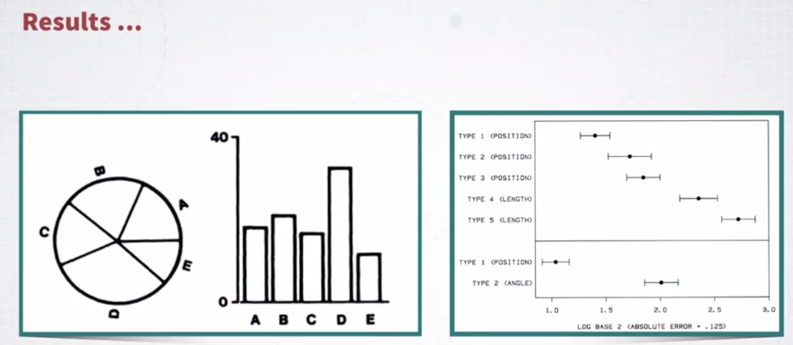

So what does this mean for visualization? Well, that you have another useful guideline. If you want to represent quantitative information, it's in general preferable, if possible, to use length and position of a bar rather than the area and angle of a segment of a pie chart.

### Implications for Design (Accuracy)

Okay. Now, what we need to do next, is to discuss a little bit of what are the implications for design for the accuracy ranking, that we just saw. Okay, you can think of the ranking as roughly grouping the channels into three main groups. So, position is always the best channel and this is followed by length and angle and finally we have area. 

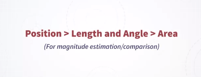

So these are channels that are very commonly used to represent him for quantitative information and more or less, roughly speaking you should always keep in mind these hierarchy, position is past length and angle are a little worse and area a little worse than length and angle. Okay? Keep in mind, that **this is true when we are talking about the problem of visualizing a quantity and comparing quantities**. But not all visualization tasks are about that as we will see later on. Okay. So the rule is, or the guideline more precisely is prioritize high ranking channels in your design if you can. Okay? And also related to that, do not expect your viewers to be able to make accurate comparisons or accurate estimates out of your visualization if you're using channels that come from the low ranking area.

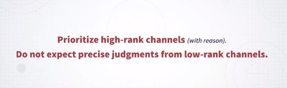

So, that's a general guideline that you may want to follow. Let me give you an example to make this more concrete. So in the following slides, I'm going to show you the same data represented with different charts and this is a simple data set. It's a data set describing sales coming from a private company. In this specific case we're using three variables, we have the profit amount by different categories of products and how it changes over time so the question is, how does the profit change over time for the three categories of products that we have in this company? One way to show this information, is to use what is called a stacked bar chart, which is exactly what you see here. 

So, on the x axis we have time, on the y axis we have the amount of profit, but each bar is also split into the three categories of products. Now, think about it when you're trying to compare the evolution over time of profit across these three categories, you are visually trying to compare the length of the bars and as we know, comparing lengths is not particularly effective especially compared to comparing positions. And that's why, trying to extract this information from this chart is not particularly easy, it's possible but it's not best. 

Here is another example, I'm presenting exactly the same information using a series of pie charts, each single pie chart corresponds to one specific time, sorry, month.

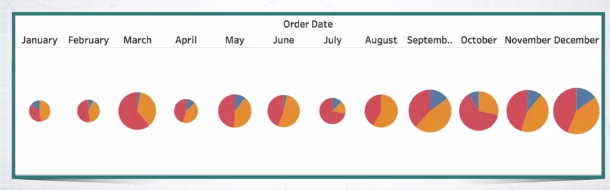

The pie is split into three segments each one representing the amount for that category for that month. Once again, if you try to see what is the temporal evolution of the three categories and compared them, is not easy, not easy at all. And what are we using here? We're using an encoding method that uses angle and area, which again, they are not particularly effective. 

Here is once again another example, very similar to the previous one in this case we are using area, and area once again, is not particularly effective. 

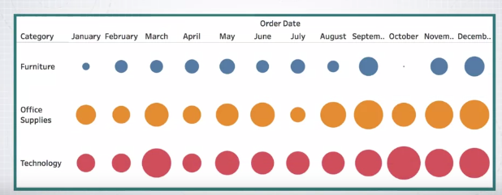

Here, in this bar chart, we are using position. So the position of the top end of each bar is communicating information about the quantity for each one and if you observe this chart for a moment, you will see that extracting information the temporal evolution over time across the three categories it somewhat easier than before. 

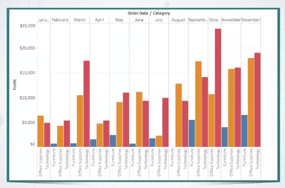

Once you switch to a line chart, that uses position once again, an angle to represent information about variation, this is even better and I would say that's probably the best chart, if the goal, the specific task is to see the evolution over time and how the different categories compare one to another. 

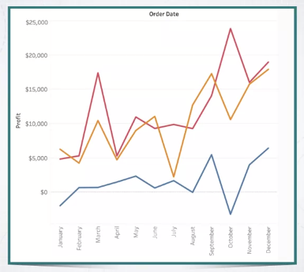

Now, **one thing to keep in mind, is that you should consider the ranking of visual variables or channels as a guideline but it's not a strict rule**. So, there are a number of limitations to these guidelines, so the first one is that, it is very specific to the idea of comparing and estimating magnitudes or quantities and once again, not everything in visualization is about comparing and estimating magnitudes. A lot is about it, but not everything. 

Another important aspect, is that sometime you may want to find a balance between accuracy and other important parameters. 

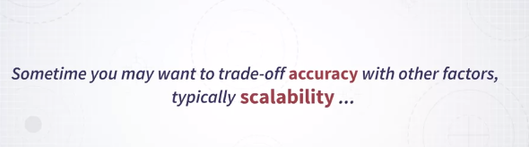

<mark>A very common one is scalability, there are situations where you want to visualize a lot of information at once and because of that, you just don't have enough space to use position or length as the main channel to represent a quantity.</mark> So, a typical example is a heat map, like the one that you see here. In this heat map we have lots of elements, lots of individual elements and magnitude is represented by color intensity.

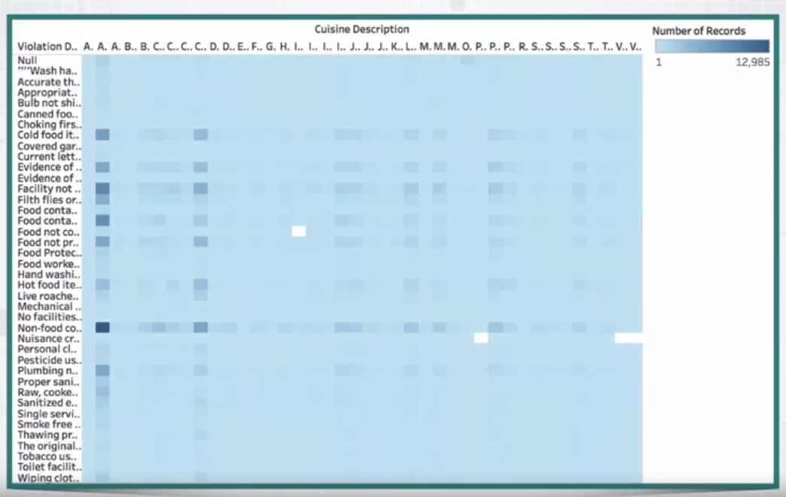

So now, **color intensity is the lowest or one of the lowest channels in terms of accuracy in conveying quantitative information**. Nonetheless, it's very useful in those situations where you need to represent a lot of data points at once, why? Well, because you don't need necessarily a lot of space in order to represent information with color. So once again, in these cases, _keep in mind that you may want to find the balance between competing needs and a very common competing need, is the need of representing a lot of information, so the need to scale up_. So, this concludes this part about accuracy.

### Discriminability

Another important concept to introduce when we talk about channel effectiveness is the concept of discriminability. What does it mean? Well, it means that when you look at how you encode information with one channel, you also have to consider how many distinct values within this channel the viewer is going to be able to perceive.

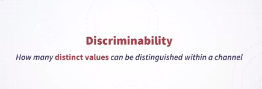

That's a very important characteristic. Let me give you a few examples. For instance, if you're using the area of a bubble to represent a quantity, you want to make sure that you know how many distinct values a viewer is able to perceive. 

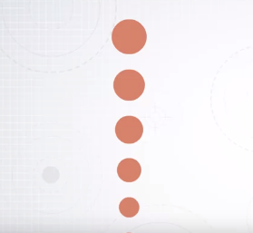

The same is true with say, line width. If you have too many different values, the viewers won't be able to perceive many of them, really. 

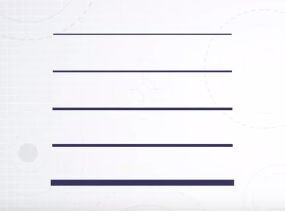

As we will see in a moment, this also depends on other contextual factors.
Very similarly with color. If you have too many colors, you won't be able to distinguish between all of these colors. 

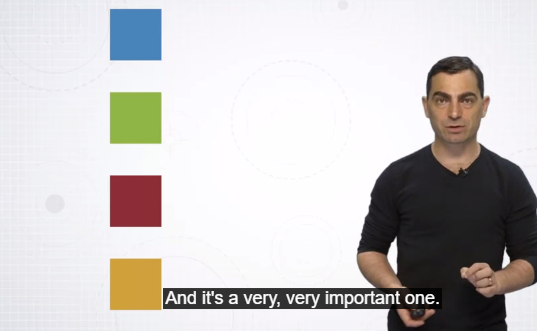

So that's the concept of discriminability. And it's a very, very important one.

In general, discriminability depends on a number of parameters. So it depends on intrinsic properties of the channel typically following the same ranking as the accuracy ranking that we have seen before. But they also depend on many other things. 

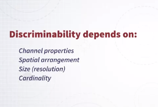

They depend on the spatial arrangement of the visual marks. It depends on size, and it also depends on cardinality. Let me show you these three aspects through a few examples.

So let's start with the effect of **spatial arrangement**.

So here I have, once again, a series of bubbles of different sizes, and when they are presented this way, aligned, you can very easily distinguish their size. 

But once they are arranged in a somewhat more random layout which is typically what you have in this organization, in real data, it's much, much harder to distinguish all of these differences. 

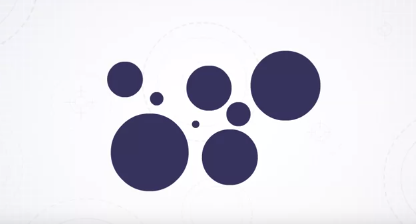

So you can see that there is an effect of layout or spacial arrangement, similarly with color. So here we have lots of different colors. 

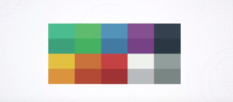

And when they're arranged in a well organized grid, it's somewhat easy to distinguish between them. It's actually pretty easy. But when I use colors, the same set of colors, in a layout where it's much more spread out and random, it's much harder to identify which colors are the same. 

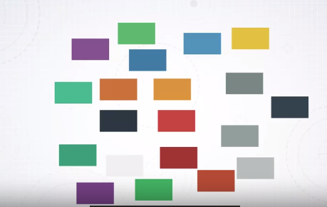

So that's a problem, and it's very important to keep it in mind, when you are designing or using visualizations. 

The second aspect is the effect of **size**. In this affects specially color. Here is a scatterplot showing data coming from food products data set. 

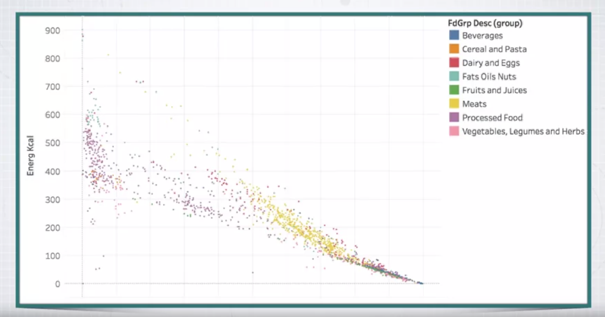

So every single dot is a food product and as you can see, the dots are colored, and they are colored according to a number of categories of food products. Now in this case, I, on purpose, designed these scatter plots in a way that the dots are very small. And because of that, comparing the colors is really hard. Try to do it for a moment, and look also at the legend that you see on the right. There are many cases where it's confusing and it's not clear which color is which. But once I make these dots bigger, much bigger, it becomes much, much easier to compare the colors. 

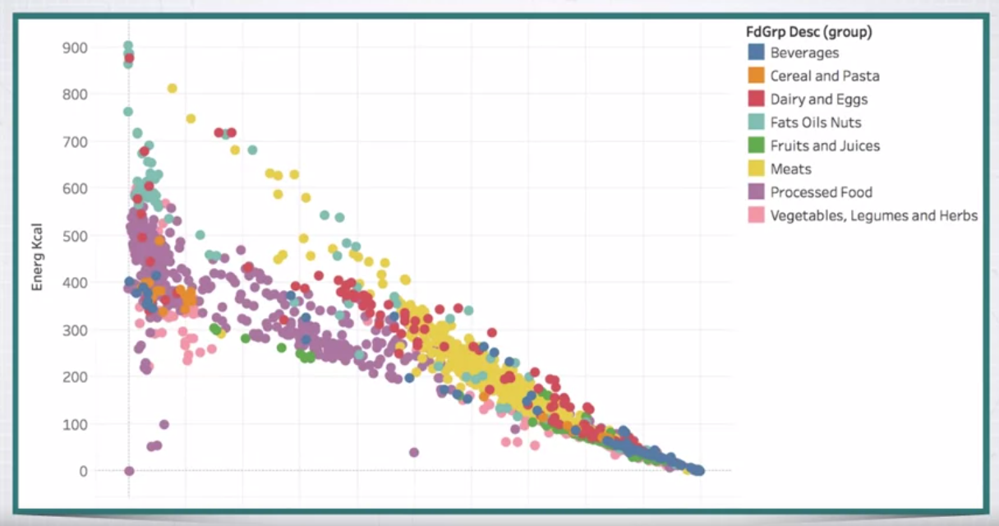

So here is an example that shows you the effect of size with exactly the same channel and exactly the same colors, if the marks are very small, comparing the colors is going to be much, much harder than when you have marks that are bigger. 

Lastly, there is also an effect of **cardinality**. What is cardinality? Cardinality means how many different values you want to be able to represent. And I have, once again, an example with color. 

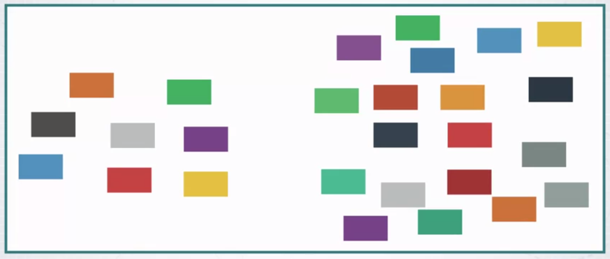

So the color palette and items that you have on the left side is much, much easier to perceive than the one that you have on the right-hand side. Why? Well, because on the right-hand side you have too many distinct values and there are higher chances that you mix one with the other. So cardinality also plays a major role. So in summary, the screening ability is about the property of a channel to create visual representations in which a certain number of values can be discriminated.

And it depends on the accuracy of the channels, but also on a number of other contextual parameters. And this is very important to keep in mind. So discriminability depends on the spatial arrangement, size and cardinality.

### Implications for Design (Discriminability)

What are the main implications for design for discriminability? The most important one is that you should not overestimate the number of distinct values that one can perceive out of your visualization. 

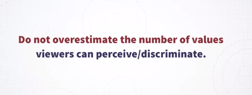

So, in turn, you should never try to encode too much or too many values. Why? Because they create a lot of clutter, they hinder perception, and your viewers won't be able to read them anyway. That's a very, very important problem, and you have to keep it in mind because I see a lot of examples out there where the main source of the problem is exactly not keeping in mind the problem of discriminability. So, this is a very, very special one. It's important to keep it in mind. 

Let me give you a few examples, a few practical examples to make this more concrete. Here is a visualization that is called a tree map, where every single rectangle represents a given category or item, and the size of the rectangle represents a quantity, and color represents a category. 

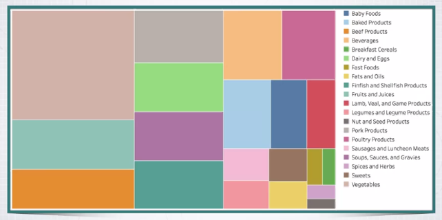

You see the categories on the right once again. Okay. Here we have a quite large number of categories, and it's already quite hard to compare the color of one rectangle to another, but it's okay. It's almost doable. But when we represent the same data in the scatter plot that I've presented to you in the previous video, you'll see that distinguishing all of these categories, it's incredibly hard. 

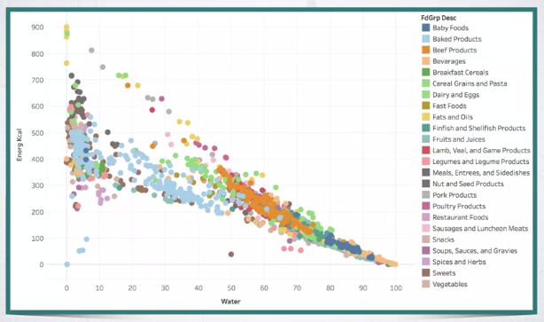

Look at the legend that you have on the right. So, in principle, you should be able to visually detect all of these different categories. But it's virtually impossible because many colors are too similar and also they are overlapping, and it's just too much. So, _the discriminability is too low because you're trying to encode too many values with one channel that is not able to encode all of these values_. 

But don't think that this is only a problem with color. Here is another example. 

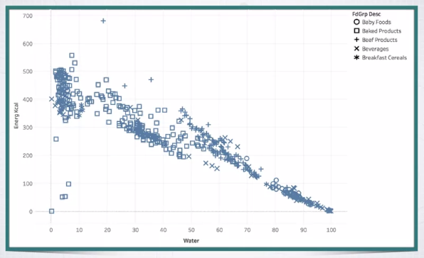

Here I'm encoding information about a number of categories with the same scatter plot using shape. Look at the legend on the right. Here I'm encoding five or six different categories, and each one is represented by a specific shape. So, each item in the scatter plot is represented by a specific shape. As you can see, look at this scatter plot for a moment, you'll see that in many cases, it's hard to discriminate between which category is which. This is just five or six categories. Can you imagine if you try to encode 10, or 12, or 20 categories with shape, it's very, very hard to discriminate among them. 

So, in turn, this means that very often, where you're trying to design new visualizations, you find yourself into the situation where you have to solve the problem that there is an attribute, typically a categorical attribute or categorical variable that has lots of values, and you will like to visualize all of them, to encode all of them in your visualization, but you don't have a channel that is able to _express_ all of these values at once. 

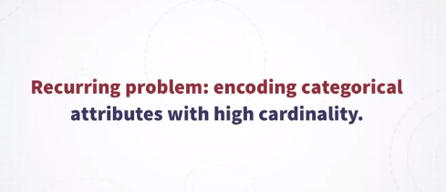

So, take the example of color. There is no way to represent 50 different categories with color. The same is true for most of the other channels. 

So, how do you fix it? How do you fix this problem? 

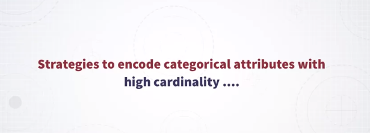

Well, there are three main categories of solutions: **grouping, filtering, and faceting**. Let me go through these three types of solutions. 

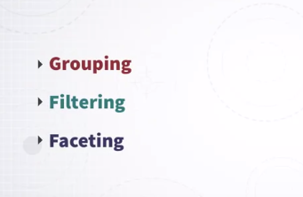

So, the first one is **grouping**. What do you do? You have too many categories. There is no way to represent all of them. So, one thing that you can do is to take these categories and group them together in groups of categories. 

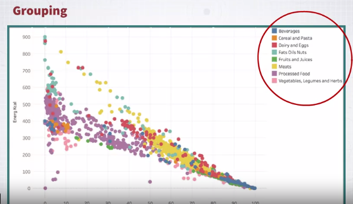

Okay. You're effectively building a hierarchy. So, if there is a way to say, oh, all of these categories can be grouped together in one category, and all of these other ones in another category, and so on, and you can reduce it to, say, five, or four, or six, well, then you are solving the problem by processing the data, and now it's much, much easier to visualize the new data that you have created. So, that's one strategy. So, whenever possible, keep in mind that the good strategies to group categories together. 

Another one is **filtering**. So, maybe out of all these categories, say, 50 categories, what you're really interested in is only a handful of them, say, four, five, again, four, five, six, right? 

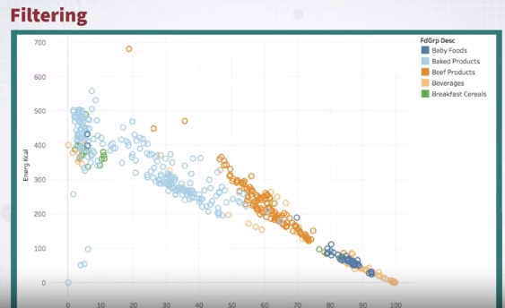

Typically, I think one strategy that I see is often very useful is to look at which categories are those that have the highest frequency and then just keep the top five or top ten. So, that's another useful strategy. 

Finally, there is a strategy that works more on the visual side of things, and it's called **faceting**. So, how does faceting work? So, effectively, what you're trying to do here is to change the channel that you are using to encode the categorical information from channels like color or shape into position, and position, as we have seen before, is a very, very powerful channel. So, how do you do that? So, you basically recreate the same plot multiple times, one next to another, but each plot represents only the data of the category it belongs to. 

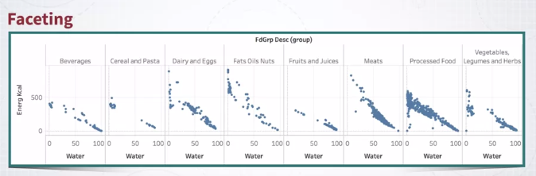

So, in this example, I have taken exactly the same scatter plot, and I split the scatter plot into a number of repeated scatter plots, where each one represents only the fruits that belong to a given category. As you can see, this is way, way more scalable than other channels. Why once again? Because position is a very, very powerful channel. 

If you want, once you do that, now you can redundantly encode the same information with other channels. 

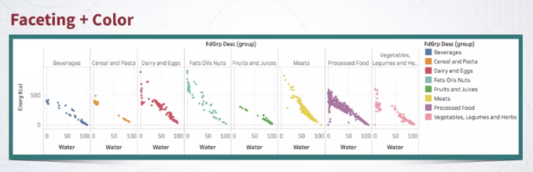

In this case, I'm using color, but I could have used shape or other channels, and this makes it even more powerful. So, in summary, the <mark>main message behind this discriminability is, don't overestimate the power of visual channels to represent a large number of values</mark>. Most of the time, the number of distinct values that can be perceived out of a visualization is very small, in the order of between one, 10, or 15. Much more than that, and you are in trouble.

### Salience (Pop-out)

Another important concept we need to introduce is concept of an old pop-out. What is salience? It's the ability to stand out in a scene. 

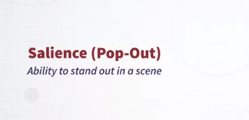

In general, in visualization, there are situations where you want something to stand out from the rest. Let me show you an example. This is the famous Where's Waldo comic strip. 

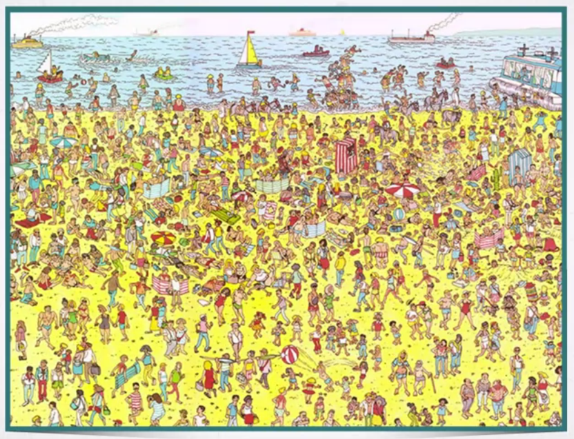

The idea here is to look for the little figure that is called Waldo, and he has a t-shirt with stripes and a hat, and so on. So, why is it so hard to find Waldo? Well, it's hard because there are many things that look like him. So, this makes it visually hard to identify your target. 

But if we put Waldo in a completely different context, where the context is very different, well, then finding Waldo is very easy, as in this image. 

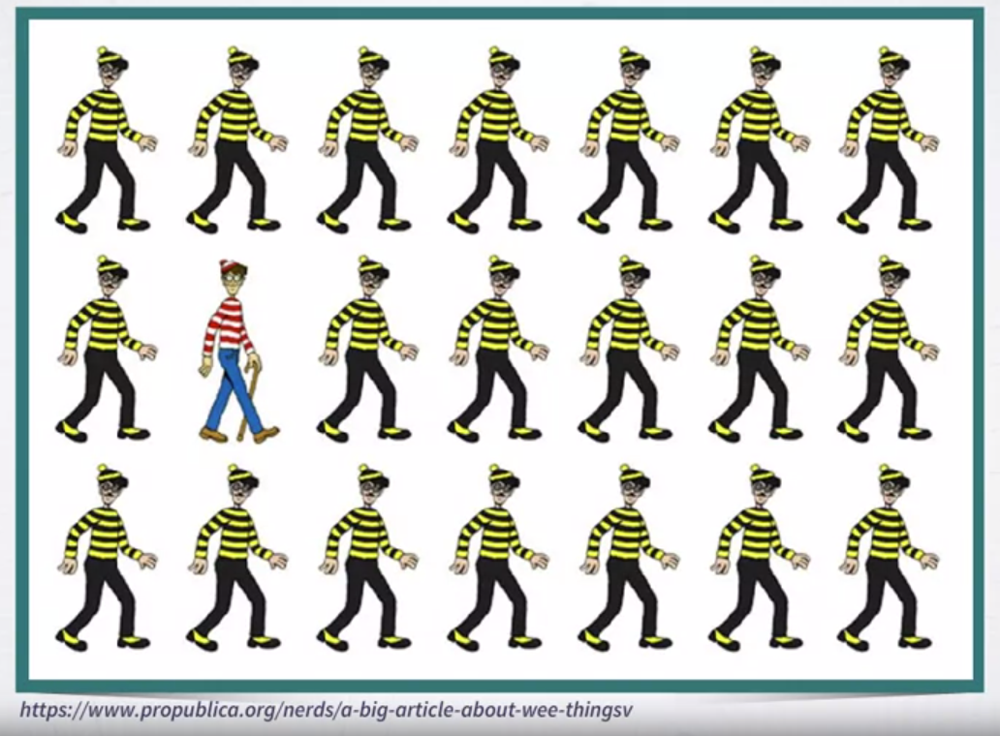

So, this is also true in visualization. Whenever you want to highlight something, or make sure to direct the attention of your viewer, or do something, then you have to consider the problem of salience and pop-out. 

So, this is very highly related to a concept that is called **pre-attentive processing**. So, what is pre-attentive processing? This is a term that has been developed by vision scientist, and it captures the idea that human vision works in a way that some visual features can be detected extremely fast. How fast? Well, typically, a feature, in order to be considered pre-attentive, has to be detected at least in less than 200 or 250 milliseconds. Why is that? Well, because this amount of time is the amount of time that is needed to our eyes to initiate their movement and look for something. In turn, this means that if our visual feature can be detected faster than this amount of time, then it must involve some elements of the parallel low-level vision system. What does it mean? It means that it doesn't depend on us looking at a specific location of the view field that we have in front of us. In turn, this means that these features can be detected very fast and effortlessly. 

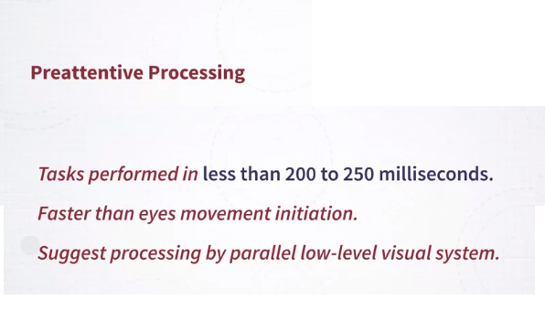

Let me give you an example. This is a very classic example. 

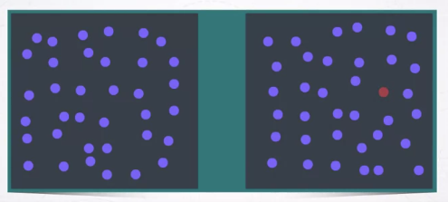

If I have a series of a sea of blue dots, and in this image, some time I have a red dot or I don't have a red dot, and I ask you, I show you a number of images where sometimes there is a red dot, some other times there's no red dot, and I ask you to tell me whether the red dot is present or not, and I show you this image only for a very small amount of time, below the 200 milliseconds threshold, most of the time you will be able to answer correctly. Now let's test this. I want you to try it out. So, in the next animation, so we will be showing a number of images, very similar to what you see here. So, blue dots and sometimes in some images, a red dot is present, and some other times is not present. So, your goal, the exercise is for you to say whether the red dot is present or not. Once the image flickers, the next image is going to tell you absent or present. So, you can check whether your answer was correct or incorrect. You're ready? This is starting now.

So, I hope you can see through your experience now that situations like the one that you have just experienced, looking for a red dot in a sea of blue dots, can be done extremely fast by our visual system. 

So, this is not limited to finding a red dot in a sea of blue dots. The same is true in this other example. 

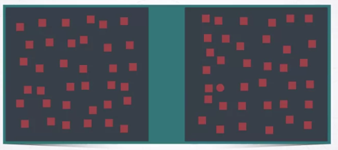

If I ask you to look for the squared mark in a sea of circles, once again, you will be able to do it pretty fast. It's not as fast as color, but it's fast. Because of that, this is also considered pre-attentive. So, let's try exactly the same exercise, where the target is a square versus in a sea of red dots.

The interesting thing is that vision scientists have been testing many other visual features to see whether they are pre-attentive or not. It turns out that there are many visual features that are pre-attentive and typically, most of the channels that we described previously in the previous videos actually correspond to pre-attentive visual features. So, here is a non-exhaustive list of features that are pre-attentive. 

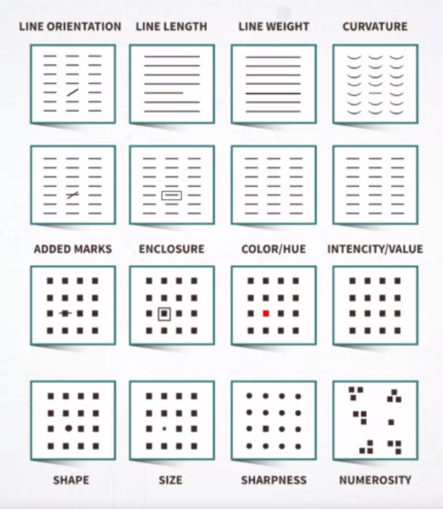

<mark>Some of them are very commonly used in visualization design, and all of them are features that can be detected very fast. Because of that, they are very good candidates of features to use in visualization design to encode information.</mark>

