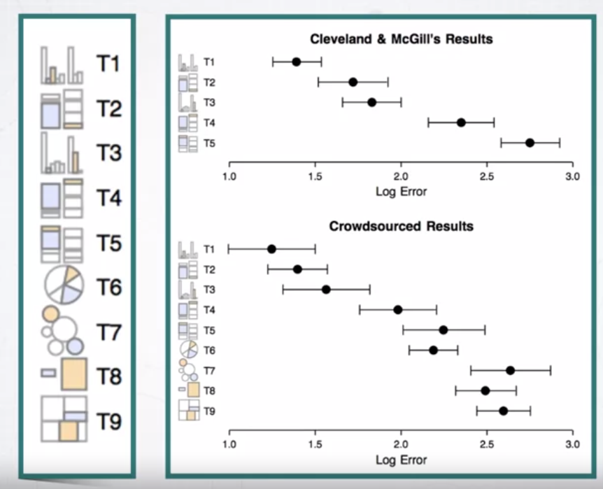
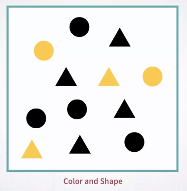
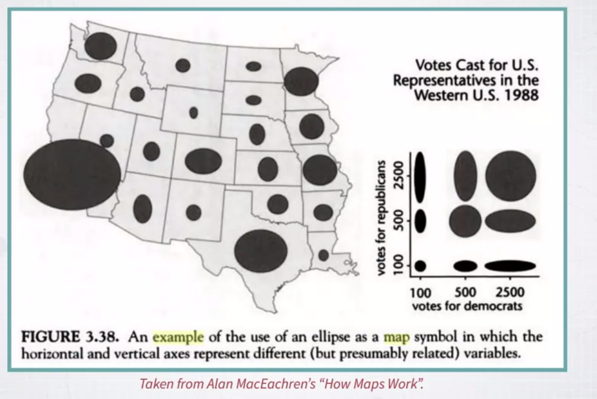
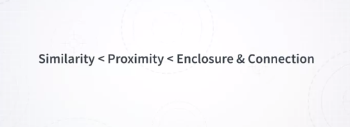

# Applied Perception &mdash Week 2

### Effectiveness of Visual Channels

After covering the concept of expressiveness, now we need to talk about effectiveness. What is effectiveness? Effectiveness is about how well a given channel can represent certain type of information. 

Okay, a very important thing to say about effectiveness is that effectiveness can be designed according to a number of different parameters. And here, there is a list of possible parameters that we can use to define effectiveness more precisely. So what does it mean for a channel to be effective? Well, a channel can be effective if it can represent information accurately. For instance, If a channel is used to represent a quantity, how well can one extract information about quantity by looking at visual information expressed by this channel? Another concept is discriminability. So basically how many different values I can identify in a given channel. Another one is salience, how easy it is to single out information by using one or more channels. Or how easy it is to attract the user, or the reader, or the viewer using one of these channels, attract attention using one of these channels. Another one is separability. If I encode information with more than one channel at the same time, like for instance, in the example that I gave you using the scatter plot and the get minder project. I explained to you that each dot, each bubble encodes information with a number of different channels. In that case, we had, for instance, color and size of the same kind. How do color and size interact, okay? Or other pairs of channels? And the last one is grouping, how easy it is for a given channel to represent information about groups. The idea that some elements are group together formed a group. So we will go through each of these properties individually and going to explain much more in detail what they mean. I'm going to give you a few examples and as I said I'm going to provide many, many more details about what they actually mean. 

So let's start with accuracy. Accuracy is a very important property. Accuracy means how accurately a given channel can express quantitative information. Information about magnitude.

In order to do that I first have to introduce the concept of psychophysics. So what is psychophysics? Psychophysics is a branch of physics and psychology that basically studies the relationship between the physical intensity of a signal and the perceived sensation from a human being, okay? 

Let me give you an example. Let's say that there is an experiment where the scientist is turning a knob to change the physical intensity of a given signal. Let's say, for instance an audio signal that's somebody's listening to and we have the volume of the signal. Or say, a light, or the intensity of the light is manipulated, is controlled by this knob, okay? On the other side of the experiment, there is a person who's actually observing this light or listening to the volume of this sound. And every time the knob is turned, the experimenter asks the subject how much bigger is the volume, or the light compared to the previous value, okay? So now, by doing this kind of experiment, what the experimenter can do is to find a relationship between how much difference there is between the physical intensity of the signal that can be measured by some physical measurements technology, and the perceived intensity from the human subject. So this is exactly what Fechner did by inventing the whole idea of psychophysics. As I said before, the idea of studying what is the relationship between physical intensity and perceived intensity of a signal. 

So Fechner invented the whole idea of psychophysics that was in the late 19th century. And in particular, he ran a number of experiments and the most important result that he found, or the foundations of his theory is that the relationship between the physical intensity and the perceived intensity of a signal always follows a power law. So what is a power law? It's basically a mathematical equation or a model that describes the relationship between these two variables, physical intensity and perceived intensity, as a power equation, okay? So in the equation that you see in this image, we have the physical intensity represented by the I. And the perceived intensity represented by the S symbol. And as you can see the mathematical relationship is I to a given number represents the perceived sensation. And that's a power law, okay? You can also see a graph here. <mark>And in this graph, you see examples of curves that have been experimentally generated through experiments in psychophysics.</mark> And here are some of the signals that have been studied. So we have for instance, the brightness of a light, the depth of something, the area of something, the length of something, the color saturation of something, and so on. And as you can see these curves, while belonging to the same categories of mathematical objects, they are all power laws, right? They are obtained from equations that have different exponents, okay? **In particular what you can see is that with some of these curves, if for some of these curves we have under-estimation of the signal, whereas with some other curves with over-estimation of the signal.**

What do I mean by under and over-estimation? It means that when the physically intensity is changed, the way it is perceived maybe when it's under-estimated the sensation that is perceived is actually smaller than the change that has been made on the physical intensity. And the opposite happens when we have over estimation. So why is this important for visualization? Well, because we are studying visual channels, each visual channel can be expressed In terms of this power loss. And it's important for us to know whether a given channel is visually underestimated or overestimated. In particular, in this graph, you can see for instance that brightness, if you use brightness of something to represent a quantity, you can expect under estimation. Whereas if you use length of something, you can expect over estimation. And of course this is very important in the use of visual channels for visual encoding.

### Experiments in "Graphical Perception"

When we talk about accuracy of visual channels, we also have to talk about experiments in graphical perception. What are these experiments? Well, over the years visualization researchers have been running lots of experiments to understand effectiveness of visual channels. 

And in particular, we have to talk about the work of Cleveland and McGill. So what does these researchers do? Well, they run very seminal study trying to understand how effectively certain number of channels can represent quantitative information. 

How did they do that? Well, they did it through a very interesting experiment.

In the experiment, they have shown different types of charts, like the one that you see in front of you here, a simple bar chart. And then, marking the elements of this chart with a little dot and asking the subjects to estimate how much bigger one was compared to the other. 

So imagine that I'm showing this chart to you, and I ask you how much bigger is B compared to A. And then, you give me an estimate, say, 50% bigger, 40% bigger, and so on. 

<mark>So what they did was to run this experiment with different types of visual tasks, and using different types of charts</mark>. In this case, you see that we have five different types.

And they always ask for different types and different information, different data to estimate how much bigger is one compare to the other. But if you look carefully, these different types actually introduce, use slightly different ways of representing information, representing quantities. So in the first one, Type 1, we have the length of the bar is used as a way to represent information. And these bars are one next to another, okay? In Type 2, it's exactly the same thing, but the bars are wider. In Type 3, it's exactly the same, but the bars are much more far apart. In Type 4, you see that the dots are only on the segments that are on top. **So what is important here to note is that even though in these two bars we are representing quantity by the length of the bars, these bars are actually not aligned. And because of that, we expect the estimate to be worse, to be harder to make.**

And the same is true four Type 5, with the difference these two segments of bars are actually not separated, but were at one on top of the others. So the main question of the experimenters here was is there a difference between these types? If I ask my subjects, a sufficiently large number of subjects, to make estimates about how much larger is one element compared to the other, do I get different estimates? <mark>And it turns out that, yes, it does lead to different estimates</mark>. So this is the chart that you see below represents the result of the study.

And the dots represent the average amount of error across all the participants. And as you can see, Type 1 is the one that leads to the best estimate. Followed by Type 2, then Type 3, then Type 4, and Type 5. And as you can see, Type 4 and Type 5, which are those in which the estimate is due to the length of bars that are not aligned, perform much worse than the rest.

So why is this important and useful? Well, it's important and useful because it gives you a first guideline on what to do when you are encoding information with different channels. In this case, we can say that if we are representing quantitative information with the length of a bar, the encoding is more effective when the bars are aligned than when they are not aligned. The same type of experiments has been performed with different channels. There is another one that Cleveland and McGill performed that includes a different channel.

So in this experiment, they have been comparing the length of the aligned bars to the angles or areas represented in pie charts. So think about how the same information is encoded in a pie chart and a bar chart.

In bar charts, we're using the length of the bar to represent quantity. Whereas in a pie-chart, we're using the angle and the area.

Okay, so they perform exactly the same type of experiments. And the results showed that representing information with the length of aligned bars is much, much more effective than representing information with the angle and area of a pie chart. 

So what does this mean for visualization? Well, that you have another useful guideline. If you want to represent quantitative information, it's in general preferable, if possible, to use length and position of a bar rather than the area and angle of a segment of a pie chart.

### Implications for Design (Accuracy)

Okay. Now, what we need to do next, is to discuss a little bit of what are the implications for design for the accuracy ranking, that we just saw. Okay, you can think of the ranking as roughly grouping the channels into three main groups. So, position is always the best channel and this is followed by length and angle and finally we have area. 

So these are channels that are very commonly used to represent him for quantitative information and more or less, roughly speaking you should always keep in mind these hierarchy, position is past length and angle are a little worse and area a little worse than length and angle. Okay? Keep in mind, that **this is true when we are talking about the problem of visualizing a quantity and comparing quantities**. But not all visualization tasks are about that as we will see later on. Okay. So the rule is, or the guideline more precisely is prioritize high ranking channels in your design if you can. Okay? And also related to that, do not expect your viewers to be able to make accurate comparisons or accurate estimates out of your visualization if you're using channels that come from the low ranking area.

So, that's a general guideline that you may want to follow. Let me give you an example to make this more concrete. So in the following slides, I'm going to show you the same data represented with different charts and this is a simple data set. It's a data set describing sales coming from a private company. In this specific case we're using three variables, we have the profit amount by different categories of products and how it changes over time so the question is, how does the profit change over time for the three categories of products that we have in this company? One way to show this information, is to use what is called a stacked bar chart, which is exactly what you see here. 

So, on the x axis we have time, on the y axis we have the amount of profit, but each bar is also split into the three categories of products. Now, think about it when you're trying to compare the evolution over time of profit across these three categories, you are visually trying to compare the length of the bars and as we know, comparing lengths is not particularly effective especially compared to comparing positions. And that's why, trying to extract this information from this chart is not particularly easy, it's possible but it's not best. 

Here is another example, I'm presenting exactly the same information using a series of pie charts, each single pie chart corresponds to one specific time, sorry, month.

The pie is split into three segments each one representing the amount for that category for that month. Once again, if you try to see what is the temporal evolution of the three categories and compared them, is not easy, not easy at all. And what are we using here? We're using an encoding method that uses angle and area, which again, they are not particularly effective. 

Here is once again another example, very similar to the previous one in this case we are using area, and area once again, is not particularly effective. 

Here, in this bar chart, we are using position. So the position of the top end of each bar is communicating information about the quantity for each one and if you observe this chart for a moment, you will see that extracting information the temporal evolution over time across the three categories it somewhat easier than before. 

Once you switch to a line chart, that uses position once again, an angle to represent information about variation, this is even better and I would say that's probably the best chart, if the goal, the specific task is to see the evolution over time and how the different categories compare one to another. 

Now, **one thing to keep in mind, is that you should consider the ranking of visual variables or channels as a guideline but it's not a strict rule**. So, there are a number of limitations to these guidelines, so the first one is that, it is very specific to the idea of comparing and estimating magnitudes or quantities and once again, not everything in visualization is about comparing and estimating magnitudes. A lot is about it, but not everything. 

Another important aspect, is that sometime you may want to find a balance between accuracy and other important parameters. 

<mark>A very common one is scalability, there are situations where you want to visualize a lot of information at once and because of that, you just don't have enough space to use position or length as the main channel to represent a quantity.</mark> So, a typical example is a heat map, like the one that you see here. In this heat map we have lots of elements, lots of individual elements and magnitude is represented by color intensity.

So now, **color intensity is the lowest or one of the lowest channels in terms of accuracy in conveying quantitative information**. Nonetheless, it's very useful in those situations where you need to represent a lot of data points at once, why? Well, because you don't need necessarily a lot of space in order to represent information with color. So once again, in these cases, _keep in mind that you may want to find the balance between competing needs and a very common competing need, is the need of representing a lot of information, so the need to scale up_. So, this concludes this part about accuracy.

### Discriminability

Another important concept to introduce when we talk about channel effectiveness is the concept of discriminability. What does it mean? Well, it means that when you look at how you encode information with one channel, you also have to consider how many distinct values within this channel the viewer is going to be able to perceive.

That's a very important characteristic. Let me give you a few examples. For instance, if you're using the area of a bubble to represent a quantity, you want to make sure that you know how many distinct values a viewer is able to perceive. 

The same is true with say, line width. If you have too many different values, the viewers won't be able to perceive many of them, really. 

As we will see in a moment, this also depends on other contextual factors.
Very similarly with color. If you have too many colors, you won't be able to distinguish between all of these colors. 

So that's the concept of discriminability. And it's a very, very important one.

In general, discriminability depends on a number of parameters. So it depends on intrinsic properties of the channel typically following the same ranking as the accuracy ranking that we have seen before. But they also depend on many other things. 

They depend on the spatial arrangement of the visual marks. It depends on size, and it also depends on cardinality. Let me show you these three aspects through a few examples.

So let's start with the effect of **spatial arrangement**.

So here I have, once again, a series of bubbles of different sizes, and when they are presented this way, aligned, you can very easily distinguish their size. 

But once they are arranged in a somewhat more random layout which is typically what you have in this organization, in real data, it's much, much harder to distinguish all of these differences. 

So you can see that there is an effect of layout or spacial arrangement, similarly with color. So here we have lots of different colors. 

And when they're arranged in a well organized grid, it's somewhat easy to distinguish between them. It's actually pretty easy. But when I use colors, the same set of colors, in a layout where it's much more spread out and random, it's much harder to identify which colors are the same. 

So that's a problem, and it's very important to keep it in mind, when you are designing or using visualizations. 

The second aspect is the effect of **size**. In this affects specially color. Here is a scatterplot showing data coming from food products data set. 

So every single dot is a food product and as you can see, the dots are colored, and they are colored according to a number of categories of food products. Now in this case, I, on purpose, designed these scatter plots in a way that the dots are very small. And because of that, comparing the colors is really hard. Try to do it for a moment, and look also at the legend that you see on the right. There are many cases where it's confusing and it's not clear which color is which. But once I make these dots bigger, much bigger, it becomes much, much easier to compare the colors. 

So here is an example that shows you the effect of size with exactly the same channel and exactly the same colors, if the marks are very small, comparing the colors is going to be much, much harder than when you have marks that are bigger. 

Lastly, there is also an effect of **cardinality**. What is cardinality? Cardinality means how many different values you want to be able to represent. And I have, once again, an example with color. 

So the color palette and items that you have on the left side is much, much easier to perceive than the one that you have on the right-hand side. Why? Well, because on the right-hand side you have too many distinct values and there are higher chances that you mix one with the other. So cardinality also plays a major role. So in summary, the screening ability is about the property of a channel to create visual representations in which a certain number of values can be discriminated.

And it depends on the accuracy of the channels, but also on a number of other contextual parameters. And this is very important to keep in mind. So discriminability depends on the spatial arrangement, size and cardinality.

### Implications for Design (Discriminability)

What are the main implications for design for discriminability? The most important one is that you should not overestimate the number of distinct values that one can perceive out of your visualization. 

So, in turn, you should never try to encode too much or too many values. Why? Because they create a lot of clutter, they hinder perception, and your viewers won't be able to read them anyway. That's a very, very important problem, and you have to keep it in mind because I see a lot of examples out there where the main source of the problem is exactly not keeping in mind the problem of discriminability. So, this is a very, very special one. It's important to keep it in mind. 

Let me give you a few examples, a few practical examples to make this more concrete. Here is a visualization that is called a tree map, where every single rectangle represents a given category or item, and the size of the rectangle represents a quantity, and color represents a category. 

You see the categories on the right once again. Okay. Here we have a quite large number of categories, and it's already quite hard to compare the color of one rectangle to another, but it's okay. It's almost doable. But when we represent the same data in the scatter plot that I've presented to you in the previous video, you'll see that distinguishing all of these categories, it's incredibly hard. 

Look at the legend that you have on the right. So, in principle, you should be able to visually detect all of these different categories. But it's virtually impossible because many colors are too similar and also they are overlapping, and it's just too much. So, _the discriminability is too low because you're trying to encode too many values with one channel that is not able to encode all of these values_. 

But don't think that this is only a problem with color. Here is another example. 

Here I'm encoding information about a number of categories with the same scatter plot using shape. Look at the legend on the right. Here I'm encoding five or six different categories, and each one is represented by a specific shape. So, each item in the scatter plot is represented by a specific shape. As you can see, look at this scatter plot for a moment, you'll see that in many cases, it's hard to discriminate between which category is which. This is just five or six categories. Can you imagine if you try to encode 10, or 12, or 20 categories with shape, it's very, very hard to discriminate among them. 

So, in turn, this means that very often, where you're trying to design new visualizations, you find yourself into the situation where you have to solve the problem that there is an attribute, typically a categorical attribute or categorical variable that has lots of values, and you will like to visualize all of them, to encode all of them in your visualization, but you don't have a channel that is able to _express_ all of these values at once. 

So, take the example of color. There is no way to represent 50 different categories with color. The same is true for most of the other channels. 

So, how do you fix it? How do you fix this problem? 

Well, there are three main categories of solutions: **grouping, filtering, and faceting**. Let me go through these three types of solutions. 

So, the first one is **grouping**. What do you do? You have too many categories. There is no way to represent all of them. So, one thing that you can do is to take these categories and group them together in groups of categories. 

Okay. You're effectively building a hierarchy. So, if there is a way to say, oh, all of these categories can be grouped together in one category, and all of these other ones in another category, and so on, and you can reduce it to, say, five, or four, or six, well, then you are solving the problem by processing the data, and now it's much, much easier to visualize the new data that you have created. So, that's one strategy. So, whenever possible, keep in mind that the good strategies to group categories together. 

Another one is **filtering**. So, maybe out of all these categories, say, 50 categories, what you're really interested in is only a handful of them, say, four, five, again, four, five, six, right? 

Typically, I think one strategy that I see is often very useful is to look at which categories are those that have the highest frequency and then just keep the top five or top ten. So, that's another useful strategy. 

Finally, there is a strategy that works more on the visual side of things, and it's called **faceting**. So, how does faceting work? So, effectively, what you're trying to do here is to change the channel that you are using to encode the categorical information from channels like color or shape into position, and position, as we have seen before, is a very, very powerful channel. So, how do you do that? So, you basically recreate the same plot multiple times, one next to another, but each plot represents only the data of the category it belongs to. 

So, in this example, I have taken exactly the same scatter plot, and I split the scatter plot into a number of repeated scatter plots, where each one represents only the fruits that belong to a given category. As you can see, this is way, way more scalable than other channels. Why once again? Because position is a very, very powerful channel. 

If you want, once you do that, now you can redundantly encode the same information with other channels. 

In this case, I'm using color, but I could have used shape or other channels, and this makes it even more powerful. So, in summary, the <mark>main message behind this discriminability is, don't overestimate the power of visual channels to represent a large number of values</mark>. Most of the time, the number of distinct values that can be perceived out of a visualization is very small, in the order of between one, 10, or 15. Much more than that, and you are in trouble.

### Salience (Pop-out)

Another important concept we need to introduce is concept of an old pop-out. What is salience? It's the ability to stand out in a scene. 

In general, in visualization, there are situations where you want something to stand out from the rest. Let me show you an example. This is the famous Where's Waldo comic strip. 

The idea here is to look for the little figure that is called Waldo, and he has a t-shirt with stripes and a hat, and so on. So, why is it so hard to find Waldo? Well, it's hard because there are many things that look like him. So, this makes it visually hard to identify your target. 

But if we put Waldo in a completely different context, where the context is very different, well, then finding Waldo is very easy, as in this image. 

So, this is also true in visualization. Whenever you want to highlight something, or make sure to direct the attention of your viewer, or do something, then you have to consider the problem of salience and pop-out. 

So, this is very highly related to a concept that is called **pre-attentive processing**. So, what is pre-attentive processing? This is a term that has been developed by vision scientist, and it captures the idea that human vision works in a way that some visual features can be detected extremely fast. How fast? Well, typically, a feature, in order to be considered pre-attentive, has to be detected at least in less than 200 or 250 milliseconds. Why is that? Well, because this amount of time is the amount of time that is needed to our eyes to initiate their movement and look for something. In turn, this means that if our visual feature can be detected faster than this amount of time, then it must involve some elements of the parallel low-level vision system. What does it mean? It means that it doesn't depend on us looking at a specific location of the view field that we have in front of us. In turn, this means that these features can be detected very fast and effortlessly. 

Let me give you an example. This is a very classic example. 

If I have a series of a sea of blue dots, and in this image, some time I have a red dot or I don't have a red dot, and I ask you, I show you a number of images where sometimes there is a red dot, some other times there's no red dot, and I ask you to tell me whether the red dot is present or not, and I show you this image only for a very small amount of time, below the 200 milliseconds threshold, most of the time you will be able to answer correctly. Now let's test this. I want you to try it out. So, in the next animation, so we will be showing a number of images, very similar to what you see here. So, blue dots and sometimes in some images, a red dot is present, and some other times is not present. So, your goal, the exercise is for you to say whether the red dot is present or not. Once the image flickers, the next image is going to tell you absent or present. So, you can check whether your answer was correct or incorrect. You're ready? This is starting now.

So, I hope you can see through your experience now that situations like the one that you have just experienced, looking for a red dot in a sea of blue dots, can be done extremely fast by our visual system. 

So, this is not limited to finding a red dot in a sea of blue dots. The same is true in this other example. 

If I ask you to look for the squared mark in a sea of circles, once again, you will be able to do it pretty fast. It's not as fast as color, but it's fast. Because of that, this is also considered pre-attentive. So, let's try exactly the same exercise, where the target is a square versus in a sea of red dots.

The interesting thing is that vision scientists have been testing many other visual features to see whether they are pre-attentive or not. It turns out that there are many visual features that are pre-attentive and typically, most of the channels that we described previously in the previous videos actually correspond to pre-attentive visual features. So, here is a non-exhaustive list of features that are pre-attentive. 

<mark>Some of them are very commonly used in visualization design, and all of them are features that can be detected very fast. Because of that, they are very good candidates of features to use in visualization design to encode information.</mark>

### Non Preattentive Features

Now you may wonder: if there are visual features that are pre-attentive, what is not pre-attentive? That's a reasonable question. Well, first of all, there are actually visual features that are not pre-attentive. 

An example is these two features. 

So, if you look at the image on the left and you assign the task of looking for objects that have a junction or don't have a junction, well, this task is not pre-attentive. Similarly, if you have pairs of lines and some of them are parallel and some others are not, this is not pre-attentive. So, these are results that come from several studies that vision scientists generated over the years. 

There is another important element here to consider, **that not only some visual features are not pre-attentive but also the combination of some visual features is not pre-attentive and this is much, much more important from the visualization design standpoint**. 

In particular, if I ask you to look for something and this something requires you to consider two features at once, then this task and this combination of features it's no longer pre-attentive. So, let's go back to a similar example to those that we had before but a little variation. Once again, we have dots in squares and these dots and squares some of them are blue and some of them are red. 

Now, in a configuration like this one, if I ask you to look for the red dot, now this search requires you to search using two visual features at the same time. Is not sufficient to look for something that is a circle, and is not sufficient to look for something that is red. You need to find a circle that is red. So, this is a _conjunction_ of two features at the same time. As you will see in a moment, this is not pre-attentive. Let's go to exactly the same exercise as we have done before. We are going to show you a sequence of images and you have to look for the red dot, and tell whether these red dot is present in the image or not. As you will see, this is much, much harder than the conditions that you tried before.

Technically speaking, this is called a **conjunctive search**. What is a conjunctive search? It's looking for a target that requires looking for something that combines two or even more features at the same time? Once again, this is not pre-attentive. Why it is not pre-attentive? Well, because it requires the viewer to scan the whole view in order to search for the target. Because of that, the visual processing that is performed, it's no longer parallel but it's sequential. 

What do I mean by sequential? I mean that the viewer needs to scan the view and look for the target rather than perceiving the target right away suddenly. Here is an image that explains a little bit of what it means to have a serial search in an image. 

Here is an eye tracking scan, that has been performed by a group of scientists from MIT when they are looking for Waldo, in an image of where is Waldo. The lines that you see are basically the traces of the movement of the eyes that the participants make when they're looking for Waldo. This is one example of one participant. As you can see, what happens is that people are scanning the entire image and little by little trying to converge towards the area that contains the final target. As you can imagine, these takes much, much more time than the situation where you have a pre-attentive feature that is immediately perceived all at once. So that's the main difference. 

Now, there are another couple of important considerations to make on pre-attentive features. So, the first one is that **some features are stronger than others**. Let me give you an example. 

So, here, I have a number of bubbles, and some of these bubbles are bigger than others, and some of these bubbles are colored differently than the others, and some of these bubbles are. If you want to look for blue bubbles, it's easy for you to focus on the blue bubbles. *But if I ask you to focus to search for big bubbles, it's a little, little harder than looking for colored bubbles*. **Both are pre-attentive but color is stronger than size**. 

Another factor is that some of these features are asymmetric. What do I mean? I mean that, when you look at the feature, when you use the feature, if the feature as a directionality, then one direction is easier to perceive than the other. 

Here is another example. 

Once again, I have a number of bubbles and two bubbles are bigger than others. So, these two bubbles stand out, pop out, they are very, very salient. 

But now, if I switch to the other condition where the two bubbles are the only ones that are smaller in a sea of larger bubbles, they don't really stand out as much as in this situation. So, this is an example of a pre-attentive feature that is asymmetric.

### Implications for Design (Salience)

Now, what are the main implications for design for the salience part that we just saw in the previous video? There are a couple of really important implications. The first one is that _it's very important for you as a visualization designer to always be mindful about how you are directing the viewer's attention_. Whenever you show a visualization to a viewer, there is always something that grabs the person's attention.

You have to be really careful about how you're designing is encouraging specific kind of visual tuning to certain kinds of graphical elements. In other words, _if you don't think about it, it may be harder for the reader to understand exactly what to extract out of a visual representation_. Similar to that, or as a consequence of that, if you are using too many visual channels at once into many values within each visual channel, the more you have, the harder it is to tune on specific things. 

As we will see in a moment in the later videos, we will also see that channels interact one to another in very specific ways. So, the more channels you have, the more values you try to depict, the harder it is to tune on specific patterns. 

Let me give you an example. Here I have a series of line charts. 

This is data coming from conference publications. Every single group of lines represents one conference, and each line represents one type of paper. Now, the idea here is that we want to see, over the years, our different paper types distribute across different conferences. In this specific solution, I've colored every single line with the color that represents the type of paper. Now, if you notice, look carefully, there are lines at the bottom that all behave the same, whereas there are two lines that tend to behave differently not only over time, but also across conferences. So, in a way, what is really interesting and important here in these graphics is what these two lines are doing, because the rest is not really important. So, differentiating between them is not really going to help out much. So, what can you do here? You can switch from this visual representation to this one, where all the lines that are on the bottom have been grayed out. 

So, they're all painted with gray. Now, as you can see, the attention, the tuning is on the two lines of interests. So, this is an example of <mark>how to use graphical properties in a way that directs the viewer's attention to what is really important, and at the same time is offloading the cognitive effort to understand what to attend to. So, this is very useful</mark>. 

So, as a general remark here, I would say you have to remember a couple of things. One is to use color sparingly. This is something that we are going to talk again about in the later section when we talk exclusively about color. Similarly, learn how to use gray shades because they tend to attract attention much, much less than all the other colors and the colors that remains standout compared to the rest. 

So, this is a very useful trick as a way to tell the viewer implicitly what elements he or she should attend to.

### Separability

In the previous videos, when we talked about pre-attentive processing, you notice that when we encode information with more than one feature, and when the viewer needs to search for something that requires looking for multiple features, then things get more complicated. Okay? 

Now, another related project, sorry, another related concept is the concept of visual separability. What is separability? It's the idea that when we are encoding information with more than one channel, how easy is it to focus your attention on one channel versus the other? 

So, if you remember the previous examples, how easy is it to visually tune your attention to colored dots versus large objects? Okay? Now, let me give you a couple of additional examples. 

Here we have a few dots, and some of them are separated in two groups. Within these groups, we have dots of different colors. Some are black, some are yellow. Now, if you want to focus on grouping, it's easy. You very easily and readily distinguish between one group and the other. But if you also want to look for objects of one specific color, that's also easy to do. Try to do it. Focus on the black dots and the yellow dots. These two tasks are very easy to do. 

Now, let's examine a different image. 

In this case, we have objects of different shape and different color. Now, if you want to tune your attention to color, it's easy. But if you want to turn your attention to shape, it's a little harder. So, these two are interacting in some way. 

Now, let me give you another example. Here we have a number of rectangles. 

Some rectangles have the same height, and some rectangles have the same width. But if I ask you to look for rectangles that have the same height independently from the width or the same width independently from the height, it's very hard to do. Try to do it for a moment. It's very hard. So, if I ask you tell me which rectangles have the same width, it's very hard. If I ask you tell me which rectangles have the same height, this is also very hard. Why? Because these two visual elements interact a lot. 

So, they are not _visually separable_, and this is the main idea behind separable visual features. So, <mark>visual features are highly separable if it's easy to tune your attention to only one regardless the other, and they are, we say, integral if they are perceived as one single feature even if you have two, and that's the case of width and height of rectangles</mark>. If I ask you to focus on one of the two features, it's very hard. So, that's the basis of integral and separable visual features.

### Implications for Design (Separability)

Let's move on to the implications for design related to separability. There are two main implications for design: The first one is that you should use integral dimensions when the effect that you want to obtain is holistic. What do we mean by holistic? Holistic means that you want your viewer to react to the graphics that you encode with two or more dimensions. Let's focus on two is easier. As one single unit, you don't want the viewer to think about one unit regardless without thinking about the other one. They are perceived as one single thing. I give you an example in a moment that is going to make this much clearer. 

What as you want to use separable dimensions, when you want the viewer to be able to focus on one single dimension at a time and then to the other. So, you want to be able to differentiate between the different channels that encode the different pieces of information. 

Let me give you a couple of examples that make this concept probably much much clearer. Here we have once again the same kind of plug that we used in previous examples. 

On the X-axis, we have sugar. On the Y-axis, we have calories, every single dot represents one food, and the foods are colored according to food categories. Now, if you think about it, what you can do with these graphics is that you can focus on the property of color and visually group all those elements that belong to a particular category. But you can also focus on position in trying to extract information about which objects, which items are in which position, and how they relate to the values that they represent. As we have seen before, position and color is highly separable, so it's very easy for you to focus either on one or the other without having any interference from one channel to the other. 

Now, let's move on to another example where we are using integral dimensions. Here we have a dataset that represents Body Mass. 

What is Body Mass? Body Mass is created as an equation of two parameters that are weight and height. Now, in these graphics, every single dot represents one person and it's represented through an ellipse, and the width and height of this ellipse are proportional to the weight and height of the person. Now, if I ask you to observe these graphics and tell me which individuals have a Body Mass that is proportioned between weight and height, which basically means which one is closer to circle, it's very easy for you to do it because you just have to look for objects of a specific shape. They are not elongated horizontally. They are not elongated vertically. You want to look for those that are as close as possible to the shape of a circle. But think about what you're doing here. **The shape is actually given by the combination of two attributes. As we said, height and weight, but you are never really attending to one of these two attributes individually. You are perceiving them as one unit and that's what you want the graphics to communicate. So, this is an example where we are encoding two attributes through two integral dimensions. And because of that, the way we are perceiving this information is exactly the way we want it to be perceived as a unit, as we said before, holistically**. So that's what it means to use integral dimensions in an appropriate way. 

Let me give you another example that is very very similar. Look at this map. 

So this is a map of the United States. And once again, we have information represented through an ellipse, and we have the width and the eye of the ellipse representing the amount of votes that go to Republicans and amount of votes that goes to Democrats. Now, once again, if I ask you to tell me what are the states where the two parties are balanced, you basically have to _translate these into the visual query of looking for elements that are as close as possible to a circle_. And that's another good example of using _on purpose_ integral dimensions to perceive elements that are built through the combination of two attributes. This doesn't always work very well, so you have to be careful. 

Here is another example of a map where three quantitative values have been encoded as three different channels of color. 

Now, the problem here is that, in these original graphics, you should be able to identify areas where the three individual attributes one should be able to detect them independently from one to another. But this is impossible in this graphic because trying to discern for every single element, how much of each color is present is really really hard. Look at the legend on the left. There are four main colors in trying to figure out how much of each color there is in one area is extremely extremely hard. And by the way, it's also hard if you want to obtain the effect of an holistic view, it's really really hard to understand which areas have exactly the same combinations of the three colors. 

So, this doesn't always work and you have to be really really careful in the way you're using this technique. <mark>But the general idea is use separable channels when you want the viewer to be able to attend to one channel without the other, without the interference of the other, and use integral dimensions when you want the viewer to be able to **perceive the combination of the attributes as one single thing.**</mark>

### Grouping: Similarity and Proximity

We now introduce a new, very important concept, the concept of grouping and pattern formation through the Gestalt laws of grouping. What are the Gestalt laws of grouping? So this is a very, very important concept.

So you may have noticed that when you are looking at a visualization, there are patterns that emerge. This is basically the core feature of visualization. When you look at data represented through a visual representation, there are things that emerge that you just can't avoid not seeing.

Now the question is how do these patterns emerge, and why do they emerge?

This is the main question behind the Gestalt laws of grouping. It's a number of laws that basically try to explain or describe under what conditions, individual visual objects are perceived as a group? And as you can imagine, this is very, very important for visualization. 

It's very important for you as a visualization designer to be aware of what methods you have in your toolbox to give a sense that a group of objects are related one to another. So you have lots of individual objects, but if they're arranged in a certain way, they're perceived as a single group. That's a very, very important feature.

Okay, so let me first introduce the list of the main Gestalt laws, and then we will go individually through each of them. 

So the first one is proximity, then we have similarity, connection, enclosure, closure, and continuity. Let's start from proximity and similarity.

The law of proximity says that if some visual objects are close, positioned close, one close to another, they are perceived as a group. 

This is pretty straightforward, let's take a look at this example. Here we have a number of individual objects organized in a square. 

But some in this square, there are cases where the objects are slightly closer in the direction, in the horizontal direction, and some are slightly closer in the vertical direction. 

And because of that, I perceive in one rows, so the objects that are closer in this direction tend to be grouped together. And because of that, we see a row for each line of elements. And the same is happening in the other direction.

Let me give you a practical example, once again, I'm using the same scatter plot that you've seen before. In a scatter plot, this is a perfect example of the law of proximity. When there is a group of dots that are closer together than the rest, you readily perceive these dots as a group. 

Some time people call these clusters, so there are clusters of group, clusters of data points, so the data points are clustered together. It's a very, very common situation with visualizations like scatter plots, or any other visualization where there are dots that are positioned on the screen. And proximity may give the sense that there is a group of objects that are related one to another, this is very common.

The second one is similarity. So the law of similarity says that if a group of object shares a visual property, then these objects are perceived as being part of a group.

Let me give you another example similar to the one that we used for proximity. Once again, we have a group of objects placed in a grid.

So in the first example we have that some objects have the same color. And because of that, they are perceived as part of a group. That's why we see different rows in the graphic that you see on the left. Why do you see different rows? Because the objects that have the same color are perceived as a unit, that's the reason why you see it that way. It's exactly the same thing on the graphics on the right. Objects that have the same shape are perceived as belonging to the same group. And because of that, you see rows, okay? Even though, I forgot to say that, sorry, these objects are all equally spaced, so _there's no interference of space here_. **The only reason why you see rows is because the objects that are in the same row are either the same color or the same shape.** So this is an explanation of the law of similarity.

Let's go back to our practical example, once again with our scatter plot. Now in this scatter plot I have colored dots, where color represents dots, foods of the same category. 

Once again, objects that have the same color are perceived as belonging to the same group. Notice the group of dots that I circled in this visualization. 

Despite the fact that some of them are somewhat far apart, they are perceived as one group because they have exactly the same color. And color is just one of the possible features, visual features that you can use to convey the idea of similarity. 

Let me give you one last example without practical, with a real graph. Here is a bar chart, it's representing some relationship between categories and values, but the bars are also colored. 

Now since some bars have the same color, in this example they have two bars are colored as orange, you perceived them, you very readily perceived them as belonging to the same group. So this is the general principle of grouping by similarity.

### Grouping: Connection and Enclosure

The next law is the law of **connection**. 

This law says that if objects are connected by a line or some other elongated objects then they are perceived as belonging to the same group. Let me give you a few examples. 

Here we have four squares and two squares of the same color and the other two squares on the right of the same color. 

Because of that, according to the guess law of similarity you perceive the object with the same color as belonging to the same group. But now, notice what happens when I draw a line that connects these objects. 

Now you perceive this grouping differently. You see the squares on top as belonging to the same group, in the squares on the bottom as belonging to the same group _despite the fact that these breaks the law of similarity_. So objects that are connected by a line or anything similar are perceived as being grouped together. Let me give you another example. 

Here once again we have four squares and some squares are smaller than the other and because of that, without the presence of a line that connects them, you perceive them as two groups. The groups of small ones and the groups of big ones. 

But when I draw a line that connects them, now you perceive the squares on top as belonging to the same group, and the squares on the bottom as belonging to the same group, same thing. Exactly the same thing with shape. 

So we have circles and squares and when I connect them with lines, they are perceived as belonging to a group of objects that are connected through a line. 

Let me give you a practical example of how these translates into real world visualizations. A very very common example is what happens in line charts. So if we draw a line chart without lines but only using the dots, we don't really perceive these elements as being connected and being part of one single object. 

Right. Look at these graphics. You actually perceive these as individual data points, individual dots. But when I connect them with the line, now I have the perception that this is one single object. 

Why is it one single object? Because all of these dots are connected through lines. 

The next law is the law of **enclosure**. Somehow similar to the law of connection. These laws says that if a group of object is enclosed in an area then they are perceived as being part of the same group. 

Once again, let me give you a few examples. 

First, here we have the same set of foursquare's as before, but if I create, if I circled them and I enclose them in this circle in this area, I perceive these objects belonging to the same group.

Now, a really nice practical example of existing visualizations that use these property is a technique called Bubble Sets. What is Bubble Sets? Bubble Sets is the idea of connecting dots that spread out in different locations of a visualization through areas that convey the idea that all of these objects belong to the same group to the same category. 

Notice in the specific example. So this is applied to a map visualization, but it can be applied to any other visualization that uses individual dots or individual graphical elements to depict something. What is interesting here? The main thing that you should notice, is that despite the fact that these elements are spread out in the map, those that are enclosed by the same object, they are all perceived as belonging to the same group despite the fact that they are in very different locations. 

So that's the main idea here. So in summary the main laws that we have seen so far are: _the law of proximity, the law of similarity, the law of enclosure and the law of connection_. 

**All of them play a role in the perception of how objects are grouped together to form a unit to form a group**. And as we will see in the next video, there is a hierarchy of these graphical methods. What do I mean by a hierarchy? I mean that some are stronger than others and when they compete there are some that supersede the others. So we would see that in the next video.

### Hierarchy Within Grouping Techniques

In this video, I want to show you how the different methods, the different visual techniques you can use to group, to give a sense of object grouping together, relate one to another. As I said before, some are stronger than others. Let me start once again with the grid of squares. 

So, number of squares arranged in a grid. When you look at this, you can't really perceive any specific pattern. As soon as I color them, some of them, you perceive the squares that are colored the same as belonging to the same group as we have seen before. 

But now let's see what happens when I use more methods at the same time, multiple methods at the same time. So, now I'm taking the first row and I'm creating space between the first row of objects and the rest. 

What do you see here? I guess what you see is that there is one group of objects on top and one group of objects at the bottom despite the fact that they didn't change the coloring. So what do you see here? **You see that despite the fact that color, as we saw in the previous slide, is one of the methods that you can use to group things together when space or position is used, position is stronger**. 

Now, if I add that contour and group together with a line, some of these objects, those objects on the left, what do you perceive? 

You perceive these objects as belonging to a group, despite the fact that some of them are more distant and some of them have different colors. So, what does this suggest to you? It should suggest that **contour, enclosing objects in a contour, in an area is stronger than the rest**. 

Very similar to this last case is the case of connection. 

If I connect some elements together, the grouping that I perceive more strongly is the group of objects that are connected through lines despite the fact that some of them have different colors and some of them are more distant than others. So, that's the ranking of the grouping methods that we have seen so far. 

So in summary, what do we have? We have that you can group things together through similarity but that's the weakest method. After similarity, you have proximity proximity stronger than similarity. And then you have enclosure and connection that are stronger than the rest. These are very useful properties to keep in mind when you think about how to design a visualization and also what kind of effect certain design choices may have on what is perceived by the viewer.

### Grouping: Closure and Continuity

The last two laws of grouping are the Law of **Closure** and the Law of Continuing.

So what are these laws about? The Law of Closure says that if there are gaps in open structures, these structures are perceived as being closed, despite the presence of these gaps. 

Let me give you an example. Look at these two objects. 

These are two separate objects. But once they are arranged in the specific configuration, since they give the impression of creating a square. Despite the fact that there are lots of gaps, we perceive this as a square. 

So this is an example of the Law of Closure. 

The Law of **Continuity**, somewhat related to that, says that if a set of objects are aligned along a specific direction or line, or curve, they are perceived as being connected, despite having gaps between them. 

Or even despite any intersections with other objects. So here is a practical example. We have two lines, right? And some of the objects that belong to these lines are colored with one color, or colored with another. 

So when we look at these little dots, we actually perceive two intersecting lines, despite the fact that individual objects have different colors. So in a way, having the objects aligned around a specific curve or direction, produces the effect of having these objects grouped together in one single line.

How does this relate to visualization? Let me give you a couple of practical examples. The first one is the old idea that alignment is a very powerful tool in this utilization. 

Every time you align objects together, despite adding gaps between them and no lines or other objects connecting them, you will perceive them as being one unit. Classic example is bar charts. If you align bars together, even though you don't have a reference line or anything else, you only draw the bar. You still perceive them as being one single unit.

Another example is when you have node link diagrams in networks like this one that you have in front of you. Despite the fact that the lines intersect many other lines, most of the time you can perceive the direction of every single line if you focus on them. Despite the fact that there may be a lot of intersection between them.

### Recapitulation

Now, let me summarize what we have seen during this week. 

**The main idea behind this module is the idea of channel effectiveness**. What I described at the beginning of this module is the idea that every visualization can be described as the mapping between some data properties and some visual channel properties. And in general, the concept of **visual channel** is a very, very relevant one in visualization. 

And we discussed throughout the week of **different properties of channels**, and properties that describe the **effectiveness of a channel**. We also saw that effectiveness is in a way multifaceted. It's a concept that is derived from many different properties. So we saw that channel effectiveness depends on _accuracy_, on _discriminability_, on _salience_, on _separability_, and lastly, on _grouping_. 

Let me very quickly give you a set of take home messages for each one of these channel properties that we saw during this week of work. 

**Accuracy**, the main thing to remember about accuracy is that you may want to _prioritize channels that are more accurate than others_. We saw that there is a ranking, whenever possible, it's better to use channels that are more highly ranked than the others. 

The second one was **discriminability**. What is the main take home message of this disciriminability? I think it's the idea that you have to remember that _you can't really perceive too many distinct values in every given channel that you use_. And typically, the number of values that you can distinguish is between five or seven. So, this is particularly important with color, but it's true with any other channel. _Don't expect your viewers to be able to distinguish more than a handful of different values for each channel that you use_. 

The next one is **salience**. The main concept to keep in mind about salience is that you have to _be mindful of how you are directing the viewers' attention in your visualization_. And also, the different channels are also competing one to another. And if you have too many channels and too many values, it's going to be really, really hard for your viewers to focus on anything that they are interested in. So _you should never overload your graphics with too many channels and too many values_. 

Next one is **separability**, and this is once again about the interaction of multiple channels. Channels interact in many different ways. But one important concept that we saw related to separability is that _some channels are perceived as integral, whereas some channels are separable_. And you want to use separable channels when you want your viewer to be able to attend to the information conveyed by one channel independently from the other. Whereas, you may want to use integral channels when you want the viewer to be able to perceive the combination of these two attributes in a holistic manner. 

And lastly, we saw the laws of **grouping**. And the main take home message here is that, you have to be mindful of how certain visual properties give a sense of grouping. So objects get grouped together when they are arranged in a certain way. And also related to that, some grouping methods are stronger than others.

## Reading

Graphical Perception: Theory, Experimentation, and Application to the Development of Graphical Methods. William S. Cleveland and Robert McGill. Journal of the American Statistical Association. Vol. 79, No. 387 (Sep., 1984), pp. 531-554