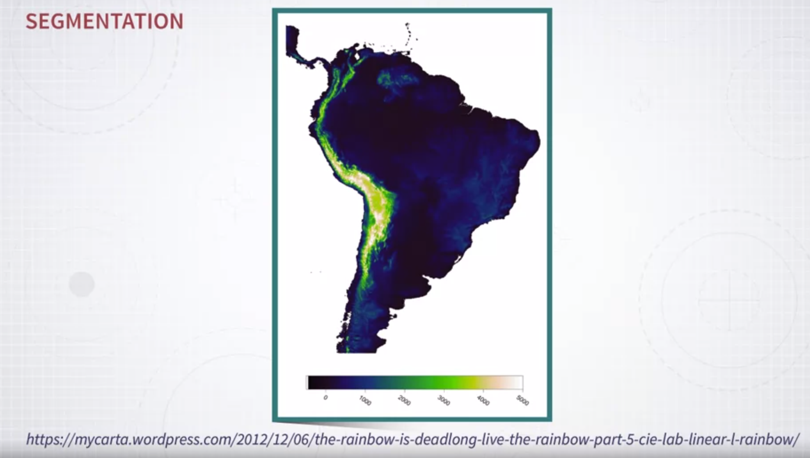
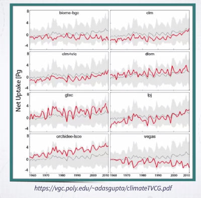

# Week 3

### Visualizing data with color

In this lesson, we focus on one of the most important channels we have available in visualization, which is color. Color is an extremely powerful channel, and it is ubiquitous in visualization, you can find the use of color in so many different situations and projects. So, what is it used for? There are many purposes for color, but here I want to focus on three main ones. So the first one is to _detect patterns_ in the data. The second one is to _label data_ so that we can distinguish between different categories, and the last one is to _highlight specific objects_ or instances so that you can _drive the attention_ of people into some specific regions or objects. 

Let me give you examples of each of these purposes. 

So, the first one is **encoding quantities** with color so that we can see some **patterns** in the data. 

An example is this map. 

In this map of South America, color is used to visualize information about altitude. So this is an example of using color to encode information about a quantity, and by doing that, we can see a pattern, actually, a geographical or spatial pattern through this specific kind of encoding. 

This next one is somewhat similar but also different because it is not geographical. 

Here I have a table, and the frequency of the elements in each cell of this table is encoded with the intensity of the color. Again, this is a way to visualize a quantity through color and to actually make sure that there are some patterns that stand out and hopefully guide you towards interesting pieces of information. 

The next one is to use color to **label data** so that we can distinguish between different sets of _categories_. 

An example is this scatter plot. 

In a scatter plot, you can encode information by position but also by giving different color codes to different items so that you can see how they distribute in the space that is generated by these two axes. So, when color is used in this way, it is very useful means to basically figure out where objects of a certain type are located. 

The final one is to **highlight visual elements** in a visualization. 

Here, I have a number of line charts, and in each one, I want to highlight one single line so that you can see this single line in comparison to all the others. 

So, in this case, as you can see, there is a background that is gray and the line that is highlighted in red so that it stands out. Okay. 

So these three main uses, these three main purposes; to encode quantities, to visualize patterns, encode categories and label data so that you can recognize where objects of a certain type are, and finally, use color to make some objects standout compared to the rest. 

So, one thing to keep in mind when using color is that color is very powerful, but it is also incredibly easy to misuse. 

So, in turn, this means that you have to learn how to use color properly because otherwise, it is very easy to misuse it. Let me give you a first example. This is a map where a quantity is encoded with color and maps to every single county in this map of the United States. 

Okay. Now, if I ask you, what do you think is the sequence of these values? For instance, is yellow or orange representing a low value or a high value, and is green higher than yellow or lower than yellow, is blue higher than yellow or lower than yellow, and so on. So it is very hard to understand because there is no natural progression of these colors that can be mapped to a quantity. In addition, in this specific example, I have also removed on purpose the legend so that you can not really see the sequence, but let me show you the legend. So, now that you have the legend, you can figure out what the sequence is, but still, the sequence is not necessarily natural. So, it is hard to memorize, and it is hard to use in general. This is an example of color when it is used in a way that is not optimal. As I said, color is very easy to misuse. So, this means, in turn, that what we need to do is to learn how color works in order to use it effectively and that is the main purpose of this lesson and next week's lesson. 

In particular, in this lesson, I am going to cover two main aspects. 

The first one is color perception. We need to understand how humans perceive color, how color perception works because this knowledge in turn is going to give us knowledge on how to use color effectively. The second one is color specification. What does it mean? It means that when we are using devices like computers, most likely in our case, we have to know how to specify colors in a way that is useful to visualization design, and not only useful but also natural. As we will see, there are many different ways of specifying color, and I am going to show you why and how certain ways of specifying colors is better than others. Finally, we will focus on color use, on how to use color. Once we have the knowledge of perception and specification, how to use color in visualization design.

### Few Examples: Misusing Color in Visualizatio

When we talk about color, I like to start by quoting Edward Tufte, the famous statistician who wrote a number of incredibly beautiful and useful books on graphic design. 

So, this one comes from one of his best books called Envisioning Information. And the quote is, "Above all, do no harm." That's the most important rule when you're using color in visualization. So be careful because it's so easy to do things wrong. 

This is why I want to show you, first of all, a number of additional examples on what can go wrong with color when not used properly in visualization. 

So the first one is similar to the previous example. 

Again, color tend to be misused very often in maps. And here is another example. We have a map of Africa and there is some quantity that is mapped to different regions, but we can't really give an order to these quantities, because the **colors that are used have no natural order**. That's a very common problem. So, you try to map, some quantity to color, but the color that it's used doesn't have an inherent order. And because of that, it hinders appropriate perception of the values or decoding of the values from this map. 

That's another map, even more problematic than the previous one. So what the authors or designers tried to do here is to represent three different variables, three different pieces of information, using three different colors, and then map these colors to the regions or counties in the US map. So the first one is the percentage of high school students, the second one is the percentage of college graduates, and the third one is household income. And these colors are blended, so that hopefully, you can decode this information out of the map when you focus on some region. But as you can see, try to do that. If you focus on any of the regions that are displayed in the map, it's very hard to figure out what these three values are, okay? So, that's definitely problematic here. 

Here's a different example. This is complaints in New York City, and the volume of complaints at different times of the day. So here, there are different kinds of problems. So, a color here is used to represent different categories of complaints. But the problem is that, there are **too many categories, and there are not enough colors to represent all these categories**. And even the specific choice of colors is problematic because **many of them look alike**. So, there are many different purple colors, different reds, different yellows, and its not always immediate or easy to understand which is which. So, that's problematic. And an **additional problem here is that these colors are so saturated that they create some sense of disorder and clutter in the visualization**. So, there is also an aesthetic problem here. 

Here is another example that is somewhat similar but even more problematic. That's a pie chart with too many segments and too many colors. So in general, the idea here, the rule that we will see more details later on, if you want to visualize lots of categories with color, and there are **too many categories, there's just not enough number of colors to represent all of them**. But here, we have also the additional problem that some colors are re-used for different categories. So, for instance, green is used two times for two different categories. The same is true for orange. So, this is even more problematic. 

Here, we have a more subtle situation. So here in this graphics, colors is used to represent a difference between two years. So in these graphics, what is represented is information about diseases and how the percentage of diseases has changed over time between two different dates, and the color intensity is used to see, to represent the change between two years. But the problem, if you look at the legend, try to look at the legend for a moment, you'd see that some of these values are positive and some of these values are negative. So some of the changes between the two years are positive, and some of the changes are negative. But now, when you focus on the graphics again, you'd see that it's very hard to distinguish between diseases that had a positive change and diseases that had a negative change. So, we will see later on why this happens and what would be an appropriate color and coding for this situation. But I guess, you understand that there is a problem here. We **can't really distinguish positive from negative** and this is a problem.

