# Week 3

### Visualizing data with color

In this lesson, we focus on one of the most important channels we have available in visualization, which is color. Color is an extremely powerful channel, and it is ubiquitous in visualization, you can find the use of color in so many different situations and projects. So, what is it used for? There are many purposes for color, but here I want to focus on three main ones. So the first one is to _detect patterns_ in the data. The second one is to _label data_ so that we can distinguish between different categories, and the last one is to _highlight specific objects_ or instances so that you can _drive the attention_ of people into some specific regions or objects. 

Let me give you examples of each of these purposes. 

So, the first one is **encoding quantities** with color so that we can see some **patterns** in the data. 

An example is this map. 

In this map of South America, color is used to visualize information about altitude. So this is an example of using color to encode information about a quantity, and by doing that, we can see a pattern, actually, a geographical or spatial pattern through this specific kind of encoding. 

This next one is somewhat similar but also different because it is not geographical. 

Here I have a table, and the frequency of the elements in each cell of this table is encoded with the intensity of the color. Again, this is a way to visualize a quantity through color and to actually make sure that there are some patterns that stand out and hopefully guide you towards interesting pieces of information. 

The next one is to use color to **label data** so that we can distinguish between different sets of _categories_. 

An example is this scatter plot. 

In a scatter plot, you can encode information by position but also by giving different color codes to different items so that you can see how they distribute in the space that is generated by these two axes. So, when color is used in this way, it is very useful means to basically figure out where objects of a certain type are located. 

The final one is to **highlight visual elements** in a visualization. 

Here, I have a number of line charts, and in each one, I want to highlight one single line so that you can see this single line in comparison to all the others. 

So, in this case, as you can see, there is a background that is gray and the line that is highlighted in red so that it stands out. Okay. 

So these three main uses, these three main purposes; to encode quantities, to visualize patterns, encode categories and label data so that you can recognize where objects of a certain type are, and finally, use color to make some objects standout compared to the rest. 

So, one thing to keep in mind when using color is that color is very powerful, but it is also incredibly easy to misuse. 

So, in turn, this means that you have to learn how to use color properly because otherwise, it is very easy to misuse it. Let me give you a first example. This is a map where a quantity is encoded with color and maps to every single county in this map of the United States. 

Okay. Now, if I ask you, what do you think is the sequence of these values? For instance, is yellow or orange representing a low value or a high value, and is green higher than yellow or lower than yellow, is blue higher than yellow or lower than yellow, and so on. So it is very hard to understand because there is no natural progression of these colors that can be mapped to a quantity. In addition, in this specific example, I have also removed on purpose the legend so that you can not really see the sequence, but let me show you the legend. So, now that you have the legend, you can figure out what the sequence is, but still, the sequence is not necessarily natural. So, it is hard to memorize, and it is hard to use in general. This is an example of color when it is used in a way that is not optimal. As I said, color is very easy to misuse. So, this means, in turn, that what we need to do is to learn how color works in order to use it effectively and that is the main purpose of this lesson and next week's lesson. 

In particular, in this lesson, I am going to cover two main aspects. 

The first one is color perception. We need to understand how humans perceive color, how color perception works because this knowledge in turn is going to give us knowledge on how to use color effectively. The second one is color specification. What does it mean? It means that when we are using devices like computers, most likely in our case, we have to know how to specify colors in a way that is useful to visualization design, and not only useful but also natural. As we will see, there are many different ways of specifying color, and I am going to show you why and how certain ways of specifying colors is better than others. Finally, we will focus on color use, on how to use color. Once we have the knowledge of perception and specification, how to use color in visualization design.

### Few Examples: Misusing Color in Visualizatio

When we talk about color, I like to start by quoting Edward Tufte, the famous statistician who wrote a number of incredibly beautiful and useful books on graphic design. 

So, this one comes from one of his best books called Envisioning Information. And the quote is, "Above all, do no harm." That's the most important rule when you're using color in visualization. So be careful because it's so easy to do things wrong. 

This is why I want to show you, first of all, a number of additional examples on what can go wrong with color when not used properly in visualization. 

So the first one is similar to the previous example. 

Again, color tend to be misused very often in maps. And here is another example. We have a map of Africa and there is some quantity that is mapped to different regions, but we can't really give an order to these quantities, because the **colors that are used have no natural order**. That's a very common problem. So, you try to map, some quantity to color, but the color that it's used doesn't have an inherent order. And because of that, it hinders appropriate perception of the values or decoding of the values from this map. 

That's another map, even more problematic than the previous one. So what the authors or designers tried to do here is to represent three different variables, three different pieces of information, using three different colors, and then map these colors to the regions or counties in the US map. So the first one is the percentage of high school students, the second one is the percentage of college graduates, and the third one is household income. And these colors are blended, so that hopefully, you can decode this information out of the map when you focus on some region. But as you can see, try to do that. If you focus on any of the regions that are displayed in the map, it's very hard to figure out what these three values are, okay? So, that's definitely problematic here. 

Here's a different example. This is complaints in New York City, and the volume of complaints at different times of the day. So here, there are different kinds of problems. So, a color here is used to represent different categories of complaints. But the problem is that, there are **too many categories, and there are not enough colors to represent all these categories**. And even the specific choice of colors is problematic because **many of them look alike**. So, there are many different purple colors, different reds, different yellows, and its not always immediate or easy to understand which is which. So, that's problematic. And an **additional problem here is that these colors are so saturated that they create some sense of disorder and clutter in the visualization**. So, there is also an aesthetic problem here. 

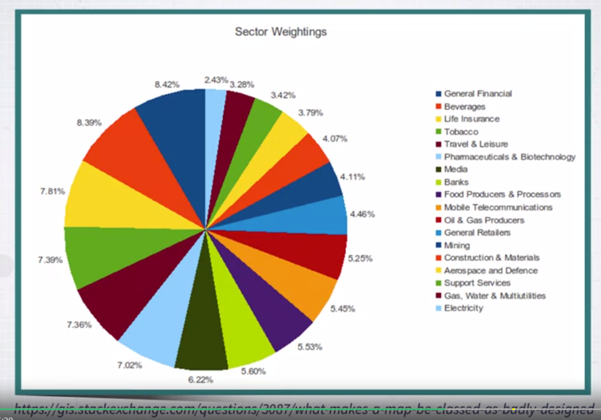

Here is another example that is somewhat similar but even more problematic. That's a pie chart with too many segments and too many colors. So in general, the idea here, the rule that we will see more details later on, if you want to visualize lots of categories with color, and there are **too many categories, there's just not enough number of colors to represent all of them**. But here, we have also the additional problem that some colors are re-used for different categories. So, for instance, green is used two times for two different categories. The same is true for orange. So, this is even more problematic. 

Here, we have a more subtle situation. So here in this graphics, colors is used to represent a difference between two years. So in these graphics, what is represented is information about diseases and how the percentage of diseases has changed over time between two different dates, and the color intensity is used to see, to represent the change between two years. But the problem, if you look at the legend, try to look at the legend for a moment, you'd see that some of these values are positive and some of these values are negative. So some of the changes between the two years are positive, and some of the changes are negative. But now, when you focus on the graphics again, you'd see that it's very hard to distinguish between diseases that had a positive change and diseases that had a negative change. So, we will see later on why this happens and what would be an appropriate color and coding for this situation. But I guess, you understand that there is a problem here. We **can't really distinguish positive from negative** and this is a problem.

### Color Perception

When we talk about color perception, it's necessary to start from understanding a little bit of what happens when lights enters our eyes and how it's processed by our eyes and then our brain. First of all, a little bit about how the eye works. Here is a little schematic of how the eye works. 

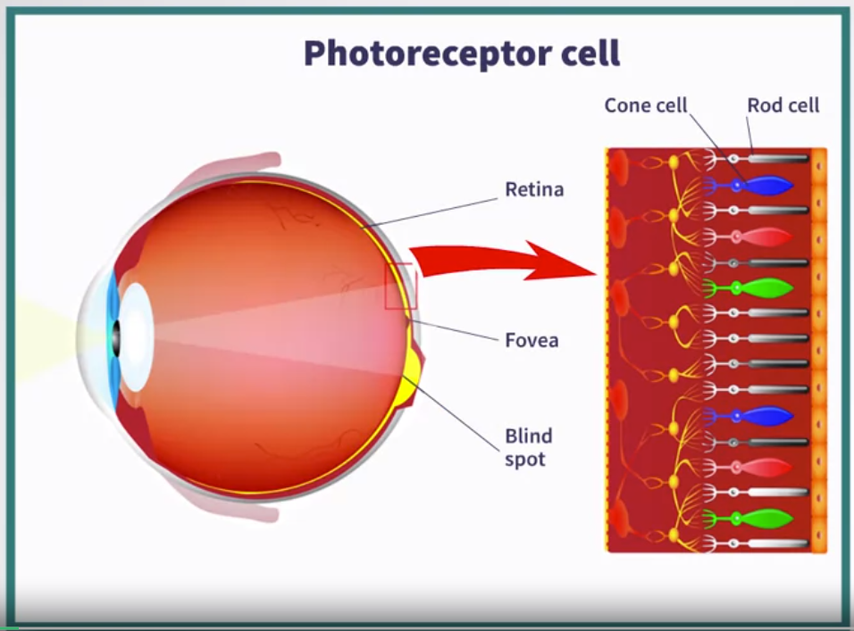

Lights enters the eye through the cornea and is reflected in the back of the eye, where all the sensors are present. In the back of our eyes, there are lots of _sensors_, and this region is called the _retina_. The retina is all the region that is in the back of our eyes that is full of sensors that are sensitive to light. In this region, the retina, it's important to know that in this region, there are different elements. First of all, there is one small region that is called the _fovea_ where the sensors are _much denser_. In turn, this means that when we are looking at something, there is one region of our field of view where we can see things in much higher detail than the rest. 

Another thing to know is that all these sensors get connected to the _optic nerve_, and the optic nerve is basically that component of the eye that _transfer the signal from the sensors to the brain_. Now, since we have an optic nerve in our eye, in the back of our eye, it also means that the retina, all these layer of sensors in the back of the eye, is basically a hole that we actually don't perceive but exists. It exists because this is where the optic nerve starts and sends the signal to the back of our head, to our brain. Before I move on, I want to give you a little demonstration that shows you the fact that this blind spot exists. What is a blind spot? The blind spot is that region of the eye where the optic nerve attaches to the eye. This is where we don't have sensors because there's the nerve in place of the sensors, and that we normally don't see it but there is an exercise that can actually show you that this blind spot exists, and I'm going to show you how to do that. 

First of all, you'll have to use this image that is in front of you. There is a cross and a dot. Now, I'll show you the procedure necessary to verify that you actually do have a blind spot in your eye. I'm going to use my laptop to do that. If you have a laptop in front of you, you can use your laptop to do exactly the same procedure, or if you don't have a laptop, you can also just print this page and try on your own. How does this work? You have to do two important things. First of all, you have to cover your left eye with your hand and then stare at the cross, only at the cross with your open eye, and then slowly try to get the image closer and closer but always focusing on the cross. When it's close enough, you'll see the dot disappear. When the dot disappears, it means that this is the time when the dot is basically falling on that region of the retina where the optic nerve is, and this is where you can no longer perceive anything. It's very interesting. 

Now, another very important thing to know is that we have two types of sensors in the retina. 

We have rods and cones. Rods are sensors that are sensitive when we are in low light conditions, so basically when it's dark. They are not very much used today because we almost always have some light around us. But if you find yourself at night outside and there's no lights, this is what you're using, you're using rods to see objects in front of you or around you. But when there is enough light, so in most of the time, you're using another type of sensor that is used that is called cone. You have lots of cones and there are different types of cones. There are three different types of cones and these three different types of cones are actually sensitive to different wavelengths, and this is the basis of what is called the trichromatic theory, a very important concept in color perception. 

These three types of cones are respectively sensitive to short wave length, medium wave length, and long wave length as you can see in this diagram. In turn, this means that some of them are more sensitive to lights that are around the spectrum of blue, some around the spectrum of green, and some around the spectrum of red. 

This means that physiologically, at the physiological level, the eye reacts to light using three main sensors, and as we will see, three main _channels_. This is the basis for a lot of other important concepts in color perception and use. In particular, it means that every color can be expressed, as we will see later on, as a combination of three main channels. This is repeated over and over in color perception and use. The trichromatic [acho!] theory says that we basically perceive color as a three-channel system, which is very important. 

However, it's also important to realize that when we talk about color, when we try to specify how we perceive color, we soon realize that we don't describe color naturally as the combination of red, blue, and green. It's very hard for us to think about color as combination of these three values or intensity of these three colors.

An important theory that has been developed in the past is what is called the **color opponent process theory** which basically says that the signal that is received from these three types of sensors is actually processed by our brain, by the visual cortex, in a way that creates three different types of channels, so not necessarily green, blue, and red, but three different channels. What are these three different channels that we actually create in the visual cortex?

The first channel is the red-green channel. This is measuring the amount of red, green or green in one channel. The other one is the blue-yellow axis. The last one is the black and white axis which basically gives what is normally called luminance or also brightness, which is the amount of light that is emitted by a given color. Basically, how dark or how much light is coming from the color. The theory says that the three different sensors, the blue, the green and red, the short wave, medium wave, and long wave are combined in the visual cortex in the following ways. The three sensors are combined altogether summed up to compute how much lightness is emitted by a given color, that's the first one. The second axis, the red-green axis, is calculated using the difference between the short waves and medium waves as you can see in the diagram. This is the calculation that is made by the brain to create the red-green axis. The last one takes the short and medium waves, sums them up, and then does a subtraction of this sum with the long wave, the red one that you see here, and this is used to calculate the blue-yellow axis. 

This theory has been studied in many different ways which I can't really summarize here but it's been found to be accurate in many different ways, both at the physiological and at the perceptual level. A couple of interesting facts about this theory. First of all, one interesting fact that seems to corroborate the theory is that _we never describe colors in terms of reddish-green or greenish-red. The same is true for blue and yellow_. We don't really do bluish-yellow or yellowish-blue, which seems to corroborate the fact that this is just one axis. Another very important fact that seems to verify the accuracy of this theory is that _color blind people tend to be color blind exactly on these two axis that we have here, red-green and blue-yellow_. Color blindness typically is about people who are not able to distinguish red from green or, more rarely, blue from yellow, which again is another important fact that seems to corroborate this theory. Now, I want to conclude with another little demonstration that actually shows you how the color opponent process theory works and gives you another example of why it seems to be true. 

Let me explain how this works. 

In order to do that, you have to stare at this picture for at least 30 or even more, 60 seconds, and look at the little white dot that is in the middle and just focus on it for 30, between 30 and 60 seconds. Then I'll switch to a white slide like this one and you'll see that what you see on this white background is the flag of the United States. Why is that? Well, it's basically because when you are staring at these colors, you are exciting the same source of these colors, and when I switch to the white background, since these sensors have been excited for too long, they actually inhibit those colors and the only colors that you see are the opposite of those that you have here. In particular, what you see is that in place of green, you see red, in place of yellow, you see blue, and in place of the dark stripes, the black stripes, you'll see white, which is exactly the opposite colors that you have in the color opponent process theory. Stare at this one for 30 seconds and once the 30 seconds pass, I'll switch to a white background.

In summary, in this lesson, I talked about three main concepts. 

The first one is a little bit about the physiology of the eye, the elements that are in the eye. This is by no means a complete account of what is in the eyes, much are complex than that, but what is important to remember is that in the eye, there is a retina that is full of sensors in the back of the eyes. These sensors tend to be much more dense in a specific area called fovea. There are two types of sensors: rods and cones. The rods are sensitive to low light conditions, cones are sensitive to high, lots of lights conditions, and then we have three types of sensors, and this is the basis of the trichromacy theory and they are sensitive to short waves, medium waves, and long waves. Finally, these three sensors are combined together by our visual cortex to create three main axes that are the three axes described by the opponent process theory and these three axes are black and white, which basically give the amount of light, luminance, that is created by a color, displayed by a color, and then we have what is called the two chromatic axis that are the red and green axis and the blue and yellow axis. These are the main concepts to remember from this lesson.

### Color Specification

Now, after learning a little bit about how color is perceived by human vision, the next step is to understand how to specify color. What do I mean, specify color? Well, I mean that when we want to practically use color, especially in visualization as we will see later on, we want to be able to say, I want this type of color. Or I want these colors to have certain properties. So how do we specify colors in a way that is helpful for visual representation? We need _color specification systems_.

And we need color specification systems that are _reliable and uniform across different devices_. If you think about it, that's not a trivial problem at all. So if I want to reproduce a specific kind of color, I want to be able to use a specification that can be reproduced in different devices, which is a quite complex problem. So, one important thing to know, as I already mentioned earlier, is that every color can be expressed as the sum of three colors, or in general, as we will see, every color can be expressed in a three dimensional space. 

So let's start with a somewhat simple example. If you have three lights and one light is blue, one light is green, and one light is red, what we can do is to change the intensity of these lights to basically match an existing color. 

If we can do that, we actually have a way to specify numbers that describe a specific color. Think about having a way to create a standard set of three lamps, one is blue, one is green, and one is red. And let's assume that it's easy to reproduce a standard version of these lamps. Then if I want you to reproduce a given color that I've tested earlier, what I have to do is just to give you the number or the value of these three intensities, the intensity of blue, the uncertain intensity of green, and the intensity of red. So this is the basis of a very large set of _color spaces_. What is a color space? A **color space is a system typically of three variables, in a three-dimensional space, that describes uniquely a color**. By giving, I give you three values, I'll tell you which space I'm using, and you'll be able to reproduce exactly the color that I want to communicate to you. So that's a very important concept and a very useful one in practice.

One thing to know about color spaces, before we dive into specific color spaces, is that the three primary axis of each color space basically define what is the gamut of the color space. We choose the whole set of colors that can be reproduced by this specific color space.

One important thing to know is that _not all color spaces are equivalent_. What do I mean by that? I mean that _a given color space may reproduce a subset of the full set of colors that humans can naturally perceive_. For instance, the RGB space, which I'm going to introduce next, can cover a subset of all the possible colors that human can perceive. In the next lesson, I'm going to walk you through different color spaces. And as we will see, these color spaces have different properties that make them more or less useful for this organization design and color specification in general.

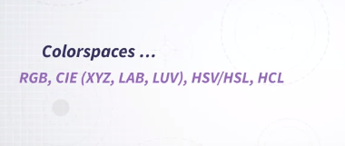

### Color Space: RGB

The first color specification system we're going to talk about is the RGB. It's a very popular color specification system, and RGB stands for red, green, and blue. And it's very commonly used in digital devices to describe color in digital devices. Why that? Well, one important reason is that monitors are built in a way that these three colors are used. These three primary colors are used as the basis physically to represent colors. 

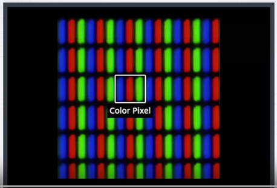

This image shows you very zoomed in image of how a pixel of an LCD screen looks like. So, if you look very, very, very closely, you'll see that every single pixel is made of three colors, three lamps, and by tuning the amount of blue, red, and green, we can create pixels of different colors and different intensities. This is how digital devices normally work. You can't see that, but if you look closely with a lens, you'll see that this is the structure, the actual structure of a monitor. There are many different technologies to realize that, but the basis is always the same, amount of green, amount of red, and amount of blue. 

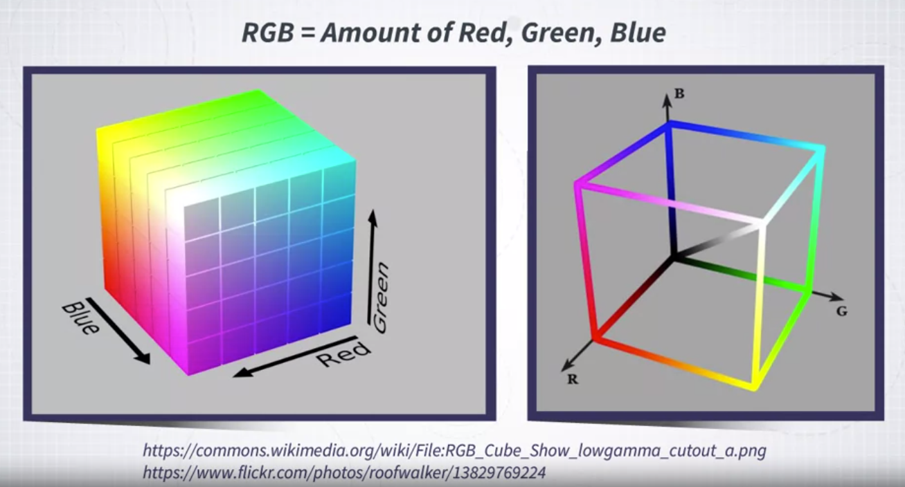

Now, if we represent the RGB space as a three-dimensional space, and basically as a cube that shows all the possible colors that can be created by specifying different amounts of blue, green, and red, this is what you obtain. This is a representation of the color cube obtained with RGB. The image that you see on the right, shows you a little bit of some important colors that you can obtain by mixing these three values. So, starting from the origin that is completely dark is actually black. As you move in different axis, you obtain different colors. So, for instance, if you go up only in one direction, you'll get blue. If you go down in only one direction, you'll get red. And in the other one, you'll get green. But then, you can also mix two of these colors. For instance, if you mix blue and red, you'll get magenta. If you mix blue and green, you'll get cyan. If you mix red and green, you'll get yellow in different intensities. Another thing to notice is that, when you sum the three of them, all with the same value, so the diagonal that you see in the middle, you'll get different shades of gray, and the maximum value for the three axis, so one, one, one, you'll get pure white. One thing I forgot to say is that in order to create the cube, the RGB values have a domain that goes from zero to one. So, zero is the minimum and one is the maximum. _So, the point in the cube that corresponds to zero, zero, zero is black, and the point that corresponds to one, one, one, or sometimes is also specified as 100 percent, 100 percent, 100 percent, so, a scale between zero and 100, you'll get pure white_. And combinations of these values lead to different colors, okay? So now, let me give you live demonstration of how it looks like to use the three channels, RGB, to specify some colors. 

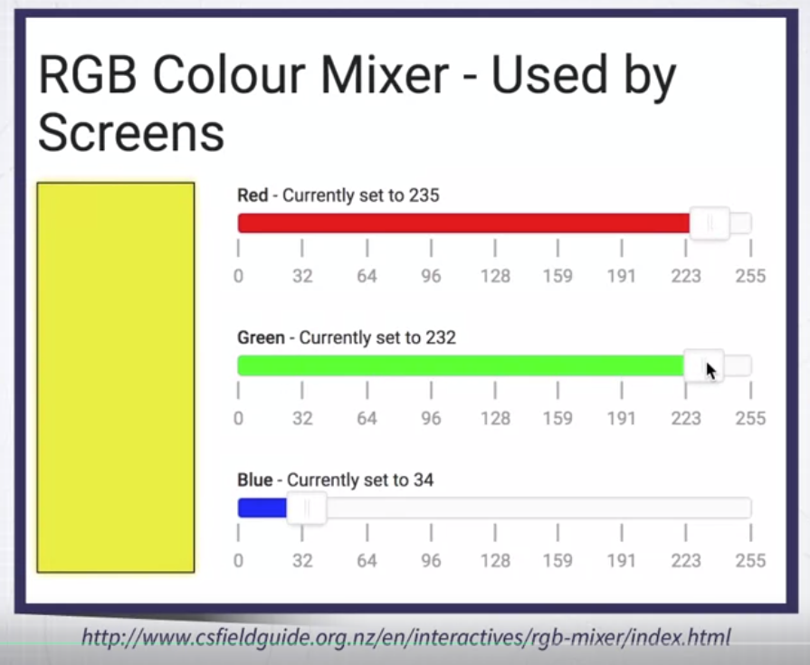

So, in this interactive demo, you can see that I can change the amount of red, the amount of green, and the amount of blue. And as I change the amount of each of these colors, the final color changes dramatically, okay? So for instance, if I do lots of red and lots of green, I get yellow, right? If I do lots of green and lots of blue, and I remove red, I get cyan. If I have all values close to zero, it gets very dark, and basically to black. If use the maximum intensity of all of them, I get closer and closer to white. 

Okay, now, one interesting problem with the RGB color space is that, it's not particularly easy to generate colors in ways that are natural and useful for visualization. 

So, let me give you an example. For instance, let's say that I want to have yellow, but at different intensities of yellows. So, first of all, **I have to know that yellow is obtained by having roughly the same amount of red and green**. If I have too much green or too much red, I don't get yellow, I get different colors. So, I have to know that they have the same amount of red and green. And if I want to change the intensity, I have to change the intensity of these two values at the same time, which is not necessarily natural. _If I want to obtain another color, it's not necessarily intuitive how to obtain this color_. Let's say, I want to obtain brown, how do I get to brown? If I want to obtain, I don't know, a specific kind of blue, or orange, how do I get to orange? It's not necessarily intuitive. As we would see later on, especially in visualization, we want to be able to specify color mainly by describing the intensity of the color and the color type. I want a red, I want a green, I want a yellow, I want a blue, I want an orange, and so on. And specifying these colors is not natural in the RGB space. And as we will see in a moment, that's a problem with RGB and that's also the reason why it's not particularly useful as a color space to use in visualization design. 

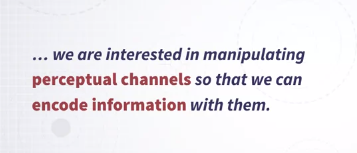

In general, one thing to remember is that, we are interested in manipulating colors and using color spaces in a way that is closer to the way we perceive color, and we want to describe color. And even more specifically, the way we want to encode color in visualization by mapping properties of the data with properties of the color. If we want to do that in a natural way, we have to use a color specification system that is more natural.

### Color Space: HSV / HSL

In the previous video, we saw that specifying a color with the RGB color space is not easy. So what are the other options? Another useful option is a different color space that is called HSV or a very similar one that is called HSL, which stands for hue, saturation and value, or hue, saturation and lightness. 

And the interesting property of these color spaces is that it's _easier to specify colors_. Because they use channels or axes that are more closer to the way we want to specify colors. It's much more natural. It's much more natural to think about color in terms of hue, saturation and lightness. So what are these three channels? Hue is basically the name of the color. Green, red, blue, yellow and so on. Saturation is how vivid the color is, the colorfulness of the color. And lightness is the amount of light, the brightness of the color.

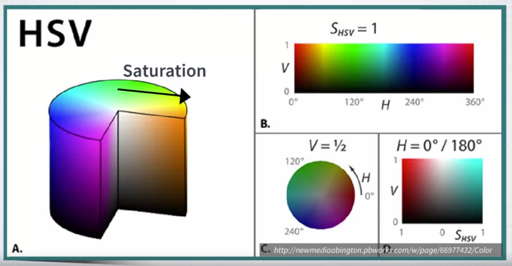

Here is a representation of the color space. And as you can see, HSV can be described as a _cylindrical color space_. And what happens here is that saturation corresponds to the radius of this piece. The value corresponds to the height and the hue corresponds to the angle. And as you change these parameters, you position yourself into a different position of this color space and every single position represents one color. Now to make this even clearer, let me show you a demo using a color picker.

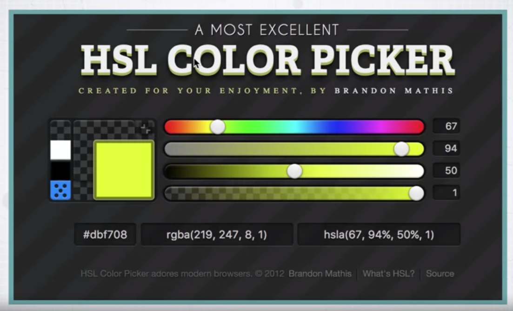

Okay, so now let's take a look at an HSL Color Picker to get a sense of how this color space works.

Okay, let me describe first what are these elements that you see on the screen. There are a few sliders, as you can see, similar to what we have seen before with the RBG color picker. But now each slider corresponds to one of the new channels that we have in this new color space. So the first one is the h channel, the hue. Then we have s, which stands for saturation. And the last one is lightness. So as I move the slider of the hue channel, as you can see, the color on the left is the color that is currently peaked, changes the hue, okay? So we go from red to purple, blue, green, yellow and red, okay? So now if we keep one of these colors, if we keep hue constant, now we can change the saturation value.

So remember that saturation means how vivid the color is. So let me show you how vividness of this color changes as I move the slider here. So we go from very saturated blue to blue with very low saturation. As you can see, _as the saturation gets lower and lower, we create colors that are very similar to gray_.

Okay, and another parameter is lightness, which can be thought of as the amount of light that is emitted by this color. So now we keep hue and saturation fixed, and we change the amount of lightness and see what happens. So we go from dark, very dark, to very bright. This is the lightness channel.

Okay, so we have hue, saturation and lightness. As we saw in the demo, choosing colors with HSV or HSL color space is so much easier than with the RGB space. So now you may think, okay, the problem is solved. We can just use this color space all the time and in particular when we want to use color for visualization. Well, there is another problem. 

The problem is that these color spaces are not perceptually uniform. What does it mean to be **perceptually uniform**? Well, it means that distances that are calculated in the color space mathematically do not correspond to perceptual distances. So the difference between colors that we actually perceive with our eyes. Let me give you an example to show you how this works. 

So what you see here, the set of colors that you see in the top row, these are all colors that exactly the same V value selected using the HSV color space. And the colors that you see below them are exactly the same with the chromatic component removed. So all these grays represent the lightness value of the colors that you see on top. And as you can see, we have different levels of gray, which basically means that these colors have different color intensities. We perceive these colors with different intensities, so this is a problem. It's a problem because, ideally, we want to specify colors that have exactly the same lightness, exactly the same V here. But the color space is not perceptually uniform, so we perceive these colors differently.

### Color Space: CIE Lab/ Luv Part 1

So, how do we solve the problem of non-uniform color spaces. Okay, it turns out that there are other color spaces that have been created over the years, that are being created exactly to solve this problem. So, these are uniform, perceptually uniform colors spaces. And here, I want to talk about two very popular ones, that are very similar. There are just small variations between the two, that are CIE Lab and CIE Luv. So, these are color spaces that have been generated by the International Commission on Illumination. So, CIE is a French acronym, and this is the International Commission for the Illumination is very popular, and has contributed a lot of very important color spaces. 

So, Lab and Luv solved this problem by creating a color space where _mathematical distances between the points in the space corresponds at least to some extent, approximately two perceptual differences_. 

Let's focus on CIE Lab. How that would work? There are three main channels. 

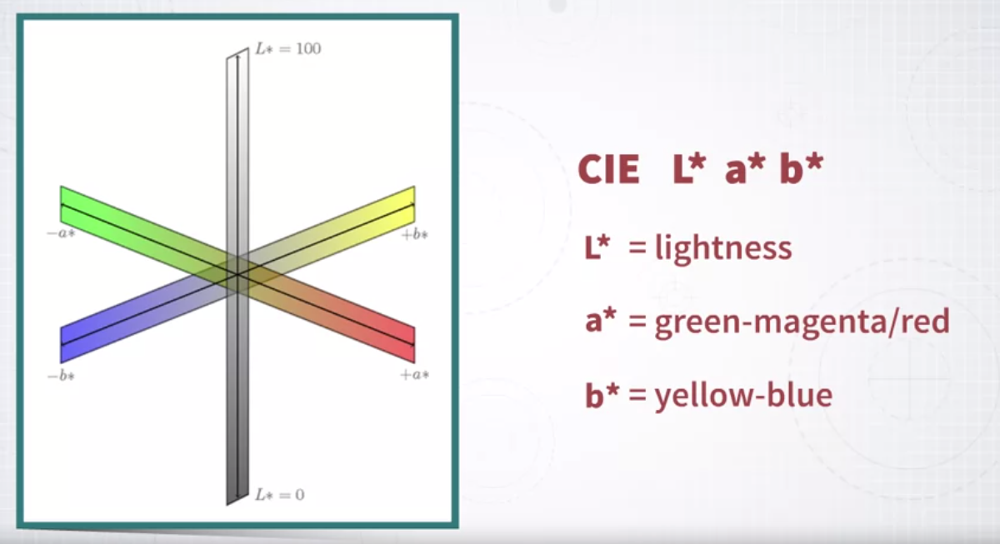

There is the L channel which is the lightness. Very similar to what we have seen before with HSV color space. So, what used to be called V, value in HSV. So, this is called **lightness**. And it's basically the brightness, the intensity of the color. But here, the intensity of the color, is perceptually uniform. Then, there are two additional channels a and b. So, the a channel goes from one chromatic axis that goes from green to red. And the next one b goes from yellow to blue. What you see on the right, is a three-dimensional representation of these three channels. So, on the vertical side you have the lightness, the color intensity. Then, you have one axis is for blue and yellow, and another axis for green and red. _And this color space is modeled, if you remember, according to the opponent process color theory, that I introduced earlier_. So, the idea is that, the the way our brain perceives colors is according to these three axes. So, we have color intensity, we have green-red axes, and yellow-blue axes. And every single color that we can perceive, is a combination of these three independent axes. So, these color space is nonlinear transformation of the physical measure of the color. So, if you physically measure the wavelength of the color, you don't get a linear mapping between the physical measurement and perceptual measurement. 

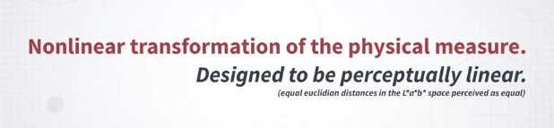

This is necessary to make sure that, as I said before, distances in this space are perceived uniformly and is designed to be perceptually linear. So, now let me move onto another demo. So, similarly to what I've done with the HSV and RGB color spaces, I want to show you how to play with the color space and show you the axes, specification of values in the axes changes the color.

### Color Space: CIE Lab/ Luv Part 2

So, this is color picker that is being created by David Johnston, that shows how the CA lab color space works. 

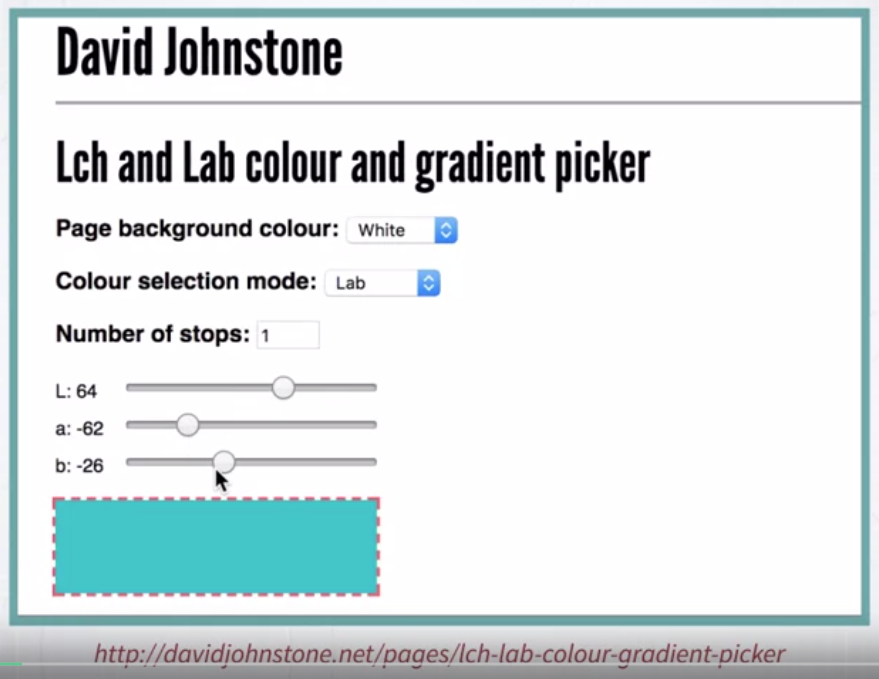

So, as you can see here, once again we have three main sliders. One for the L channel, one for the A channel and one for the B Channel. Let me show you how the color (the one that you see at the bottom here) changes as I change the values through the sliders. Okay. So, if I change the L value as you can see the color gets very dark or very bright. Okay. Now if I change the A value, I go from green to red and magenta, and If I change the B value, I go from blue to yellow and orange. So, this is exactly what I described before. So, with different combinations of the sliders, you can create different combinations of colors. Once again, we have one that is lightness and two chromatic axis, elements that can be combined to create different colors. 

Let me show you another demo using a different color picker. This one has been created by Grego Reisch, and this is useful because here rather than seeing how the color changes when you change the three values through some sliders, here we can get a glimpse of how the color space looks like. 

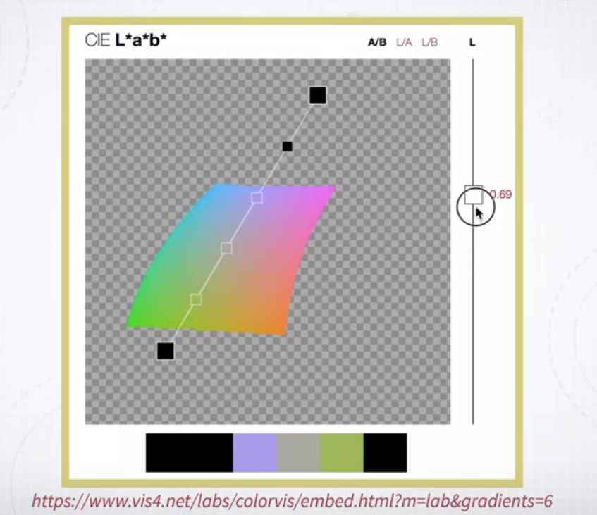

So, the regional color space is made of three dimensions. So, here we are not showing three dimensions at once, but we have two dimensions map to the x and y axis, and we can vary the third dimension through the slider. So, this gives you more precise sense of how the color space looks like. So let me explain how this works. So, on the x-axis right now with the current setting we have the A channel, and on the y-axis we have the B channel, and what we can vary through the slider is the lightness, the L channel. So, let me show you what happens when I change the lightness.

As you can see, a very interesting phenomenon is that as I change the lightness, the range of colors that are available changes, what is called the gamut. 

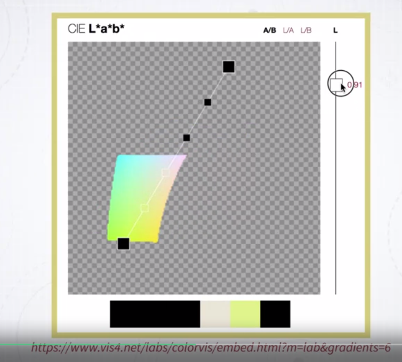

So, let me explain that. Every time you see part of the space that is not covered by a color that is covered by these small gray squares, it means that these color is not perceivable. Okay, so it exists mathematically in the space, but it's not a color we can perceive. Okay? So it doesn't correspond to any real color. Okay, as you can change, the space changes the range of available colors changes, as I change the L channel. Of course you can also see that the lightness of all the available colors changes accordingly. So, when I have high lightness, all the colors available in the AB space have a very high value of lightness, and the same is true when I reduce the lightness value. Okay? Another thing that you can notice is that, if we look at what colors are available on the A-axis, they correspond exactly to the green and red spectrum that I described before, and on the vertical axis we go from yellow to blue. Let me show you this. So, this little line that I'm moving right here, is an actual color picker. So, how does it work? As I move it around as you can see, the colors at the bottom are changing. So, the little squares represent the samples that are taken from the space. So, every single square here represents one of the colors that are positioned here at the bottom. So, as I move this line around, I'm creating different samples from the space. So, let me show you what happens. If I sample in a direction that is parallel to the B channel, as you can see we go from blue to yellow. 

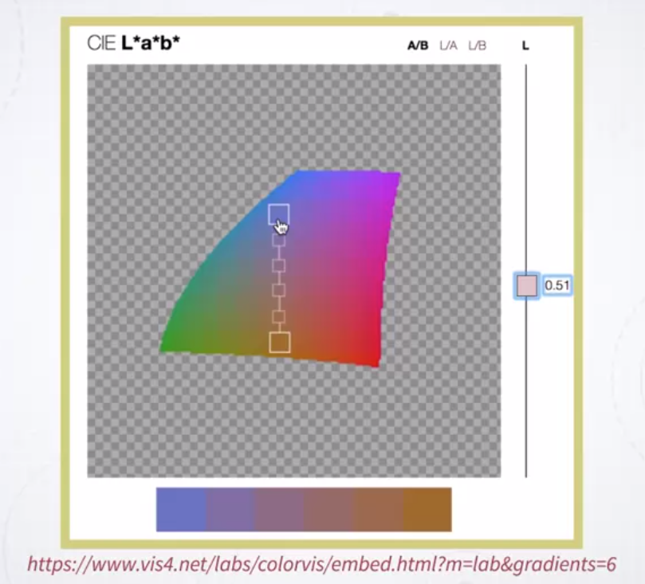

Okay? If I do the opposite, so I pick the colors in the direction of the A channel, I go from red to green.

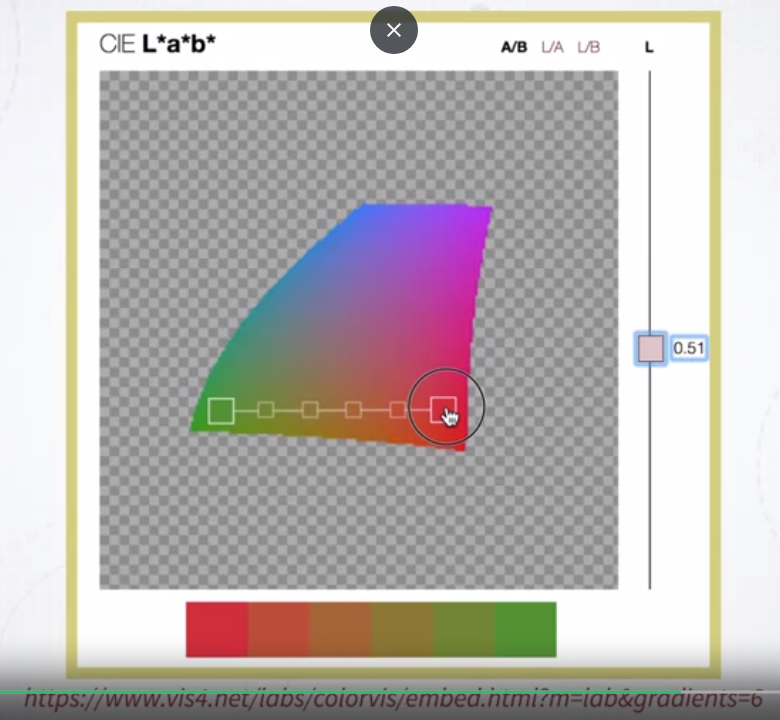

Whereas combinations of them create other combinations of colors. So for instance here we go from purple to green. An interesting aspect of these little color picker is that you can also change the axes. So, now for instance we have on the x-axis we have the lightness value, and on the y-axis we have the A channel. 

So as you can see, if I pick colors that go in this direction they go from dark to bright, and the same thing can be done with these other selections. 

So having lightness on the x-axis, and the B channel on the y-axis With the lab color space, we solve the problem of non-uniformity. _Now we have a color space where distances in the space represents perceptual distances_. So, the way we perceive colors, but now we have another problem you may have noticed. _The problem is that specifying colors using the A and B channel, is not that easy_. In a way compared to the HSV color space that we saw before, _HSV is more usable than the lab one_, LAB. So, now we have a problem; we have that one space is non-uniform, but it's more usable and then another space (the lab space) is uniform, but it's not as usable as the other. So what can we do? Well, one can transform the lab space into a new space where both properties are retained. So, a space that is more usable, but also retains the fact that is perceptually uniform, and that's the main topic of the next video.