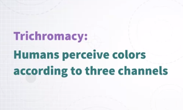
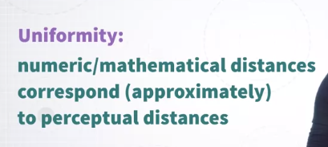
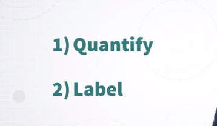
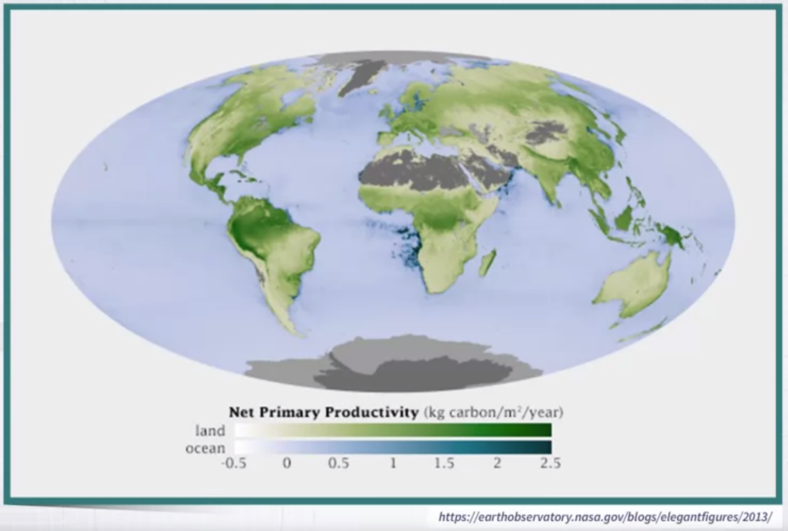
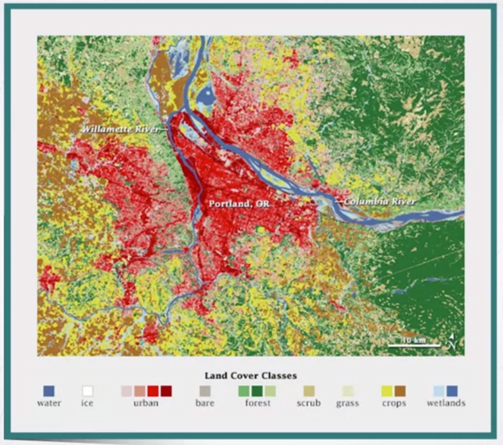

# Week 4 &mdash Using Color in Visualization

### Using Color in Visualization

Hi, welcome to a new model which is a follow up of the previous one. So, we're still talking about **color**. But with the main difference that in the previous module, we focused on perceptual issues and color spaces. Now, with the knowledge acquired in the previous module, we can talk more about _how to actually use color in visualization design_. 

Before I do that, I want you to recall a few important concepts from the previous module, that's it's important for you to keep in mind as we move through the rest of this module. 

So, the first one is the idea that every color can be described by _three main components_, the **trichromacy theory** of color. So, that's important, every color can be described in different color spaces if you want, but always with three main components. 

Then, we talked about the problem of **perceptual uniformity**. When you specify colors for data visualization, it is very important to keep in mind that we need to specify colors in a uniform color space. Why? Well, because as you will see, we typically want to create color palettes that have certain properties, and some of these properties require that for instance, some colors have the same lightness value or the same saturation and so on. If we can't assure that these values are constant from the perceptual point of view, we can't really create effective color scales. Finally, we will keep using the important concept that _color can be described through three very intuitive and usable axis or parameters_. The first one is _hue which defines the color name_, if you want the type of color. The second one is _saturation which defines the vividness or colorfulness of the color_. The last one is _luminance which is the amount of light or brightness that the color is emitting_.

Okay, so let's go back to the most important question of this module. __How do we use color in visualization?__ __What is its main purpose?__ 

Well, we can define color use in visualization in a somewhat abstract way as being used for two main purposes, two specific purposes. The first one is to **quantify**. We want to use color to map quantities to color so that when we see colors in a visualization, we can go back to quantity. That's purpose one. Purpose two is **label**, we want to be able to label data and objects in a way that we can recognize and recall what type of object some object is when we see this color. 

Let me show you a couple of examples. So, the first one as we said is going from perceiving color to linking the color to the concept of quantity. Here, is an example. 

There is a map where a quantity has been mapped to the color intensity of the colors that you see here. In this specific map, which I've taken from NASA, we have what is called Net Primary Productivity which is a measure of how much carbon is generated by plants, okay? So, as you can see in the maps, there are regions that are darker than others. So, these are regions where the Net Primary Productivity is higher than others. So, what are we doing visually here? We are extracting quantity out of color. It's a perfect example of the first purpose. 

The second purpose is labeling. So, mapping categories to colors. So, think about it, when color is used this way, what we are doing is perceiving colors in the visualization and linking, mentally linking the color to a concept, to a category. Let me give you an example, once again with a map. 

So, this is another map where the areas of the map have been labeled or painted in order to convey the concepts of some categories. So, for instance, whether some region is urban, whether there is water, whether there is a forest and so on. So, these are categories, is not quantities, okay? So, in general, you can always think of the two main purposes of color use in visualization as being either communicating some quantity, the magnitude of something, and how it distributes according to other different parameters, and convey and labeling. So, conveying through color the concept of categories and labels.