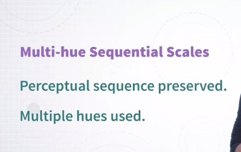
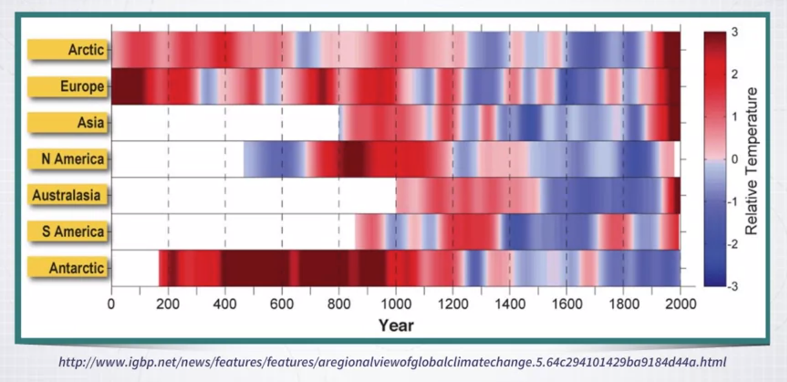
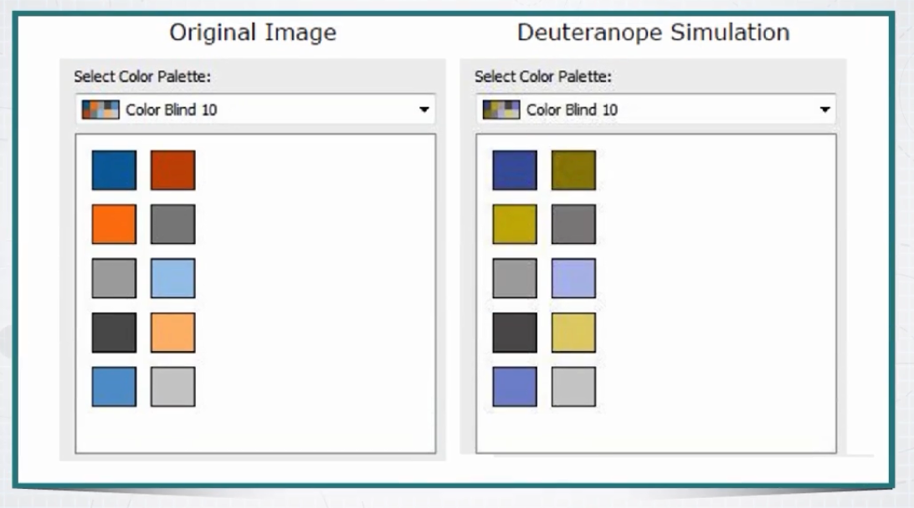
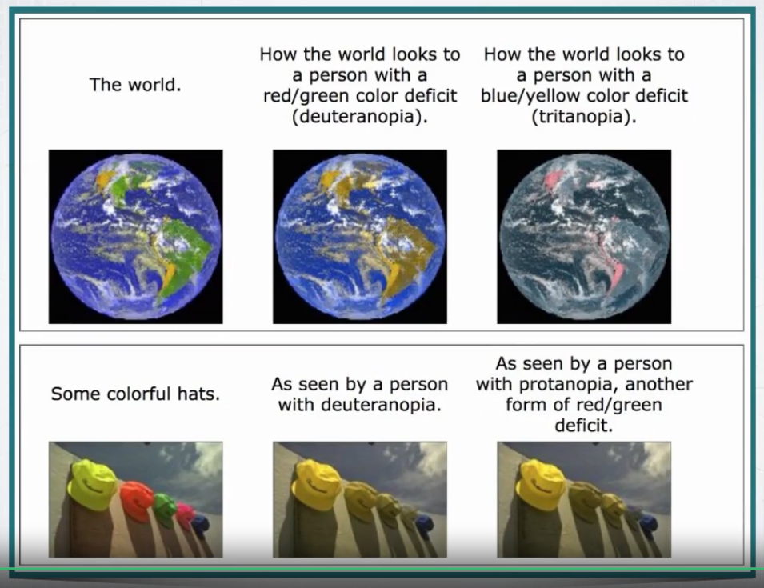
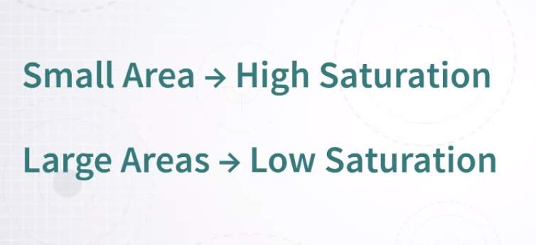

# Week 4 &mdash Using Color in Visualization

### Using Color in Visualization

Hi, welcome to a new model which is a follow up of the previous one. So, we're still talking about **color**. But with the main difference that in the previous module, we focused on perceptual issues and color spaces. Now, with the knowledge acquired in the previous module, we can talk more about _how to actually use color in visualization design_. 

Before I do that, I want you to recall a few important concepts from the previous module, that's it's important for you to keep in mind as we move through the rest of this module. 

So, the first one is the idea that every color can be described by _three main components_, the **trichromacy theory** of color. So, that's important, every color can be described in different color spaces if you want, but always with three main components. 

Then, we talked about the problem of **perceptual uniformity**. When you specify colors for data visualization, it is very important to keep in mind that we need to specify colors in a uniform color space. Why? Well, because as you will see, we typically want to create color palettes that have certain properties, and some of these properties require that for instance, some colors have the same lightness value or the same saturation and so on. If we can't assure that these values are constant from the perceptual point of view, we can't really create effective color scales. Finally, we will keep using the important concept that _color can be described through three very intuitive and usable axis or parameters_. The first one is _hue which defines the color name_, if you want the type of color. The second one is _saturation which defines the vividness or colorfulness of the color_. The last one is _luminance which is the amount of light or brightness that the color is emitting_.

Okay, so let's go back to the most important question of this module. __How do we use color in visualization?__ __What is its main purpose?__ 

Well, we can define color use in visualization in a somewhat abstract way as being used for two main purposes, two specific purposes. The first one is to **quantify**. We want to use color to map quantities to color so that when we see colors in a visualization, we can go back to quantity. That's purpose one. Purpose two is **label**, we want to be able to label data and objects in a way that we can recognize and recall what type of object some object is when we see this color. 

Let me show you a couple of examples. So, the first one as we said is going from perceiving color to linking the color to the concept of quantity. Here, is an example. 

There is a map where a quantity has been mapped to the color intensity of the colors that you see here. In this specific map, which I've taken from NASA, we have what is called Net Primary Productivity which is a measure of how much carbon is generated by plants, okay? So, as you can see in the maps, there are regions that are darker than others. So, these are regions where the Net Primary Productivity is higher than others. So, what are we doing visually here? We are extracting quantity out of color. It's a perfect example of the first purpose. 

The second purpose is labeling. So, mapping categories to colors. So, think about it, when color is used this way, what we are doing is perceiving colors in the visualization and linking, mentally linking the color to a concept, to a category. Let me give you an example, once again with a map. 

So, this is another map where the areas of the map have been labeled or painted in order to convey the concepts of some categories. So, for instance, whether some region is urban, whether there is water, whether there is a forest and so on. So, these are categories, is not quantities, okay? So, in general, you can always think of the two main purposes of color use in visualization as being either communicating some quantity, the magnitude of something, and how it distributes according to other different parameters, and convey and labeling. So, conveying through color the concept of categories and labels.

### Quantitative Color Scales

Okay. So, now we start with considering how to create quantitative color scales. Color scales that are designed to represent quantitative information.

So, I think we should start by reflecting on what are properties that we want a quantitative color scale to have. So, I think there are two main properties. 

The first one is **uniformity**. What does it mean? _It means that as we move through the values of the color scale, we want these values, the changes to be perceived uniformly_. Okay? **A difference in the value needs to be proportional to the difference that is perceived**. That's very important. 

The second one is the **discriminability**. So, as we create color scales that map data quantity to a color, we want to _make sure that we can discriminate as many different colors as possible_. Why that? Well, because the more colors we have available, the higher the number of different colors that we can extract visually from the visualization. 

So, let me give you an example that shows the concept of uniform and nonuniform color scale. 

This is a little example that I prepared, where I'm using a color scale where the color intensity or lightness is used to represent the value, the quantity of information, okay? So, we go from very dark to very bright. But the difference between these two color scales is that the first one is not uniform. There are big jumps. So, we go from dark and then it goes very quickly up to lighter and much much quicker to even lighter than that. Whereas the one that you see at the bottom is way more uniform. So, that's the problem with uniform medium. 

So, how do we create a sequential color scale, a color scale that is able to represent quantity in sequence. Well, I almost already give you a preview with the previous example. **The idea is that you have to first choose one color hue and then map the value to luminance. **

Let me give you a couple of examples. So, here are a number of alternative color scales that use exactly this strategy. 

So, they are created by selecting one specific color hue and varying uniformly the lightness of the color, and by the way, I forgot to say that _also keeping the saturation constant_, okay? So, **hue and saturation are kept constant and what is varying is the lightness level**. 

So, now, let me make this even easier to understand through another demo using a colorpicker. Okay, here I'm using colorpicker that has been created by Tristan Brown, and it's very similar to the colorpicker that I've shown you in the previous module.

It's a colorpicker in the HCL space, and what you see here in this version we have that hue is mapped to the x-axis and lightness is mapped to the y-axis and the chroma component, which is the vividness or saturation can be changed through a slider, so that now we are keeping chroma constant, okay? So, if I want to create an effective color scale to represent quantities, what I can do is to position the colorpicker vertically like here, parallel to the hue axis and then go from a very dark to a very bright color and interpolate between the two. 

In fact, this is what you see on the right in the colors that are automatically sampled by these colorpicker. By the way, you can reduce the number of samples or also increase the number of samples. You can do exactly the same thing with a different color hue. So, say that we want a blue color scale, we can just move by still keeping the line parallel to the y-axis. Now we have a blue color scale that is perceptually uniform. We can do the same with green, sorry, with purple or pink, we can do the same we red and so on. So, this is one way we can create single hue quantitative color scales.

### Multi-hue Sequential Scales

Okay. An interesting variation over the single hue sequential color scale is a more multi-hue sequential color scale. 

So, what is the idea here? The idea is to **still have a perceptual sequence of values that changes according to lightness or luminance, but go through multiple hues**. In the previous example, I've shown you, I kept hue constant. In this one, in this new method, now, I'm trying to do exactly the same thing, create a perceptually linear color scale that changes color intensity or lightness uniformly, but goes through several color hues. Let's see how this is done. Once again, I'll give you a demo. I'm using the same color picker. But, what I'm doing right now, so, in the previous example, what I did was to _position the picker vertically parallel to the lightness axis_. 

But that's not the only way to create a perceptually uniform color scale. Let me show you what we can do. Well, we can start from, since on the x-axis we have hue, we can basically horizontally go from, try to span as much as possible of the hue space, but at the same time, also go through colors that are very dark and very bright, okay? As you can see on the right, what we have now is a color scale that **increase linearly and uniformly in terms of lightness, which is the parameter we are mostly interested in when we want to convey a quantity**, but _at the same time, it's changing color hue_, and as we will see in a moment, that's a useful property. 

I can do exactly the same thing by flipping the sampler, the color picker, in this other direction. So, you see we go from very dark to very bright, but we also span a lot of different colors and lots of different color hues. This is even more evident when I reduce the number of samples. Look at this. So, we go from very dark to very bright, but we also cover different color hues.

So, now, _why use a multi-hue sequential color scale_? If we are happy with a single hue, why should we use multiple hues? Well, there are a number of important reasons. The first one may be just **aesthetics**. It's possible sometimes that using multi-hue color scales, the result is more aesthetically pleasing, but that's not the only point. 

Another one is that **by going through different color hues, we span a larger volume of the color space, and by doing that, we go to a higher set, a larger set of colors**. In turn, _this means that we can create a higher, a larger set of discriminable colors_. Colors that can be discriminated among them. So, in a way, we have higher resolution. When we allow ourselves to span multiple hues in the HCL color space, now we have a larger space, and because of that, we have a higher resolution, which is important. 

Finally, and probably even more important, we have that by going through multiple hues, we can **communicate two pieces of information at once**. We can communicate information about the quantity that is mapped to color, but we can also **segment** areas that are mapped through color into areas that can be very easily labeled. I can say, so this is the red color, this is the red area, this is the yellow area, this is the blue area, for instance. 

Let me show you an example that makes this more clear. Here is an image that is being generated with a multi-hue perceptually uniform color scale to represent some astronomical data, okay?

As you can see here, there are different regions, each regions represent areas where the quantity is similar, but since we are going through multiple color hues, it's also very nicely segmenting these areas into regions that are easy to label and even name. I can talk about the red region, the white-blue region, and the yellow region, and the dark-black region. So, I can actually name them. This is not easy to do with color scales that use only one color hue. 

Let me give you another example. 

This is another quantity map mapped in the UK with three different uniform color maps that have the same property. They span different color hues, but they're also perceptually uniform in terms of lightness. As you can see, not only information about quantity is well-represented, but also information about regions. I can segment regions according to different hues.

### Categorical Color Scales Part 1

Now let's take a look at how to create color scales that are made to represent categorical information. So, what are desired properties of categorical color scales? In a way, they are similar, but also different from the properties that we wanted for quantitative color scales. 

So, the first one is **uniformity**. It's similar to what we said with the quantitative color scale, but also different. What do we mean by uniformity here? Well, we have to pick colors that represent different categories. As we will see in a moment, the best way to do that is to use different color use, color names. But when we use these colors, we don't want some of these colors to be brighter or lighter than other colors or more saturated and less saturated than other colors. Why? Well, _the main idea is that if some colors are lighter or brighter or more saturated than others, they attract the attention more than the others. So, they create an imbalance between the classes_. Unless this is desired, unless this is a desired property of your visualization, this shouldn't happen. 

The second one is **discriminability**. Think about it. What we are trying to do is to map categories in the data to different colors. So, we want to have as many colors as possible that can be distinguished perceptually, so that we can map as many categories as possible. But as we will see in a moment, there are not so many colors that we can actually very easily distinguish. But in general, what we want to achieve here is as much discriminability as possible because when we see colors in visualization, it has to be as easy as possible for the reader to distinguish between objects of a given color to objects of a different color. In other ways, if some objects have colors that are too similar, it's much, much easier to mix them up. 

So, now let me show you an example of a color scale that is meant to represent categorical information, but it's not uniform. There is one color that stands out more than the others. So, this is a map that is being created with the color palette that you see at the bottom right. 

As you can see, we can distinguish a number of different categories here, but there is one that is much brighter than the rest. Because of that, it _stands out_. So, once again, _it is possible that in certain situations, you want to use this property. You do want some objects to stand out. But in general, if this is not desired, when you design or use a categorical color scale, you want to make sure that no color really stands out_. 

So, this is an example with a different color scale, where all the colors have the same intensity lightness and the same saturation. In fact, you can see that no color really stands out, and we can perceive a lot of different categories. 

So, here there is another version of the map that is meant to convey the problem of _discriminability_. 

So, here we are using actually a color scale, a color palette where the color intensity and color saturation is uniform, is constant, but the number of available colors is reduced. Because of that, you can't really distinguish as many colors as in the previous image. So, look at the previous one and the next one. In this one, we can perceive a lot of different categories, whereas in this one, we can perceive only a few. 

So, **how do we create categorical color scales**. Once again, using the HCL space, the best way to do that is to **choose a constant value of chroma and luminance and then sample uniformly across the hue value**. 

So, let me show you once again through a demo with a color picker how these can be done.

So, here we have the same color picker that we used and before. What I'm using here, I'm using a version where on the x-axis, we have hue, and on the y-axis, we have chroma. So, as you can see, colors up here are less vivid than colors down here. So, now, what do I do? Well, I want to span the use space as much as possible. So, I create a line that is as wide as possible here, and I want to _draw it parallel to the chroma axis_, so that I know that _all these colors have exactly the same chroma_. Since lightness can only be changed through the slider, I also know that the lightness, the color intensity is constant.

So, now as you can see, I created a very nice color palette, which you can see here on the right side. I am spanning a number of different colors. _They all have the same lightness value, and they also have the same chroma value_. Let me reduce this here because otherwise it's too similar. So, let me show you how this color palette looks like when we visualize it on a map similar to what I've shown you before. So, this is a nice property of this color picker. So, here you can see that there are a number of different categories, and no one really stands out too much because all the colors have the same intensity, lightness, and the same chroma, which is the vividness, also called saturation.

### Categorical Color Scales Part 2

One important question to consider when using color to represent categorical information is, _how many distinct values can we actually perceive_? _How many values that vary across different use_? 

Because we just saw that using different color use is a very important principle when you are using color for categorical information. So, how many distinct values can you use? 

Well, it depends a lot on context as we will see in a moment, but in general, the estimate is between five and 10 different distinct codes. You can't really go past beyond this value. So, in general, I think the answer is very few, and it's very important to keep these in mind. **When you are using color to label data, don't try to over do it. It's going to work really well if you have four, five, six categories, maybe a little more, but as you go past this threshold, it starts getting really, really hard for the person reading to distinguish these colors**. They start blending together. So, that's a very important principle in visualization design. 

_An interesting element here is that some of the colors that we can distinguish best are those that are suggested by the opponent-process theory_ that we introduced before. **So, red, green, blue, yellow, white, and black are very special colors. Since they are at the spectrum of this perceptual scales, they tend to be distinguished very, very, very well**.

We can, of course, also distinguish more than that if we want. A very interesting piece of research is presented here. So, these image comes from a research paper published in the 80s by Post and Greene. What these researchers try to do is to show a whole spectrum of colors and see _how people would name this colors_, and then figure out which regions in this diagram would be named consistently. As you see, it goes a little bit beyond four or five colors, but it's not much more. So, people can readily label green, yellow, orange, red, pink, purple, white, aqua, and blue. 

So, that's also a very good research results that can be used to inform a visualization design. 

Colin Ware, who is a visualization and vision scientist researcher, who actually wrote one of the best data visualization books out there, I would say the best visualization book in terms of connecting vision science with visualization, proposes in his book a color palette of 12 colors. They are mostly based on the study that I have just shown you and some other pieces of information. 

So, this is a useful resource. But again, as you can see, you can't really go past beyond a few different colors. _These colors are also been selected because they are the colors that are consistently named across different cultures_. So, it doesn't matter the culture you're in or the culture in which these colors are tested. People are able to assign unique names to all of these colors, which of course makes this palette particularly strong and robust. 

So, let's talk about **color conventions and semantics**. When using color, you may be tempted to use some specific shades because they have semantic association. 

So, typically, one of the most common is red communicates danger, or bad, or alert, be careful, and green tends to be okay, good, and so on. But you have to be careful because these conventions are not necessarily universal. So, when you design visualizations that rest upon some semantic associations, you always have to be careful and think about who the readers are going to be, whether this can be confused or not. So, there are some positive and negative aspects of trying to use color in a way that there is some sort of semantic hook associated to them. So, I would say that the positive side of using semantic associations is that they would be very intuitive. So, a person reading the visualization that uses this semantic encoding would probably not need to read a legend, for instance, in order to understand what is going on. On the other hand, they can also very easily confusing, especially across cultures. So, it's a balancing act, and you have to be really, really careful there. Sometimes, if used appropriately, they can be extremely powerful. But if not, they can damage the comprehension and intuition of the chart. 

One special color that we have, that has a very interesting semantic association is **gray**. So, shades of gray tends to be perceived as being colors that have no shade, no color in some sense. Because of that, typically, the semantic association that we give to any element in a visualization that is gray is that it belongs to an unspecified class or category, and sometimes this is as useful tool.

So, let me show you an example. So, this is a chart created by visualization designer Moritz Stefaner, and it shows the evolution of child mortality over time for a number of different countries. 

But as you can see, in this chart, there are only two countries that are actually colored with some color, and the rest is gray. So, the idea here is that since most of the countries are colored as gray, they are perceived in this particular chart as not important and not classified with anything. As I said, sometimes is useful to use gray with this purpose. Say, if you have a given dataset with four or five classes, but one of these classes actually does mean uncategorized, you may want to associate the gray color to the class uncategorized. So, it's a very powerful tool.

### Diverging Color Scales

Another very important type of color scale is what is called a diverging color scale. So, what is a diverging color scale and why do we need it? Well, sometime it's useful to distinguish between values, quantitative values that are above or below a given threshold. 

Let me give you a few examples. 

Say that you have in a dataset information about altitude above or below the sea level. So, you still have a quantity how high or how low, but you also have a threshold, and you may want to be able to distinguish between what is above, and what is below. Or say in election data, so if you want to know the percent of votes between two candidates, is it more for a given one candidate or for the other. Again, you may want to distinguish between the two. Or say that you have information about profits in a company, and you have positive and negative profits. Again, it's quantitative data, but you want to distinguish between positive and negative, above or below a threshold, okay? 

So, _when this piece of information is important to communicate, typically, sequential scales don't work_. We need a different method. Let me give you an examples to show you how this works. Here, I'm showing on this choropleth map information about votes, elections, I think this data comes from the 2016 elections in the United States, okay? 

It shows the proportion, or in this particular map, what a map is the proportion for the Democratic candidate. So, the more intense is the color, the darker the color, the more votes went to the Democratic candidate or party, and the lighter it is, the more it went to the Republican candidate, okay? So, now, if you want to distinguish between regions that gave votes more to the democratic candidate is not that easy because you don't really have a threshold visually that distinguishes between the two segments above 50 percent and below 50 percent. 

So, now, if I redesign this map, and I use what is called a diverging color scale, what you obtain is something like this. 

So, now what did I do? I still use a color scale that is able to show the intensity, the proportion, but now the color scale is segmented in two parts, above 50 percent and below 50 percent, okay? Because of that, now you can very easily distinguish the blue counties from the red counties. But note, that within blue and within red, you still perceive different shades, okay? So, **we have the best of the two color scales that we analyzed so far. So, we can segment using hue, but we can also communicate information about magnitude using color intensity. This is exactly what a diverging color scale is**, okay? So, a color scale _encodes two properties at the same time. Whether, a value is above or below a given threshold, and within these two classes, the magnitude, the range_. 

So, what are the desired properties of diverging color scales? 

Well, generally speaking, the same properties that we discussed for categorical scales and for quantitative scales still hold, okay? For instance, we want the _two hues to be different enough so that we can very readily distinguish between the two categories_. But we also want the _color intensities to change in a way that these differences are perceived as linear,_ as the same amount of change from one color to the other. 

You also have an additional property that you want to satisfy in a diverging color scale. So, since we have two classes, and since the intensity is increasing from the center to the edges, you want to make sure that the change in intensity from the center to one direction and from the center to the other direction is actually the same, okay? You don't want the two scales to be unbalanced. 

So, let me show you how a diverging color scale is built, and probably what I just said is going to be a little bit clearer in a moment. So, **how do you actually build a diverging color scale**? It's not that hard. So, _we can start from building independently two quantitative color scales_ with the same principles that we've seen before. 

In this case, I just selected one that is based on red, on a red hue, and one that is based on a blue hue, okay? As you can see, _both are quantitative and both are changing with the same step in terms of intensities. The only difference between the two is the hue._ So now, what I can do is to _flip_ one of them, and join them by the color in the middle that they have in common, that in this case is white. 

Note once again that in both sides of the scale, we go from very dark, sorry, from very dark, to very high in color intensity. So, very dark, very light. So, they converge in the middle. The same thing can be done in many different ways. 

So, here is an example where again, we have diverging color scales that go from green to brown reddish. Once again, from blue to red and there is one common color in the middle. The main difference between this one and the previous one is that here we don't have discrete steps is actually continues, okay? 

Here is another example, this is a graph that is taken that visualizes information about climate change. So, this is how the temperature changes across many years in different areas of the world, and the temperature is relative to the average across many years. So, what you see is that when it's red, the regions that are red means that the temperature is above this average value, right? And when you see the blue shade it means that it is below this average value. Of course, you can see how this evolves over time and also how it distributes across different geographical regions.

### Using Color to Highlight & Emphasize

The two main uses of color that we covered so far are:

* using color to **encode information about quantity**, for magnitude representation and sequence. 
* And we also covered the idea of using color as a way to **categorize or label data according to a number of categories**. 

And we also saw that there are a number of methods to create effective color maps or color scales to represent color for these purposes. 

Now I want to introduce one third purpose of color, a third way color can be used effectively in visualization. And this is about using color to highlight or emphasize something in a visualization, which is also very very useful and very important if used appropriately. 

Let me give you an example, I want to start with this example. So this is a visualization developed by Gregor Aisch for New York Times. And the idea here, there are a number of different countries. And what you see on the x axis of each of these countries is a number of years. And what you see on the y axis, there is a proportion of different types of parties.

But the article that actually comes together with this graphic is about parties on the far right and their prominence over time, whether they're growing or shrinking across different selected countries. Okay, so now since the article focuses on this topic. What you really want to focus on in the graphics, what you want to see, what the author wants to communicate is actually what is the main proportion of far-right parties. And that's the reason why this segment is the only one that is colored, and it's colored with a very intense red. So the rest is still visible, it doesn't mean that the rest cannot be seen, but it's grey, it's on the background. And the only thing that is colored is the one that the author wants to highlight or emphasize. And as you can see, it works really really well. 

So the best way to highlight with color, or one of the best ways to highlight with color, if possible, is to use different shades of grey for what is not the main piece of information that you want to communicate, that you want to keep as a background. 

And then use something that is colored, so that it stands out compared to the rest. Let me give you a few more examples. 

This is another visual representation, another visualization that has been created by Moritz Stefaner. And in this visual representation, this is a scatter plot, where what is shown is different countries and in terms of fertility rate and life expectancy. And these lines that you see are basically the same country, how the value changes over time. And as the time changes, the bubbles also go from small to big. You can see in the legend on the top right, what is the relationship between size and years. So starting from where it's very thin to where it's very, the border increases, you can basically see how it changes overtime. But that's not the main purpose, the main reason why I'm showing you this visualization. But I'm showing it because it's another example of emphasizing, attracting the reader's attention using color. So here, what the author decided to highlight is two main countries, United States and Vietnam. These are the only two countries that are colored, and the rest is gray and is in the background. Okay, why? Well, because the idea here is to emphasize how much Vietnam has progressed compared to United States over a certain number of years. So that's the main communication intent behind this graphic, and this is why these two elements are highlighted. 

Here is another example that shows the same principle. 

So this is abortion rates across a number of years and for different age ranges, going from left to right. And again, so every single line that you see there is one of the range ages that are repeated across all charts, but those that referred to the actual bucket, to the actual range, are much more saturated. So you see the orange one is the one that refers to the age range. And the dark gray one that is repeated across all of them is the average across all of the ranges. 

So once again, **color can be used as a way to highlight some elements of interest and direct the reader's attention to something that is supposed to be noticed**. And the use of gray in these cases is also very useful because **using gray to give color to the rest, so you don't have to get rid of it. But it also doesn't interfere with the main message, and provides useful context is also very very useful.**

### Perceptual Issues With Color

Okay, so far, we have seen how color can be used for different purposes. The main three purposes that we covered are visualizing quantity or magnitude or order with color, visualizing categories for labeling purposes, and also using color to highlight and emphasize something. Now for the rest of this lesson, I want to focus on a number of additional perceptual issues with color that have important consequences on the design of visualizations that are based on a color. 

The first one, and probably the biggest one, is the problem of **color blindness**. So you may already be aware of that or maybe not. So there is quite a large proportion of people who actually have problems with distinguishing some colors. And this is called color blindness. Okay, so, color blindness affects quite large proportion of people and there are different types of color blindnesses, okay? So, in all these types of color blindness mostly depend on problems with the photoreceptors that are in the eye. So, we have seen before that in the back of our eye, there are rods and cones and there are three different types of cones. We have cones that are sensitive to three different bands of color, right? So, to short wavelengths, to medium wavelengths, and to long wavelengths. Okay, so, what happens is that, color blindness takes place in subjects where one or more of these photoreceptors are either absent, completely absent, or somewhat defective. And the lack of different receptors lead to different types of color blindness, okay? 

So what you see here is four images and also the four spectra that we get from the sensors. So the spectra are on the left, and the images as seen by people with normal vision or are color blind, you see on the right. So the first one is normal vision. So, the response of the receptors is normal, and these normal subjects have old set of receptors. So this is the first row that you see there. So the second one is the case where the _receptors that correspond to the medium wavelengths_ is absent, and this is called **deuteranopia**. And the image that you see on the right is basically, a person who is affected by these type of color blindness would see the image that you see on top, okay? 

The second one in the third row is when _the receptor corresponding to the long wavelengths is missing_, and this is called the **protanopia**. And again, on the right, you see that the way they image is perceived is very different, but it's very similar to the previous type of color blindness, okay? 

And the last one is the case _when the receptors corresponding to the short wavelengths are missing_, and this is called **tritanopia**. And as you can see, the way the same image is perceived is very, very different. 

This is a very similar example where we see an image, how this is perceived by people with normal color vision on the top left, and this is how the same image is perceived by people who have different types of color blindness. 

And here, I also included in the top right, people who actually can't perceive any color, and these actually unfortunately exist. 

This is an image that shows what happens in the back of our eyes in the retina. 

So as you can see here, every single dot corresponds to a photoreceptor. And the difference between the image on the left and the image on the right is that, in the image on the right, the red photoreceptors are completely missing. And this is the origin of the problem of color blindness. 

So, in general, the estimate is that 10 percent of male subjects, and one percent of female subjects are affected by some type of color deficiency. So this is a pretty high number, high enough that it actually means that we, as visualization designers, have to be careful on how we use color when we are creating some new graphic designs.

By far, the most common type of color blindness is the one that is due to the lack of medium and long wavelengths. This is by far the most common. And in turn, this means that the most common type of color blindness is the one in which it's hard for color blind people affected by this type of color blindness to distinguish between red and green. **So distinguishing between red and green is by far the most common problem in visualization and in general graphic design when you are using color**. 

So now, I'm going to show you a few examples that I've taken from a blog post in the website of Tableau Software, and it's titled Five Tips on Designing Colorblind-friendly Visualization. And here, there are examples of how some color pallets that are used and have been designed to be used in Tableau appear when two people who are normally sighted, and to people who have some form of color blindness. 

So, a very common problem here is the one that happens when you are using green and red, and a common type of color palette that people use is what is called the Traffic Light Palette. And this is often desired because people think that it's intuitive, and because of that, it's easy to interpret. But as you can see, on the right-hand side, all these colors are very, very hard to distinguish for a color blind person. 

This is another one, it's a color palette that is called Tableau 10 Medium, that is one of the standard color palettes available in Tableau. 

But again, if you see the same palette, when it's transformed in a way to see how a person with color blindness would perceive it, you can see that there are many colors that can't really be distinguished. So for instance, it's very hard to distinguish red from green and brown. It's very hard to distinguish between blue and purple, and it's very hard to distinguish between pink and green. So, this is clearly a problem if you want to create a visualization that can be perceived by a person who is affected by color blindness. 

So, now, the next question obviously is, how do you design visualizations that are safe for color blind people? That color blind people can read safely? So, there are a number of things you can do. Here is another color palette, again, that is available in Tableau software and it's been explicitly designed to be effective also for people affected by color blindness. 

So there are a couple of things here. First of all, if the difference between the colors is due to the difference between blue and red shades, in most cases, these can be distinguished. 

Another thing that can be done is, you have to remember that **color is a three-dimensional object**, okay? _So, not only we can vary color hue in colors, but we can also vary the color intensity or lightness and the saturation_. So in general, if you want to create a color palette with different colors that can be used with color blind people, you can also play with the color intensity, and this is exactly what is done in this color palette, okay? Of course, these clashes with another constrain or need that you may have, when you're using categorical color palettes that you don't want one color to stand out compared to another one. And this is a trade off. You can't really solve both problems at the same time. 

Another thing that you can do when you design a new visualization is to _check out how this visualization is going to look like to people who are color blind_. And to do that, there are a number of available tools on the web. 

Here, I'm showing you one of the many who are available. This is called Vischeck. And in Vischeck, you can upload an image that you saved on your computer, and see how it looks like to different types of color blind people. So, here is an example. 

On the left-hand side, you have the original image, and then you have on the right, two images created by Vischeck to show you how they look like to color blind people. So, this concludes this part about color blindness. 

I just want to briefly summarize what you can do. So, the first thing you can do and probably the safest one is to _use palettes that have been explicitly designed by someone who is an expert to be used for color blind people_. Another idea is to _use the range between blue and orange or blue and red because_ this one is normally safe, at least for a large percentage of color blind people. The next one is to _consider color variations on the axis of color intensity and/or saturation_. And the last one, by the way, I think you should always go to this step when you are designing for color blind people, is to _test your design with one of the many available tools_ that transform an image into a mini-image, _simulate how the image would be perceived by a person who is color blind_.

### Effect of Size

Another important aspect to consider when designing for effective visualizations with color is the effect of size. _The size of an object on the screen affects the way the color is perceived_. Let me show you an example. 

So, here in this scatter plot, I have lots of dots and these dots are colored according to a number of categories, these categories that you see on the right. Now, _since these dots are very small, it's very hard for you to distinguish between all the different colors_. You can maybe perceive the difference for some shades, but you definitely can't distinguish all these categories that you see on the right. Now, if I make these dots bigger, you can see that now, you can distinguish a lot more colors. 

So, this example gives you a sense of the fact that **size interacts very heavily with color perception**. And this is something you have always to keep in mind. Very, very important. 

Let me give you another example, I've taken this example from a very nice tool called Just-Noticeable Differences, which is a library developed by Connor Gramazio, who was a visualization researcher and he's been developing methods to automatically decide how much of a difference is needed in a color dimension so that a difference is perceived, taking into consideration how large the area of this object is.

And here, you see that a certain level of difference, for different sizes, it's easier or harder to perceive the difference. So, the elements in the first row, the difference can be perceived very easily. The one in the middle is a little harder, and the one at the bottom is very, very hard. So, here is another example that clearly shows you how size affects color perception. 

<mark>**So the general rule for visualization design is that when you have small areas, you should try to have colors that have high saturation. And when you have large areas, you should try to have callers who have low saturation**</mark>. 

I think another rule that you should consider is that _if you want people to be able to distinguish between a certain number of colors, the objects can't be too small_, okay? 

So let me show you what happens when you have large and small areas. I created these examples using a tool that is called ColorBrewer, that I'm going to introduce in a moment. And as you can see here, **when we have large areas, if we have colors that are too saturated and too bright, they tend to create clutter and too strong visualization**. We have what is called vibrant colors that _stimulate our vision too harshly_. On the right, I have exactly the same representation but with colors that have a much, much lower saturation, and because of that they are not as aggressive as those ones that you see on the left. So, as a general rule, _it's important when you have large shades of color, large areas, not to use colors that are too saturated_. The opposite is true for small areas with colors that need to be perceived across very small objects. This is what you see on the bottom left of the same image. **It's much better to have highly saturated colors when you have small objects**.

### Contrast Effects

Another very important concept to consider, is the concept of contrast. So, what is contrast? _We can define contrast, as the difference in colors, that make objects distinguishable_. 

So, let me give you an example. That's the best way to introduce the concept. Look at this. 

So, we have two different texts, that are colored with different color, but the same background color. And as you can see, I think it's not hard to see, in one of the images text, is very easy to read the one at the bottom, and the other one is much harder to read, the one on the top. So, that's a very good example of contrast. The one on top is very little contrast between the background and the color, that he's used for texts. Whereas the one at the bottom, exactly the opposite. There is a lot of contrast between the background color, and the foreground color used in the text. 

So, you may ask yourself, _why is contrast important in visualization_? There are a number of reasons. But I would say that the main reason why you should be aware of contrast effects in visualization, is because _visualization are often organized in layers_. There are multiple layers, and the way you play with contrast, to show these layers, and to find good relationships within these layers, is very important. 

So, what are examples of layers? Like the difference between background colors, and foreground color? So, background color and foreground objects? Or even grids, that are used in charts? Or the difference between labels and text and the rest? Or in maps, when a map is used as the background, and then there are visual marks depicted on top? So, there are lots of examples out there, where a given visualization is organized in multiple layers. And _contrast, is the main tool, that you can use to separate these layers_. Let me give you a few examples. 

So, here we have a scatter plot, and the background color is fully white, and the color used for the marks, is yellow. But unfortunately, yellow is a very bright color, and the white background is also very white, so there's not a lot of contrast between these two. 

But if I switch the background color, and they keep the foreground color of the visual marks the same, now I have a lot of contrasts, because the background color is very dark, and the foreground color used for the marks, is very bright. So you have a lot more contrast between these two. 

Let me give you another example. 

So here, there is a grid, and this is visualization that shows, train stations and a timetable of trains between Paris and Leon, is actually very popular visualization published in a book from Edward Tufte. And here are two versions. That's the original version, and this is the version redesigned by Tufte. 

It's exactly the same information, but the grid that is in the background, has been toned down, by using a gray shade. So look at the difference. This is, you have the lines of the trains are very dark, but the grid is also very dark. Whereas in this one, the lines that represent the trains, are very dark and the grid is not dark at all, it's just low saturation shades of grey. And because of that, there is a lot more contrast between these two, and you can see the lines much better. The grid and the lines are not competing against each other. So, these kind of effects are so often present in visualizations of all kind. If you start looking for these kind of effects, you'll find a lot of them, in all sorts of visualizations, and charts, and maps, and so on. So, thinking about contrast, is a very important concept for visitation.

### Luminance for Contrast

Okay. So, when we talk about contrast, the most important concept is that luminance is the more powerful channel to create contrast between objects. 

So as we saw previously, color can be defined by a number of channels, right? So we have luminance and the chromatic channels. Now, <mark>**luminance is by far the most important channel to create contrasts between different colors**</mark>. It is possible in principle to create contrast with the other channels, but it's much less powerful than luminance. So I think the general rule you have to keep in mind is that luminance is by far the most important element in color to create contrast between colors. 

So, let me show you an example. 

This is a little demo from a tool that is called Colorable, you can find online, and it's the same tool that I used to create one of the examples early on at the beginning with the different background colors and different text colors, okay? So now, what you see here at the bottom is that I can change the hue saturation and lightness of the foreground and the background. So, let's see what happens when they change the lightness. As you can see, the lightness of the background is pretty low. 

And as you can see, as I change the lightness of the font of the text part, the contrast changes dramatically. Look at this. So, as it gets darker and darker, and closer to the lightness of the background, it gets much, much harder to see, okay? Now, even more interesting. So if I move the lightness of the background, say, towards the middle, now you'll see that when the lightness of the text is much higher, I still have enough contrast. 

When I go to the middle, you have very, very little contrast. But when I go back to very low lightness, now, you have kind of like the opposite kind of contrast, right? 

So this means that you can create contrast by having one element more luminant than the other, but the order doesn't really matter, okay? So now, I want to show you that if I keep lightness between background and foreground the same, and also saturation around the same, so you will see that now we have contrast, only according to differences in hue. And as you can see, sometimes, there is a little bit more contrast, sometimes, there is a little less, but there is never a lot of contrast between them. 

So, this is contrast that is generated only by a change in hue. And as you can see, it's not particularly helpful or strong. Sometimes, some bodies are better than others but it's never as strong as contrast obtained through differences in lightness. _So, this gives you a sense that lightness is by far the most important element when you have to think about how to create contrast between different colors_.

