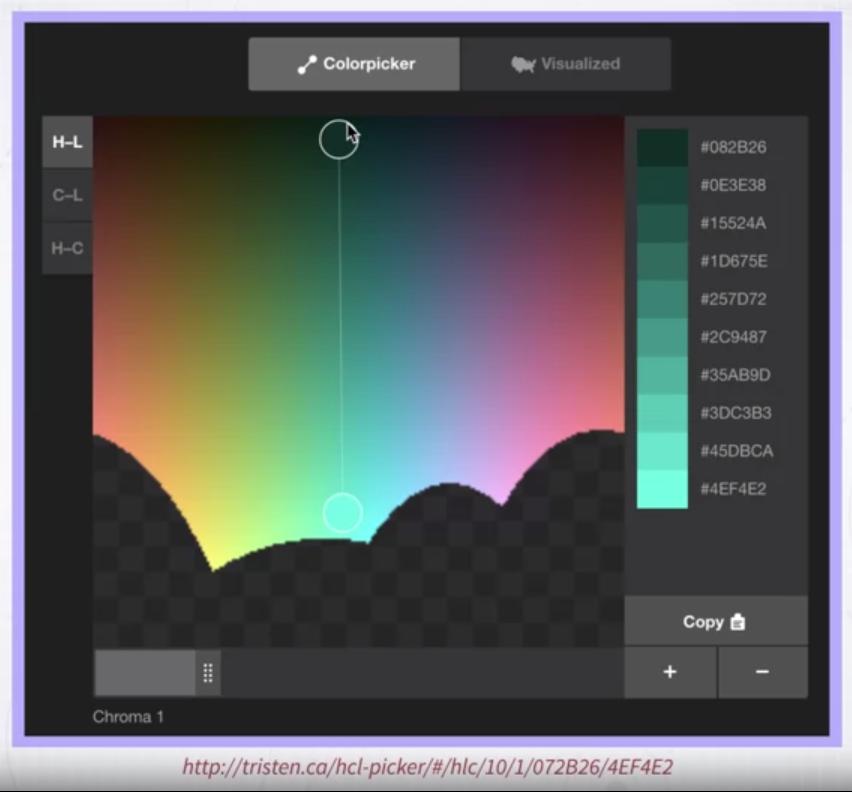

# Week 4 &mdash Using Color in Visualization

### Using Color in Visualization

Hi, welcome to a new model which is a follow up of the previous one. So, we're still talking about **color**. But with the main difference that in the previous module, we focused on perceptual issues and color spaces. Now, with the knowledge acquired in the previous module, we can talk more about _how to actually use color in visualization design_. 

Before I do that, I want you to recall a few important concepts from the previous module, that's it's important for you to keep in mind as we move through the rest of this module. 

So, the first one is the idea that every color can be described by _three main components_, the **trichromacy theory** of color. So, that's important, every color can be described in different color spaces if you want, but always with three main components. 

Then, we talked about the problem of **perceptual uniformity**. When you specify colors for data visualization, it is very important to keep in mind that we need to specify colors in a uniform color space. Why? Well, because as you will see, we typically want to create color palettes that have certain properties, and some of these properties require that for instance, some colors have the same lightness value or the same saturation and so on. If we can't assure that these values are constant from the perceptual point of view, we can't really create effective color scales. Finally, we will keep using the important concept that _color can be described through three very intuitive and usable axis or parameters_. The first one is _hue which defines the color name_, if you want the type of color. The second one is _saturation which defines the vividness or colorfulness of the color_. The last one is _luminance which is the amount of light or brightness that the color is emitting_.

Okay, so let's go back to the most important question of this module. __How do we use color in visualization?__ __What is its main purpose?__ 

Well, we can define color use in visualization in a somewhat abstract way as being used for two main purposes, two specific purposes. The first one is to **quantify**. We want to use color to map quantities to color so that when we see colors in a visualization, we can go back to quantity. That's purpose one. Purpose two is **label**, we want to be able to label data and objects in a way that we can recognize and recall what type of object some object is when we see this color. 

Let me show you a couple of examples. So, the first one as we said is going from perceiving color to linking the color to the concept of quantity. Here, is an example. 

There is a map where a quantity has been mapped to the color intensity of the colors that you see here. In this specific map, which I've taken from NASA, we have what is called Net Primary Productivity which is a measure of how much carbon is generated by plants, okay? So, as you can see in the maps, there are regions that are darker than others. So, these are regions where the Net Primary Productivity is higher than others. So, what are we doing visually here? We are extracting quantity out of color. It's a perfect example of the first purpose. 

The second purpose is labeling. So, mapping categories to colors. So, think about it, when color is used this way, what we are doing is perceiving colors in the visualization and linking, mentally linking the color to a concept, to a category. Let me give you an example, once again with a map. 

So, this is another map where the areas of the map have been labeled or painted in order to convey the concepts of some categories. So, for instance, whether some region is urban, whether there is water, whether there is a forest and so on. So, these are categories, is not quantities, okay? So, in general, you can always think of the two main purposes of color use in visualization as being either communicating some quantity, the magnitude of something, and how it distributes according to other different parameters, and convey and labeling. So, conveying through color the concept of categories and labels.

### Quantitative Color Scales

Okay. So, now we start with considering how to create quantitative color scales. Color scales that are designed to represent quantitative information.

So, I think we should start by reflecting on what are properties that we want a quantitative color scale to have. So, I think there are two main properties. 

The first one is **uniformity**. What does it mean? _It means that as we move through the values of the color scale, we want these values, the changes to be perceived uniformly_. Okay? **A difference in the value needs to be proportional to the difference that is perceived**. That's very important. 

The second one is the **discriminability**. So, as we create color scales that map data quantity to a color, we want to _make sure that we can discriminate as many different colors as possible_. Why that? Well, because the more colors we have available, the higher the number of different colors that we can extract visually from the visualization. 

So, let me give you an example that shows the concept of uniform and nonuniform color scale. 

This is a little example that I prepared, where I'm using a color scale where the color intensity or lightness is used to represent the value, the quantity of information, okay? So, we go from very dark to very bright. But the difference between these two color scales is that the first one is not uniform. There are big jumps. So, we go from dark and then it goes very quickly up to lighter and much much quicker to even lighter than that. Whereas the one that you see at the bottom is way more uniform. So, that's the problem with uniform medium. 

So, how do we create a sequential color scale, a color scale that is able to represent quantity in sequence. Well, I almost already give you a preview with the previous example. **The idea is that you have to first choose one color hue and then map the value to luminance. **

Let me give you a couple of examples. So, here are a number of alternative color scales that use exactly this strategy. 

So, they are created by selecting one specific color hue and varying uniformly the lightness of the color, and by the way, I forgot to say that _also keeping the saturation constant_, okay? So, **hue and saturation are kept constant and what is varying is the lightness level**. 

So, now, let me make this even easier to understand through another demo using a colorpicker. Okay, here I'm using colorpicker that has been created by Tristan Brown, and it's very similar to the colorpicker that I've shown you in the previous module.

It's a colorpicker in the HCL space, and what you see here in this version we have that hue is mapped to the x-axis and lightness is mapped to the y-axis and the chroma component, which is the vividness or saturation can be changed through a slider, so that now we are keeping chroma constant, okay? So, if I want to create an effective color scale to represent quantities, what I can do is to position the colorpicker vertically like here, parallel to the hue axis and then go from a very dark to a very bright color and interpolate between the two. 

In fact, this is what you see on the right in the colors that are automatically sampled by these colorpicker. By the way, you can reduce the number of samples or also increase the number of samples. You can do exactly the same thing with a different color hue. So, say that we want a blue color scale, we can just move by still keeping the line parallel to the y-axis. Now we have a blue color scale that is perceptually uniform. We can do the same with green, sorry, with purple or pink, we can do the same we red and so on. So, this is one way we can create single hue quantitative color scales.

### Multi-hue Sequential Scales

Okay. An interesting variation over the single hue sequential color scale is a more multi-hue sequential color scale. 

So, what is the idea here? The idea is to **still have a perceptual sequence of values that changes according to lightness or luminance, but go through multiple hues**. In the previous example, I've shown you, I kept hue constant. In this one, in this new method, now, I'm trying to do exactly the same thing, create a perceptually linear color scale that changes color intensity or lightness uniformly, but goes through several color hues. Let's see how this is done. Once again, I'll give you a demo. I'm using the same color picker. But, what I'm doing right now, so, in the previous example, what I did was to _position the picker vertically parallel to the lightness axis_. 

But that's not the only way to create a perceptually uniform color scale. Let me show you what we can do. Well, we can start from, since on the x-axis we have hue, we can basically horizontally go from, try to span as much as possible of the hue space, but at the same time, also go through colors that are very dark and very bright, okay? As you can see on the right, what we have now is a color scale that **increase linearly and uniformly in terms of lightness, which is the parameter we are mostly interested in when we want to convey a quantity**, but _at the same time, it's changing color hue_, and as we will see in a moment, that's a useful property. 

I can do exactly the same thing by flipping the sampler, the color picker, in this other direction. So, you see we go from very dark to very bright, but we also span a lot of different colors and lots of different color hues. This is even more evident when I reduce the number of samples. Look at this. So, we go from very dark to very bright, but we also cover different color hues.

So, now, _why use a multi-hue sequential color scale_? If we are happy with a single hue, why should we use multiple hues? Well, there are a number of important reasons. The first one may be just **aesthetics**. It's possible sometimes that using multi-hue color scales, the result is more aesthetically pleasing, but that's not the only point. 

Another one is that **by going through different color hues, we span a larger volume of the color space, and by doing that, we go to a higher set, a larger set of colors**. In turn, _this means that we can create a higher, a larger set of discriminable colors_. Colors that can be discriminated among them. So, in a way, we have higher resolution. When we allow ourselves to span multiple hues in the HCL color space, now we have a larger space, and because of that, we have a higher resolution, which is important. 

Finally, and probably even more important, we have that by going through multiple hues, we can **communicate two pieces of information at once**. We can communicate information about the quantity that is mapped to color, but we can also **segment** areas that are mapped through color into areas that can be very easily labeled. I can say, so this is the red color, this is the red area, this is the yellow area, this is the blue area, for instance. 

Let me show you an example that makes this more clear. Here is an image that is being generated with a multi-hue perceptually uniform color scale to represent some astronomical data, okay?

As you can see here, there are different regions, each regions represent areas where the quantity is similar, but since we are going through multiple color hues, it's also very nicely segmenting these areas into regions that are easy to label and even name. I can talk about the red region, the white-blue region, and the yellow region, and the dark-black region. So, I can actually name them. This is not easy to do with color scales that use only one color hue. 

Let me give you another example. 

This is another quantity map mapped in the UK with three different uniform color maps that have the same property. They span different color hues, but they're also perceptually uniform in terms of lightness. As you can see, not only information about quantity is well-represented, but also information about regions. I can segment regions according to different hues.

### Categorical Color Scales Part 1

