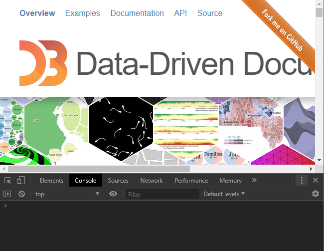
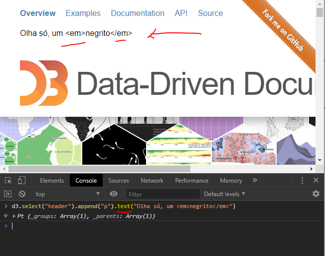
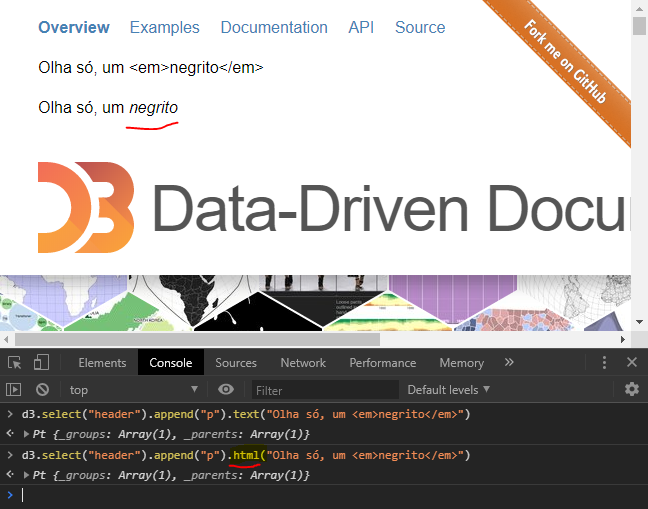
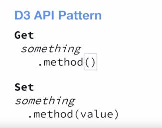

# Javascript

### Control Structures

```javascript
let color;
if (v1 === 10) {
    color = "blue"
} else {
    color = "red"
}

// ternary operator
let color = v1 === 10 ? "blue" : "red;
```

#### Loops

```javascript

for (let i = 1; i < 21; i+=1){
    console.log(i);
}

let j = 1;
while (j < 21){
    console.log(j);
    j+=1;
}

let k = 1;
while (true) {
    console.log(k);
    k += 1;
    if (k > 21) break;
}
```

Essa construção não conhecia, para iterar com `for` sobre os elementos de um array:

```js
let a = [1,2,3,4];

for (let elemento of a) {
    console.log(elemento)
}

```


### Manipulating the DOM

```javascript

document.write("tsa, não sabia dessa.");

```

Talvez ressaltar as idiossincrasias: 

* separar propriedades por "," e não ";". Os valores de propriedades são declarados com ":", e não "=". Essas coisas acabam sendo boas, porque te remetem ao contexto em que aqueles dados estão sendo utilizados.

* contagem começa por "0" x length da array

* nome do parâmetro na declaração de uma função... não usar o mesmo nome da variável que vai ser passada como argumento, para evitar confusão.

Outras coisas:

mostrar como vc vai precisando de outras funções e métodos pra fazer coisas simples. tipo, detectar o nome de um arquivo antes da extensão, a partir do nome completo com extensão.

# D3

### Selections

Get the actual node from a selection:

```js
let $h1 = d3.select("h1");

console.log($h1);
// Pt {_groups: Array(1), _parents: Array(1)}

console.log($h1.node())
// <h1>...</h1>

let _h1 = document.querySelector("h1");

console.log(_h1);
// <h1>...</h1>

```

Então `d3.select(selector).node()` equivale a `document.querySelector(selector)`.

Outra coisa:

`d3.selectAll("p").node()` equivale a `d3.selectAll("p").nodes()[0]`, porque nesse caso existe uma array de nodes, e `.node()` retorna o primeiro elemento da array. `.nodes()` retorna a array inteira.

Um detalhe para a pequena e sutil diferença entre o que é apresentado no console para `d3.selectAll("p").nodes()` e `document.querySelectorAll("p")`:


### tamanho da seleção

`d3.selectAll("p").size()`,

que equivale a

`d3.selectAll("p").nodes().length`

ou ainda a 

`document.querySelectorAll("p").length`


### selection.text() vs.selection.html()







When using `selection.html()`, the content passed in as argument will actually be parsed as html.

### obtendo vs definindo valores



### `onclick` attribute (for buttons elements, e.g.)

When use it ("inline events"), instead of adding an event listener?


