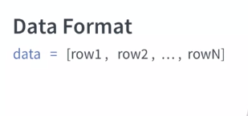
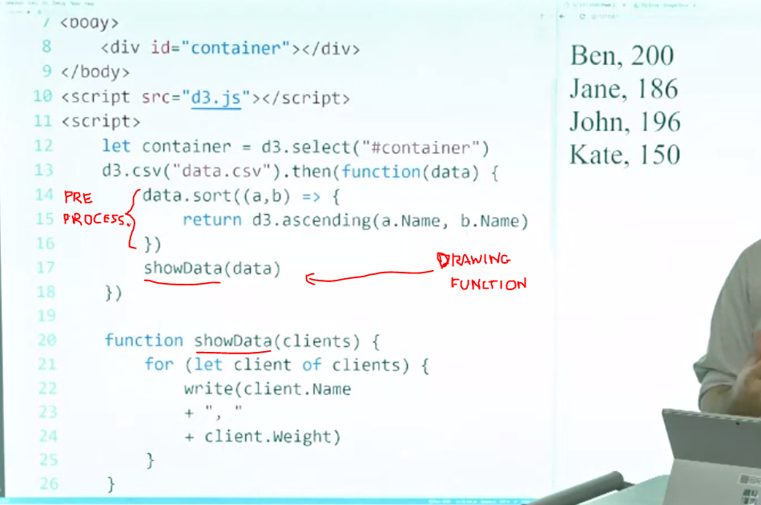
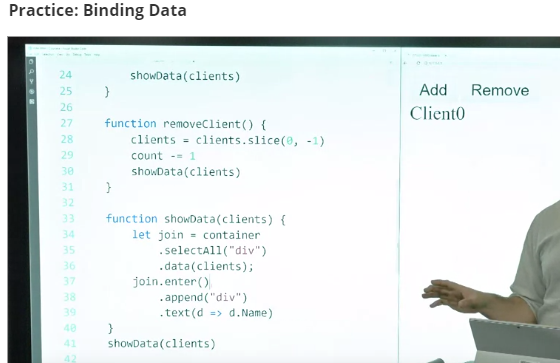
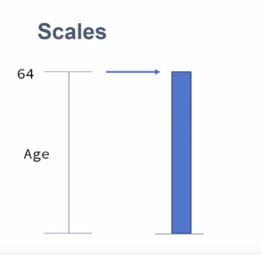
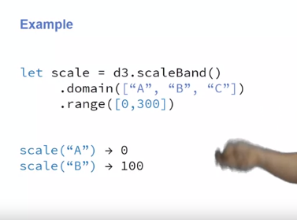

## Week 1

D3:  javascript library that provides: 

* methods to manipulate the data, to transform the data to a format that is easy to visualize. * methods to create the actual visualization, to draw on the webpage

Visualization steps:

1) Transform Data
2) Map data to image space
3) Compute layout
4) Draw the chart

We use the APIs to perform each of those steps.

Some examples:

### d3.selection

We can chain selections:

And we can bind selections to variables:

Main methods that we will be using for selections:

I know that if you have been working with other libraries before, you can do that with jQuery. You can do that with Angular and many other variables in libraries. You even have native code that you can use to select those elements. 

But D3 has a difference. What we are returning here, is not the node itself, but a D3 wrapper that allow us to use functions that we wouldn't get if we were to do the same thing with other libraries. 

`selection.attr()` vs `selection.style()`
attribute if I want to change any attribute that is directly on the tag, and the style is a helper to change the style attribute much easier because then you can change properties inside style directly other than having to concatenate and do all the job yourself.

## Week 2

### Loading data

What's another thing that is important to remember about this process, is that is asynchronous. What this means is that once data is requested to the server, the code on your application is still running. So, if you need to do something with the data you have to provide a callback that the system is going to call once the data is back. 

`d3.csv("file.csv").then(function_to_be_called_when_data_is_available)`

So, this `write` function does a simple thing. You just add the `div` to the container with the information that I provided. It's just to provide a easier way to write to the screen a list of information. 

So, our next step is load the data. How we can do `d3.csv`, and the next thing is the name of my file. So, if my file is in another server, I can give the URL to the file. Here the fire was in the same server, so I can just give the name. So, let's do `data.csv`, this is the name of my file. Then after that, I'm going to do `.then()`, and this function is going to run _after_ my data is available. So, remember that the data is not available immediately. _So, it's going to take a little bit to the data to be available, so you have to provide a callback, a function that d3 is going to call once the data is available, and that is why we have to write a function inside this `.then()`thing_. So, we create a function and you see that this function has no name, is what we call an _anonymous function_. 

Then we're going to see that the data is going to come inside this function. So finally here, we're going to write ''Data is available'' because this only happens when the data is ready. Here we're going to write
''Line after'' because this is my line right after I call my data. 

So if I save that, you see that the order that I write is inverted. So, even though data is available happens first here in the code, this line is written first, because this line is going to wait d3 to go to the server, get the data and then it's going to be reading the screen. So, that's what you have to keep in mind. You cannot use the data right here, you have to use that inside the function that you're going to call once the data is available. 

Here, note that this construction of the `for` loop makes it iterate over the elements of the array.

### Filtering and Sorting

You have to remember that the result that you get when you load your data is often an array. That's not always the case, but most of the time you have an array and then each element inside your array is going to represent one of the roles that you have in your CSV for example. Then, inside this row, we have what we call an object, a JavaScript object, where you have keys, like here I have named for John Doe, and then I have age for how old he is, and each row is going to have an object similar searches and we can access this properties from inside this object.

Turns out that JavaScript already offers you some methods to filter. So you don't really need D3 to filter your data, you can use the methods that JavaScript provides you and in this case, the name of the method is filter. So you basically call the method "filter" and you pass a function as parameter.

It's important to remember that filter is going to return you a new array. So this means that the original data is still there, and you get a copy of your data that now you can play and visualize. So if you need to change our filter, you just can filter again the original data. It doesn't destroy your data.

Different of that is sorting. So sorting I basically want to order my rows in a certain order. What happens is that for example, imagine that I want to order by age, sorting is going to change my list. So I'm going to have the same list, but now it's going to be in a different order. While filter, you get a copy of the list. 

So if I want to sort, I basically have to call the function "sort". Again it's a JavaScript method, not a D3 method and you pass a function that is a comparator. 

A comparator basically received two values and here I am calling them a and b, and the goal of the function is return minus one if a is less than b, zero if they are equal, and one if a is greater than b. However, what happens is that d3 provide us some helpers that we can use. So we don't have to write this comparators all the time. So for example, d3 ascending and d3 descending are comparators built-in D3 that we can use to order lists either ascending or descending order. 

So for example, imagine that I'm calling my function "sort" I can also insert my function my comporator. Run something more complex with this function and pass different parameters to them. So let's see how this work. Imagine that I have again my list with my clients and now I want to sort my clients by age. So I'm going to create, I'm going to call sort, I'm going to pass a function and inside this function, I'm going to again call the ascending from d3 and then I'm going to pass only the age of the client. 

So the order that I going to get is an array where the elements inside are ordered by their age. So sorting and filtering are very important mechanism in order to facilitate showing data to your users. You not always have to visualize everything that you have, sometimes you need interaction and you want the user to switch between different subsets of your data. So you need filtering in order to select only the elements that you want to visualize and sorting in order to visualize them in an order that is easier to the user to deal with.

##### Practice

So, `.sort()` operates on the array itself, overwriting it. It doesn't return anything. `filter()` returns a new array, that can be grabed by a variable.

we are using d3.csv to load the data, and then once this is available, instead of writing the anonymous function here [inside `.then()`], we actually wrote a separated function and we just give this function as parameter, and then d3 is going to call this function with the data. The reason why we do that, one is because it's cleaner than writing the whole function inside these parentheses. The second one is that now we can use this to actually draw if my subset changes. So, I can just call this function again with the new subset and then we're going to be able to draw these new subset without actually changing the function. How we can do that? So, instead of calling showData straight here, we're going to add anonymous function. But this time [the anonymous function] is just to pre-process the data, not to really draw the data. We're gonna receive as parameter, the data, the original one, and here what we're going to do is do some manipulation with our data. Then finally, we're going to call showData to show the data that we got from the server. So, you see that right now it's still doing the same thing because we didn't really change, we just added a function between the two calls.

Sorting: 

Filtering:

most of the time when we are in your application, you don't really want to replace the original data. You want to get some future data, like this one, and then render this data, but keep the original one available so you can use it later, for example if the user change the filter criteria, and they have a different criteria to filter.

### Transforming data

how we can transform our data so that data can be in the shape or the format that we need for our visualization

#### map

So, the function that we use to transform is.map, and inside it, you are going to pass a function that's going to receive each element, and then it's going to return the new version of the element. 

So, for example, here, I am calling map in my array, and I am returning my client.age. So, my original array actually had a list of different clients with all the information like name and any other information that I have. 

Now, I am transforming this original list in only a list of numbers where each number is the age of the client in the same order that I had before. This make easier for me to visualize for example, just the age, if I want to provide that to a method that knows how to draw numbers, the method doesn't have to worry about all the rest of information that I have for each client.

#### reduce

Another method is to use reduce. So, different from map that maps one element to one element in the reduce list, reduce is going to map all the elements to _just one value_. That is for example what we do when we sum. So, we're basically mapping all the values that we have in my array to just one element that is the sum of all the numbers.

So, let's see how it looks like. So, in order to use reduce, you have to first provide a reducer, that is a function, that is going to be called for each element. Then you may also provide the initial value. It's not required. If you don't provide an initial value, JavaScript is going to use the first element of your list as your first initial value. 

A reducer is a function that can have many parameters. So, the first parameter that you have is what we call accumulator. So, basically, this is the object that is carried between each call to the reducer. So, when you start your list, just start with some value and you keep updating this value every time you run your reducer. The current value, is actually the element that we're looking at the moment. Finally, we have the index, that is the position of the element on the array, and they're array itself in case you need to look in some information of it. Then as I said, you return the new value that you want to use that is basically the new accumulator that's going to be passed to the next function. 

So, let's see how it looks. Imagine that I have a list, where I have only numbers, 1 to 4, and now I want to reduce that. So, if I call reduce with this list, and here I'm passing three as my initial value. So, every time I run, I'm going to sum them. So, basically I'm going to take whatever value I have in my accumulator, and I'm going to add my current value to this value. So, for example, in the first run, I'm going to receive as accumulator, 3, because this is my initial value. I'm going to receive as current value, 1, because this is the first element of my list. I'm going to return 4 because this is the sum of 1 plus 3. In the next run, I'm basically going to receive the 4 from the first one as my accumulator. Now, my value is 2 because the second element of my array. I'm going to sum them, and it's going to become 6, and that's going to be my accumulator for the next run until I get to the end. The result of the last reducer is the result of your function. 

So, map and reduce is actually a very standard framework that people also use in big data because it's very powerful. It's basically you transform your data, and then you can do some aggregation with your data transforming it in some new object. 

#### Practice

Then we have our csv loading our data, so we can work with it. As the data is loaded, we're going to call a function called 'dataLoaded' that is just one that we have right here. Right now, this function isn't doing anything, it's just calling the function showData that's going to write to the screen the name and the BMI of the client. But as I said, we don't have the BMI. So we need a way to compute this BMI in order to transform this undefined into actually the BMI of the person. So one way we can do that is once we load the data, we can pre-compute this BMI. So the BMI is going to be available anywhere in our application. How we can do that? We can use map. Map is going to, for each element, do something and transform this element and return the transformed version. Here, the transformation that we're going to do is add this new field, that is the BMI. So in order to do that, we can do clients.map and then again, I'm going to use a error function. Under error function, I just need a parameter and d is going to be my data point, and that's basically my client. Here, I can basically change d. I can say that d.BMI is equal. Here, I have a function that computes the BMI, so I'm just going to call this function. So getBMI with d that is basically my client. So also I made it just change, I can just return d. So remember to return this case because even though this is modifying the original element, if you don't return, map is going to think that the result of the function is undefined and you're going to lose all the information. Lastly, map doesn't change really your data. So what you have to do is to add here to clients again. So I'm saying that the variable that I have is equal this new result. I don't have to use let here because I already have clients here coming as parameter to my function.

Another type of transformation that we can do in our system is actually aggregation. Here, we're going to call it reduce. So basically, you can use map to transform and now you can use reduce to aggregate all those elements in just one value. Here, what we want to do is to show the mean. We want to show the mean BMI in our data set. How we can do that? We're going to do this in our showData function. So here, we are going through each client. We are writing the client. After that, we're going to write a line, a simple thing just to separate the mean, and then you're going to compute the mean. How we can compute the mean? First, I have to sum out the values. How we can sum them? We can say that the sum is equal to our clients.reduce.
Start transcript at 4 minutes 27 seconds4:27
So, the first time we called map, now we call call.reduce, and we're going to again parse a function. But this function, it can have more parameters but for our case, we just need two. So the first is the prev, that is basically which value I had before getting to this element in the list because this is going to go element by element, and I need to know which value I had before in order to decide what's going to be the new value given this new observation that I just did. I going to call curr that is basically my current element. So it's the element that I aim in my list at the moment. Now, I can do some modification of the values. So prev is going to be the previous sum. So if I start with the first element, it's going to be zero before. Then for the next one, it's going to be the value of the first. Then for the next one, it's the first plus the second, and so on. So, we need to actually tell the system to start with zero. So at the end, we're going to add here comma, zero. That's how we're going to start, and we're going to say that the result here is going to be equal to prev, that is the value that I had before, plus the current one BMI. So this is going to basically add the BMI of each person in my data set. Finally, once I have the sum, getting the mean is easy. I can just do sum divided, remember that I can use clients.length to get the size of my data set. So this is going to give me the mean base, basically the sum divided by the size of the data set, and you're going to write this to my screen.

So, remember that you can use map. If the final results is going to be the same size, you still can use map to do some kind of filtering because it can just return undefined. If it is one element that you don't want to use, and then you can filter those element out later. But most of the time, the result is going to show a list. While you reduce, most of the time you are trying to produce one element that may be just one value, an integer or a string, or you may want to produce one object that contains some information based on this list. If you want to transform a list to a list again or just shorter version, you can use filter, for example, or map to do this transformation.

### Computing Simple Statistics

`d3.max()`, `d3.min()`

And the way we use this function is that as first parameter, we pass our data that is often an array, with each element representing one of the elements we want to visualize. And we can pass also an accessor. And this is optional, but most of the time you use it because you want, it's kind of a map, so you're basically taking your element and selecting from your whole data only the thing that you want. So for example if I have a client, I going to use the accessor to select only the age. So, and this concept is used throughout d3 in many other different functions. So you always have a function that is going to receive as parameter of value that is the data that you're looking at and a index that is the position of the data in the least that you are going through. And this is very common and many functions in d3's going to use the same pattern.

And how we use it, so for example, here, I am getting the maximum age that I have in my data or the minimal age. I basically can just switch the product mean and the product max by the function that I want, either minimal or the maximal. The rest is still the same.

`d3.extent()`

`d3.sum()`, `d3.mean()`

And often, what we need is to either get some maximum or minimum so we can understand the domain of the data. Or get sums and means so we can see the extent if I add all this data together, how much space they going to take on the screen. Or if I take the middle of my data in my distribution where it will going to be. And it will help us with that and also provide many other functions that we can use to compute those statistics.

#### Practice

What we have here is a list with the people in our data set. Now, we want to extract this information.

Sum

Mean

Extent

### Drawing with data

#### SVG

Another thing that is important is that you can use G to control the drawing order. So, if the SVG is going to show things one in front of order, in the order that you draw. But imagine that you had something that you want to show in the back, but you're only going to grow it later on your code. So, one way to do that is to create the g as a place holder and then later you just add the element to G is G. Then the element's going to be in that position of the drawing.

#### Practice SVG

#### Binding data

Once you call the data, you're going to create this binding, you're going to create this join and d3 is going to perform the join. 

And the way it works is, you have your set of elements here. But if I am starting right now, actually, this set of element is empty, right? So I'm going to select all my circles that I have, and I don't have any circle on the screen, you're going to have an empty set. 

And then, what I do is that I do `.data` to append the data. Once I do that, d3 creates the second set, that is, my data. So now, we have all my data points, that are coming, and I have all my elements that right now is empty, and d3 is going to do the join between those. 

Since I have empty here and I have a list here we don't have an intersection. So d3 is going to call everything that is new, **Enter**, and everything that is an element but doesn't have a data point, **Exit**. 

all data still not bound to any element: enter selection
all elements no longer bound to any data: exit selection

So see as my set is empty right now, we don't have anything in Exit but in Enter, we have all the new data points. Basically, the data points that doesn't have any element associated on the screen.

Then, I can call, `.enter` to access these set of elements. So these are selection of data that doesn't have element and then, I can just use append to create the elements. 

So here for example, I'm doing append and li, so now, I'm going to add one li for each data point that I have in my element set. And what happens now, is that those two set are merged, they are together and now every data point that I have, has one element on the screen. 

And that's what we call **Update**, so if I call `.data` again, I'm basically going to select all those data points that have those elements.

But now, imagine that I changed the data, maybe I add new names and I remove some of them. So now, I'm going to call `.data` again, and D3 is going to split those two sets [_creates the bind between the elements and the data and return a selection that represents all data-point+element combinations_]. 

So we still have the two sets. We're going to have the intersection, that is our _Update_, those are the ones that is still in my data.

Then, we have the `.enter`. Those are the ones that I just added. [_The code selects a subset of the combination elements+data-points, more specifically, it selects the data-points that don't have an element associated to them._]

And then, we have the exit, those are the ones that we removed.  [_selects a subset of the combination elements+data-points, more specifically, it selects the elements that don't have a data-point associated to them_.]

So if I add something, I actually have to create the element for it. But if I remove, I have to remove it from the screen. 

So for example here, we can use d3 select and you select our element and do the bind. And we can associate that to a variable that here we call sel. 

And then, if I just call `sel`, what I'm looking at are just the Update, just the elements that were there already that may have their values changed, but they're still the same elements. 

If I call `.enter`, what I get are the new ones. So one thing that we often do when we call `.enter`, the next step is called `.append`, so we can add these new elements associated to this data. 

And last one is `.exit`, that is basically, those that are removed. So often, what we do is that we call `.exit` and then we call `.remove`. In order to remove those elements from the screen, since we don't have data associated anymore. 

So keep in mind that, join is one of the many features of d3 when coming to drawing. So everything that we're going to draw on the screen based on data, is going to be the process of join and using one of those three sets. Either we're going to just update, whatever we have based on some information that changed. Or are we going to add the new elements, because we just received new information or are we gonnaremove elements that are in the screen because those elements rarely move from the data. Most of the drawing that we're going to do in d3, are supported by this three features that we have in our join method.

#### Binding data -- pratice

Now, you want to map this data to the screen, you want to show things on the screen using this data. So, one way is to just use `for` functions, and then you have to write functions that basically write things on the screen, but turns out you don't really need to do that. So, D3 has a core module, that is the binding module, that is the data module, that helps you to bind data to the elements on the screen, and that's what we want to do here. 

We want to use the data API in order to map values from our data to the elements on the screen. The advantage is because there is this link between elements and the data, is easier for us as the data change to identify which elements got changed, which elements got removed, and which elements are new. In this way, we can update our interface to reflect that. 

So here, what we have is two buttons, one is add and the other one is remove. And the goal is they just going to add and remove elements from our dataset that we have, a fake one.

Exemplo interessante de como mostrar update selection e enter selection.

So you see here, that show data is the function that's going to be calling every time the data changes, and it's up to show data to figure out how the things here should be updated. Who should leave, who should be added, and so on. Finally, I have the function show data here that is [inaudible] we have implement it, and we are calling show data at the end with our first client. So when we start our application, we want to see the client here. So, let's start working to get this client there. So, the first thing we need is our container. So container, remember is the element that is going to keep track of all the clients that we have in our list. So, we're going to do select all, and you're going to select out the DIVs. So here, I'm going to add a DIV for each client. The first thing that I'm going to do is, I want to select all the DIVs that are there. Even though I don't have any DIV yet, it doesn't matter because this function doesn't care if I have not something there. It just wants to select everything that we have there, and that's what we are doing. We have to select all the DIVs, independent if I have a DIV there or not. Then, as we select the DIVs, we're going to bind some data to those DIVs, and those are my clients. Perfect. So, now I have my dataset, and I have my list of DIVs that were now [inaudible] it, and the three notes that I want to join those two information. So for that reason, I'm going to call the return of this, join. So, whatever I return here is this join between the data and the elements that I already have on the screen. After that, what we're going to do is join.enter. So, .enter is selecting only the new data points, the data points that doesn't have an equivalent DIV on our HTML. And if they don't have a DIV, what we need to do is to actually add the DIV, so we're going to do append DIV. What we are saying here is that, for each element that doesn't have a DIV, that's what we are saying with enter, we want to append the DIV, and we're going to create this DIV. So finally, this thing returns the DIV, and we can change the text inside the DIV to contain the name of the client. So we're going to use, again, an arrow function here d.name to return the name of the client. So, you see that now, we got our Client0 here. We didn't have to go to an array[?] function or anything. D3 took care of creating this DIV for this new client, but now comes the change. What about if by click add here to add a new client? So you see that I have my button here on the top, and I say that every time I click, I want to run this function, add client. So, it's going to call this function and it's going to try to add a client with account. So this should be Client1 because count starts with one, and then it's going to call my function to update. So if I click here, I get a new client for free. I didn't have to do anything. Why I didn't have to do anything? Because these enter thing again is checking. So if I change my data, now I have the new client. d3 is going to realize that this client doesn't have a DIV, and it's going to show the data there, but there is a difference because this one wasn't recreated. I didn't clean and recreate everything, between notes which ones are new and which one is updated. And to prove that, what we're going to do here is that, we're going to append a value to the client saying new. 

So, now we're going to have new for each new clients. So you see that when I start, I have clients zero as new. Then once I add, I have Client1 as new but Client0 was showing you because the original value is still there. We want to change that, so we're going to call only on join. We're going to say join.text, and you're going to say that the name plus updated, and now let's see. So we have Client0 here, we add a new on, so you see that Client0 is updated because this code was called for the new client, while code this called only for the old ones, the ones that were already there. 

If I keep adding, you see that always only the last one is my new element, all the others are just being updated. 

They are not being added as a new element. So finally, what we want to do is to remove. If I click on remove, I'm supposed to remove the last one. But, even though _I am changing the list_, so the list is changing here, the screen is not being updated.

So, our last step is to update the screen to remove the one that is not there. The way we do that is by calling in our join, exit. So, exit are those elements that doesn't have a data anymore. And if they don't have a data, you can just remove them. 

So, I can add new elements, and now I can remove the last one. So, I add, and I can remove. I changed the array and is up to this function show data to make sure that whatever information I have in my screen is synced with my list. So, the other functions do not have to worry what you're doing or whatever we are doing with your data. They just have to worry that the data has to be in DIV specific format. And this function has to make sure that what you have on your screen is equivalent to what you have in your data. It's the same thing, so that's why we write them separated, and those three functions: enter, exit, and update itself are going to help us to make sure that those two data points, the data and the elements are synced.

#### Numeric scales

Now what I want to do is to map the age of each people to the height of a bar. So, for example, if my maximum person in my dataset has 64 years old, what we can do is map this one to the tallest bar that I have. Someone with half his age is going to have half the size of the bar. But now the problem is, how much pixels is each of those? So, if I have 64, what should be the size in pixel of the bar? Or if I have half of that 32, what would be the size in pixels of that? It cannot be just 64 or 32 because then I get limited to a size of a chart and also if my dataset grows, my chart's going to change in ratio and it's kind of thing here we don't want that. We want to be able to convert from the numbers that I have in my dataset to numbers that I can use that is basically the height of my bar. To do that, one option is using numerical scales. The goal of numerical scales is basically getting some information that you have in your dataset and then you split in the information that is equivalent to the graphical space. 

So, we get _data in the data space and we output data on the image space, so now we can use this information to draw_. 

Domain: data space
Range: visual space

So, if the domain is the set of numbers that we can assume in the data space, the range is the set of numbers that we can assume on the graphic space. In most of this case, this is from the minimum to the maximum size that we can have. So, for example with a bar chart, that is going to be from zero because the minimum a bar can go is zero and to the maximum that if you want the tallest bar to have 100 pixel would be 100 pixel. The same thing goes with the domain. In some cases, you want this minimum to be something actual, the minimum value that you want to have, or sometimes, you want this to be zero, you have to be very careful in your choices to make sure that the interpretation of your chart is correct.

But linear scales are not the only one that we can use. We can actually use different types of scales. So one for example, is the square root scale. That one is using for if we're mapping two size of circles and you want to map to the area of the circle other than just the radius. 

So the only thing we changed from the previous example is that now we are using a square root scale. So now if I call it to the maximum, I should get the maximum. So, 64, it returns 300. If I call the minimum, zero return zero but if I call the middle value, now I get a different picture. I get a higher number than I get before because now, my scale is exponential. 

So, it's when I get to the middle, actually, in the graphical space, I'm further on my range of values. So, as I say, different types of scales is going to use different things in the middle. _Most of the time the minimum and the maximum is going to be the same but how they interpolate between those values is what's going to change_. So, the same thing happen with all the scales that we have in D3 as well. 

Logarithmic scales have the advantage of mitigate the effect of outlier. If you have one element that is much bigger than the older one, logarithmic scale is going to try to push those down a little bit so you have a more smooth curve. But the price, you have the risk of misinterpretation of your chart. So be very careful on which scale you choose, making sure that whoever is going to look in your chart is actually reading the values correctly. This is one very important step towards that, it's choosing your scale.

#### Practice

So, we are basically binding our data to our divs, so we are creating a div for each element, and then for each client we are setting the text of the div to be the name of the client. We are changing some style, so we're changing the background color to be blue. We are changing the margin between them, so basically there is the space between them to five pixels. Also, the text color is white, and the width of those div is 100. So, all of them have the same width here. But our goal is actually to make this looks like a bar chart. So, what we want to do is to make the width dynamic and reflecting the weight of this person. We want to have the weight map it to the width. What you could say okay, you can make the width equal to the weight, and this is actually a possible solution. We have the problem that, if we want to increase the size of this bar, so we want those bars to actually take the whole screen or we want to make them smaller. Now is hard because the width is fixed, the numbers that we have. So, we want to make this proportional. So remember, you want to make your visualization work no matter how many elements you have. Also, the range of values, you have to be flexible, because if the domain of the values change, your visualization have to have the same look and feel because otherwise if we add an outlier here, the bars can actually go beyond the screen and we want to see that. So, for that reason, we actually want to create scales to deal with that.

#### Ordinal scales

D3 provides you with different types of scale when you want to convert numbers to numbers, but they also provide you with scales when you want to convert categorical value to numbers. Those types of scales is what we call ordinal scales. The way it works is basically, you want to map a value in the original space to a value on the graphic space. So, one thing is important here is that, it doesn't have to be a number on the graphic space. So, for example you can use ordinal scale is also mapped to color, so if you want to associate a different color to each name that you have in your data set, you can also use ordinal scales and but the idea here is exactly that. So, the values that are going to come as input are categorical values, are values that it can be strings, it can also be numbers but they don't have any specific order or specific range.

We have d3 scale and here we are creating one that's called scale ordinal. Then we call our domain, the difference here the domain is not going to be a range anymore, it's going to be a list of values, is how the values that I can assume on this scale. Then we're going to have the range and the range is specifically for the scale ordinal is going to be the list of values that are going to assume all my graphic space. So, for example imagine that I want to map the colors, I'm going to have the list of names on my domain and then I'm going to have the list of colors on my range. 

How we use this scale band? So, similar to the scale where do now, we're going to do dot scale band to create the scale. Then you're going to call dot domain, and the domain here same thing is going to be the list of values that we can have in our data. 

Then you're going to call range, so range is different, because range is going to be similar to a numeric scale. We want a range of values, the minimum and the maximum and again it can be zero to 300 to 400. So, if I'm doing a bar chart for example, is going to be the width of the places where I can put my bars. So, if my chart has 300 pixels, it will be from zero to 300 pixels. So, here we have the same example. So, note that we have the same domain, we have scale band, the domain is the same, but now we change the range. 

So, the range is a number from zero to 300. So, what the system is going to do, is basically take this 300 and split in chunks of 100 pixels each. So, you basically divide it by three because this is the number of elements that we have in our domain. So, once I have those chunks, if I call this function, **what I get is the beginning of the chunk**. So, note that the beginning of the chunk A is going to be zero, the beginning of the chunk B is going to be 100, because that is where the first chunk ends. So, it's not like an numerical scale that you would think if it's in the middle we're going to be a 150 because it's half no, that's the beginning of the chunk. So, the same thing if I run to see I'm going to get 200, because then plus the width, I'm going to get the 300 space that I have available. 

If I want to get the width, I can just use a `scale.bandwidth` to get what's the size of each band. 

_So, keep in mind that we can use ordinal scales to map values that are mostly categorical or even ordinal but they are not really numerical you don't do arithmetic functions with them to information on geographic space that can be a number. But can also be a categorical value like colors or any type of information that you may use in your visualization._ So, if we are dealing with data that in the original format has numeric shape, most of the time you're going to be using numeric scale, but if we are dealing with data that are categorical or ordinal shape, than most of the time you're going to be working with ordinal scales.

#### Practice

we need to create our ordinary scale that we are going to be used to position things on the screen. So to do that, we're going to create here and we already have the width scale that defines the width. 

So now we already have our position scale, we know how to position things on screen, we can actually create our rectangles to represent each client. So, we can use our join that is basically what we just did that is connecting the data to our container, our SVG container and you're going to say "enter". This means every time I have new elements, I want to append the rect. So, I going to add a rectangle to the screen for each new client that I have. Then this rect is going to have, first I'm going to set a color for this rect, so the fill is going to be blue. Then you're going to say that the width of this rect is proportional to the weight of the client. So, we're going to say width of the rect is proportion. So, D is my client and we're going to use widthScale(d.weight).

So, this is the weight of the client. The next step is the height of the bar. So, for now we're going to set the height of the bar as 20 pixels. You see that we already can see the bars here but this one on top of others, so that's the reason that it looks like one, but we actually have multiple bars here. What we have to do is just spread them each one in there bands. So in order to do that, we can say that the Y position of the bar that is the vertical position of the bar is based on the name of the person given the position scale. So you're going to provide the name, and the position scale is going to provide us where this band starts. So, that's why now we got the bars spreaded around. 

But now since this is a band and we have actually a band here on the screen for each client, we can get the height of this band and use that to decide the size of the bar. So, the way we can do is basically replace the 20 that we have here by bandwidth.

So, now each bar, the height is occupying the whole band that we have for each client. Now you have a new problem because now I cannot distinguish between two bars where one starts and the other one ends unless I look here at the end. So, this is not really good, but I can tweak that **on the scale itself** and not on the SVG or not when I am drawing things. So, I can go back to my scale and I can say, you know what? I want to set a padding here and I want it to be 0.3.

So, 0.3 is the proportion of the size that you have, so this just means that now we have the padding between them based on the proportion that I provided. So, if I want them to be closer, I can provide a smaller number, if I want them to be farther, I can provide a bigger number and I can choose whatever number better suites what I'm looking for to create my visualization. You don't want them to be too separated, so people cannot relate them, but you also don't want them to be too close so people cannot really distinguish between each bar. So, remember that if you have to transform numbers to numbers, you can use the linear scale or any other numeric scales, but if you want to transform numbers or categorical data to numbers, then you can use the ordinary scale like the band one that helps you to transform categorical values like the names of the clients to positions of bands on the screen.

