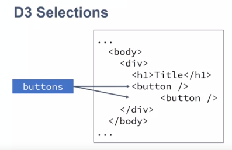

## Week 1

D3:  javascript library that provides: 

* methods to manipulate the data, to transform the data to a format that is easy to visualize. * methods to create the actual visualization, to draw on the webpage

Visualization steps:

1) Transform Data
2) Map data to image space
3) Compute layout
4) Draw the chart

We use the APIs to perform each of those steps.

Some examples:

### d3.selection

We can chain selections:

And we can bind selections to variables:

Main methods that we will be using for selections:

I know that if you have been working with other libraries before, you can do that with jQuery. You can do that with Angular and many other variables in libraries. You even have native code that you can use to select those elements. 

But D3 has a difference. What we are returning here, is not the node itself, but a D3 wrapper that allow us to use functions that we wouldn't get if we were to do the same thing with other libraries. 

`selection.attr()` vs `selection.style()`
attribute if I want to change any attribute that is directly on the tag, and the style is a helper to change the style attribute much easier because then you can change properties inside style directly other than having to concatenate and do all the job yourself.

## Week 2

### Loading data

What's another thing that is important to remember about this process, is that is asynchronous. What this means is that once data is requested to the server, the code on your application is still running. So, if you need to do something with the data you have to provide a callback that the system is going to call once the data is back. 

`d3.csv("file.csv").then(function_to_be_called_when_data_is_available)`

So, this `write` function does a simple thing. You just add the `div` to the container with the information that I provided. It's just to provide a easier way to write to the screen a list of information. 

So, our next step is load the data. How we can do `d3.csv`, and the next thing is the name of my file. So, if my file is in another server, I can give the URL to the file. Here the fire was in the same server, so I can just give the name. So, let's do `data.csv`, this is the name of my file. Then after that, I'm going to do `.then()`, and this function is going to run _after_ my data is available. So, remember that the data is not available immediately. _So, it's going to take a little bit to the data to be available, so you have to provide a callback, a function that d3 is going to call once the data is available, and that is why we have to write a function inside this `.then()`thing_. So, we create a function and you see that this function has no name, is what we call an _anonymous function_. 

Then we're going to see that the data is going to come inside this function. So finally here, we're going to write ''Data is available'' because this only happens when the data is ready. Here we're going to write
''Line after'' because this is my line right after I call my data. 

So if I save that, you see that the order that I write is inverted. So, even though data is available happens first here in the code, this line is written first, because this line is going to wait d3 to go to the server, get the data and then it's going to be reading the screen. So, that's what you have to keep in mind. You cannot use the data right here, you have to use that inside the function that you're going to call once the data is available. 

Here, note that this construction of the `for` loop makes it iterate over the elements of the array.

### Filtering and Sorting

