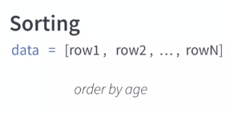

## Week 1

D3:  javascript library that provides: 

* methods to manipulate the data, to transform the data to a format that is easy to visualize. * methods to create the actual visualization, to draw on the webpage

Visualization steps:

1) Transform Data
2) Map data to image space
3) Compute layout
4) Draw the chart

We use the APIs to perform each of those steps.

Some examples:

### d3.selection

We can chain selections:

And we can bind selections to variables:

Main methods that we will be using for selections:

I know that if you have been working with other libraries before, you can do that with jQuery. You can do that with Angular and many other variables in libraries. You even have native code that you can use to select those elements. 

But D3 has a difference. What we are returning here, is not the node itself, but a D3 wrapper that allow us to use functions that we wouldn't get if we were to do the same thing with other libraries. 

`selection.attr()` vs `selection.style()`
attribute if I want to change any attribute that is directly on the tag, and the style is a helper to change the style attribute much easier because then you can change properties inside style directly other than having to concatenate and do all the job yourself.

## Week 2

### Loading data

What's another thing that is important to remember about this process, is that is asynchronous. What this means is that once data is requested to the server, the code on your application is still running. So, if you need to do something with the data you have to provide a callback that the system is going to call once the data is back. 

`d3.csv("file.csv").then(function_to_be_called_when_data_is_available)`

So, this `write` function does a simple thing. You just add the `div` to the container with the information that I provided. It's just to provide a easier way to write to the screen a list of information. 

So, our next step is load the data. How we can do `d3.csv`, and the next thing is the name of my file. So, if my file is in another server, I can give the URL to the file. Here the fire was in the same server, so I can just give the name. So, let's do `data.csv`, this is the name of my file. Then after that, I'm going to do `.then()`, and this function is going to run _after_ my data is available. So, remember that the data is not available immediately. _So, it's going to take a little bit to the data to be available, so you have to provide a callback, a function that d3 is going to call once the data is available, and that is why we have to write a function inside this `.then()`thing_. So, we create a function and you see that this function has no name, is what we call an _anonymous function_. 

Then we're going to see that the data is going to come inside this function. So finally here, we're going to write ''Data is available'' because this only happens when the data is ready. Here we're going to write
''Line after'' because this is my line right after I call my data. 

So if I save that, you see that the order that I write is inverted. So, even though data is available happens first here in the code, this line is written first, because this line is going to wait d3 to go to the server, get the data and then it's going to be reading the screen. So, that's what you have to keep in mind. You cannot use the data right here, you have to use that inside the function that you're going to call once the data is available. 

Here, note that this construction of the `for` loop makes it iterate over the elements of the array.

### Filtering and Sorting

You have to remember that the result that you get when you load your data is often an array. That's not always the case, but most of the time you have an array and then each element inside your array is going to represent one of the roles that you have in your CSV for example. Then, inside this row, we have what we call an object, a JavaScript object, where you have keys, like here I have named for John Doe, and then I have age for how old he is, and each row is going to have an object similar searches and we can access this properties from inside this object.

Turns out that JavaScript already offers you some methods to filter. So you don't really need D3 to filter your data, you can use the methods that JavaScript provides you and in this case, the name of the method is filter. So you basically call the method "filter" and you pass a function as parameter.

It's important to remember that filter is going to return you a new array. So this means that the original data is still there, and you get a copy of your data that now you can play and visualize. So if you need to change our filter, you just can filter again the original data. It doesn't destroy your data.

Different of that is sorting. So sorting I basically want to order my rows in a certain order. What happens is that for example, imagine that I want to order by age, sorting is going to change my list. So I'm going to have the same list, but now it's going to be in a different order. While filter, you get a copy of the list. 

So if I want to sort, I basically have to call the function "sort". Again it's a JavaScript method, not a D3 method and you pass a function that is a comparator. 

A comparator basically received two values and here I am calling them a and b, and the goal of the function is return minus one if a is less than b, zero if they are equal, and one if a is greater than b. However, what happens is that d3 provide us some helpers that we can use. So we don't have to write this comparators all the time. So for example, d3 ascending and d3 descending are comparators built-in D3 that we can use to order lists either ascending or descending order. 

So for example, imagine that I'm calling my function "sort" I can also insert my function my comporator. Run something more complex with this function and pass different parameters to them. So let's see how this work. Imagine that I have again my list with my clients and now I want to sort my clients by age. So I'm going to create, I'm going to call sort, I'm going to pass a function and inside this function, I'm going to again call the ascending from d3 and then I'm going to pass only the age of the client. 

So the order that I going to get is an array where the elements inside are ordered by their age. So sorting and filtering are very important mechanism in order to facilitate showing data to your users. You not always have to visualize everything that you have, sometimes you need interaction and you want the user to switch between different subsets of your data. So you need filtering in order to select only the elements that you want to visualize and sorting in order to visualize them in an order that is easier to the user to deal with.

##### Practice

So, `.sort()` operates on the array itself, overwriting it. It doesn't return anything. `filter()` returns a new array, that can be grabed by a variable.

we are using d3.csv to load the data, and then once this is available, instead of writing the anonymous function here [inside `.then()`], we actually wrote a separated function and we just give this function as parameter, and then d3 is going to call this function with the data. The reason why we do that, one is because it's cleaner than writing the whole function inside these parentheses. The second one is that now we can use this to actually draw if my subset changes. So, I can just call this function again with the new subset and then we're going to be able to draw these new subset without actually changing the function. How we can do that? So, instead of calling showData straight here, we're going to add anonymous function. But this time [the anonymous function] is just to pre-process the data, not to really draw the data. We're gonna receive as parameter, the data, the original one, and here what we're going to do is do some manipulation with our data. Then finally, we're going to call showData to show the data that we got from the server. So, you see that right now it's still doing the same thing because we didn't really change, we just added a function between the two calls.

Sorting: 

Filtering:

most of the time when we are in your application, you don't really want to replace the original data. You want to get some future data, like this one, and then render this data, but keep the original one available so you can use it later, for example if the user change the filter criteria, and they have a different criteria to filter.

### Transforming data

how we can transform our data so that data can be in the shape or the format that we need for our visualization

#### map

So, the function that we use to transform is.map, and inside it, you are going to pass a function that's going to receive each element, and then it's going to return the new version of the element. 

So, for example, here, I am calling map in my array, and I am returning my client.age. So, my original array actually had a list of different clients with all the information like name and any other information that I have. 

Now, I am transforming this original list in only a list of numbers where each number is the age of the client in the same order that I had before. This make easier for me to visualize for example, just the age, if I want to provide that to a method that knows how to draw numbers, the method doesn't have to worry about all the rest of information that I have for each client.

#### reduce

Another method is to use reduce. So, different from map that maps one element to one element in the reduce list, reduce is going to map all the elements to _just one value_. That is for example what we do when we sum. So, we're basically mapping all the values that we have in my array to just one element that is the sum of all the numbers.

So, let's see how it looks like. So, in order to use reduce, you have to first provide a reducer, that is a function, that is going to be called for each element. Then you may also provide the initial value. It's not required. If you don't provide an initial value, JavaScript is going to use the first element of your list as your first initial value. 

A reducer is a function that can have many parameters. So, the first parameter that you have is what we call accumulator. So, basically, this is the object that is carried between each call to the reducer. So, when you start your list, just start with some value and you keep updating this value every time you run your reducer. The current value, is actually the element that we're looking at the moment. Finally, we have the index, that is the position of the element on the array, and they're array itself in case you need to look in some information of it. Then as I said, you return the new value that you want to use that is basically the new accumulator that's going to be passed to the next function. 

So, let's see how it looks. Imagine that I have a list, where I have only numbers, 1 to 4, and now I want to reduce that. So, if I call reduce with this list, and here I'm passing three as my initial value. So, every time I run, I'm going to sum them. So, basically I'm going to take whatever value I have in my accumulator, and I'm going to add my current value to this value. So, for example, in the first run, I'm going to receive as accumulator, 3, because this is my initial value. I'm going to receive as current value, 1, because this is the first element of my list. I'm going to return 4 because this is the sum of 1 plus 3. In the next run, I'm basically going to receive the 4 from the first one as my accumulator. Now, my value is 2 because the second element of my array. I'm going to sum them, and it's going to become 6, and that's going to be my accumulator for the next run until I get to the end. The result of the last reducer is the result of your function. 

So, map and reduce is actually a very standard framework that people also use in big data because it's very powerful. It's basically you transform your data, and then you can do some aggregation with your data transforming it in some new object. 
