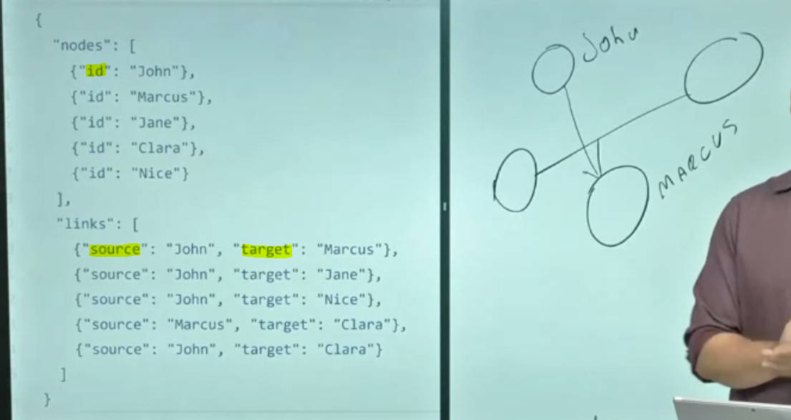
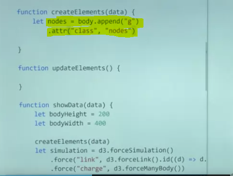
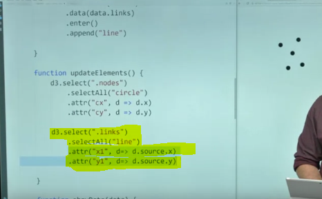

# Week 4 Layouts and Interaction

## Visualizing Networks

In this video, I want to talk with you how we can visualize **networks** using D3. By network, what we mean is the structure of the data that we are trying to communicate. So, if you think about, imagine a situation like this where we have John, and John may be friends with James and Maria, and then you'll have Mike that is friend with Maria. So, in this case is a more complex data that a simple table cannot cover it and then we're going to also have to think and how we can visualize those connections between these people. 

The important thing here is first the nomenclature that we give to those things. 


So every name header of a person or an object that has connection with something else is what we call **nodes**. So, those will be the nodes of our network and the connection between the nodes will be our **links**. Why are the most straight forward to visualize is similar to what we have here, where we have nodes and have links, those are not the only way to visualize networks. We have a matrix. We have charts diagrams, where you can show connections between elements, but here in this video, we're going to focus on the **node link diagram** that is very similar to what we have here that is basically a situation where we have nodes like these and then you have lines connecting them. 


So here, each circle will represent one of the nodes. So, if I'm trying to represent a network of friendship, then each node is going to represent one of the friends and the link is going to be people that know each other, for example. In order to create this, D3 going to provide us with many features and one of such features are **D3 layouts**. 


D3 layouts are not specifically only for networks. We can use also this feature to create other types of visualization but basically the idea is that the layout is going to compute for us positions and sizes of elements to help us to draw complex visualizations. So, we have seen one very simple version of this. That is the pie function that we use to create pie chart or R charts or donut charts, where we used pie to compute angles for the elements that we have in the data set. 

So, here we're going to use the layout to compute the positions of the nodes because that is one problem of visualization of networks if I'm trying to visualize another link diagram. That is, where I'm going to put my nodes and those layouts are going to help us to decide where the nodes should be arranged in order to provide a better view of the network. The way we do that in D3 is by using a technique called **force**. Force is basically the idea that _you have these objects and in this case are the nodes, and you have some forces operating on top of them._ 


So, those forces can either be, for example, _centering_. So, this forces push objects to the center. So, they try to bring objects to the center. While you can have _link_ forces where they try to keep a fixed distance between nodes that has some link. You can also have _Many-Body force_ that in this case is a force that simulates gravity. So, think about if these objects were able to have gravity so they would attract or repel objects around it and you can use that three forces to balance and end up with the node link version that we are looking for. 

So, by combining those forces, D3 is going to find a balance trying to not push too much, not push too close and trying to arrange elements in a way that's going to be easier to visualize. How do we do that? We do that through an object called **force simulation**. 


So, to create the force simulation, you just use `d3.forceSimulation` and that's going to be kind of our machine that's going to try to simulate these environmental forces and apply those forces on top of objects. _At the end of the day, what the force is doing is basically change X and Y positions of the elements and also changing the velocity that is how fast it's moving apart or closer to a specific position_. You can just add many forces by using the function force. You're going to give a _name_ with your force and then cause some force from D3 that I'm going to show in a minute and you can add as many as you need. 


Then finally, you have to tell which _nodes_, which elements are the nodes of my force layout. In this case what D3 will do is that these X and Y positions will be inserted on those nodes. So, every object that I give in these nodes or nodes and array, you're going to receive an X and Y position and also the velocity at the end or on each step of the simulation of the forces. So, finally, I can provide an **event** and I can capture for example one event that is called _tick_. That is every interaction of the force I get a new positions of the elements and it can update down on the screen and I'm going to have a function that's going to executed every time I have this interaction or I can use the event end[?] for example to run some function where the force simulation finishes. 


Also, we have our first simulator. We're going to need the force. So, for example here, we are showing one force in D3 that is called `forceLink`. That is a force that tries to keep the same distance between the object that has connections. So, in this way, is in our case is a way to try to put close objects that are related to each other by using this force to make sure that they are close and not too far or at least closer than others that are not related with the nodes that we are trying to visualize. In this force specifically, each force may have different features but the link one has two important things. First, you have to provide the _links_ and that's what we are providing here when we call the function and also you may want to provide an _ID_, that is basically a way to get an element. So, if you have a node and this node has some information that you want to map back to the link, so it's a way to know which nodes these links are linking. So, for example if my node has the variable ID, I can use the same ID on my links and then D3 is going to be used to link those together using this function. 

Finally, how can we put our objects together? So, imagine that I'm creating my first simulation here. The first step that I do is to assign my nodes. 


Those are the **nodes** that I want to run the force on top. Then finally, I can add my fourth **force** and in this case is the link force and I can create all the parameters of my link force. I can add a second force that is my charge force for example and the charge force is basically trying to push elements and to pull them so they're going to be far apart, but the links are going to try to attract them at the same time. So, we're going to try to balance between these two forces. Then finally, we can run a **function on every tick** to update the elements that we have in the page. So, remember, when we want to create a node link diagram, one strategy is to use the force layout and the reason is because force layout is going to help you through the force to position the nodes in a position that is easier to read. So, nodes that are related are going to be close. Nodes that are not related is going be far apart because of the balance that's going to happen between the force that you are applying. The order that you apply the force has some effect. So, you can try to change the order and see with different solutions you get when you apply the forces, because it's basically the order that D3 is going to compute each force. That is a very helpful visualization for networks but keep in mind that that's not the only one. It's the most straightforward to think, but we have all the alternatives that in some cases may be better or communicate better than information that we're looking for than using your Node-Link diagram.

### Visualizing Networks - Practice 1

In this video, I want to show you how you can use D3 to display networks. And more especially, I want to show you how we can create a node-link diagram. But in order to understand how draw a network is important for us to understand how the data looks like. So here, for example, we have a small data set. 



And this data set is break into two sections, nodes and links. So if you think about nodes, nodes are basically some circles that we're going to draw for each person. And here we have their names, so we have John, Marcus, Jane. So this could be John, this could be Marcus, Jane, and we could have others here. And then we the links. So, the links are going to be the connection between them. So, if we are saying that we have a link with a source John and the target Marcus, it means that if this is John and this is Marcos.

We're going to have a line that goes from John to Marcos. Know that even though in my visualization, I don't have any direction. In my data, I going to have this direction. So, I'm saying that I going to start from John and go to Marcus, and _it's up to me to decide if I want to draw just a line, or if I want to show this direction with an arrow_. 

So, **the problem here is how do we decide where to put each circle in "outer space"**. So if you want to show a 100 people, _how are we going to decide where to put each one_? If I just put those people in order, I may have a lot of __overlapping lines__. For example, I could have this thing here, where one line is crossing the other one. So in order to fix this problem, we use a technique called **Force Direct Layout**. 

So **a layout in d3 is going to compute information for you, basically position of elements and shapes of elements** so you can use this information later. We have seen this thing happen with arcs for example where d3 computes for us the angles of the arcs. But here we want d3 to compute the positions, and based on the links that we have between these people. And d3 is going to do that by trying to simulate some force that either push away nodes that are very dissimilar, that doesn't have much link. But I'll put together nodes that are more similar so we can avoid this kind of crossing that we have here. So, let's see how d3 help us to do this.

So here in our data, I just saw we have our nodes and we have our links.

The first step that we need to go through is to view those simulation force. Where d3's going to try to arrange the nodes for us based on just sort of gravitational force between the nodes. So to do that, we're going to create something here called simulation. And you going to create a `d3.forceSimulation`.

So, this is the first thing that we have to build. Just build the simulator that is going to simulate the force, but **now we have to choose which forces we want to use**. So as I said, one force that we are interested on is to pull apart things that does not have link, and a put together things that are related. So, we're going to create a **force called link** and we're going to use features from d3 called `forceLink`.


That's going to use the link of the object But now we need something that returns the id. So given the node, we need something that tells me what is the id of that node. So, you're going to use here function that's called id, that's going to return `d.id`. 


So this function basically takes a node as input, and returns the id of the node.

So _this is the first force that we have, but that's not enough because a force like this may put together things. But they may not be very well spaced or well centralized in my screen_, this kind of thing. So you may want to add new forces.

So a second force that we can add is charge. And this force simulates kind of elements pulling each other apart. So, we can do `d3.forceManyBody`. 


And then finally, I want to make sure that the resulting is more towards the center of my visualization. So, I'm going to use a force to put my elements in the center.


So remember that `bodyWidth` is my width, so we just divided by 2 to get the center, and then we have `bodyHeight`. There is the height and we also divide that by 2. So now, I created all the forces that I want.

My next step is to run those forces, and tell this simulator where the **nodes** come from and where the links come from. So remember that our data set we have two keys, _nodes_ and _links_. So we going to use that here, were going to say, `simulation.nodes(data.nodes)`. 


And you're going to also see that our links... So, `link` is the name of the force that we created on the top, and we going to say, that the links are `data.links`. 


Also I have my simulation, I can run it and get each steps. So, **this is a iterative process. So it going to run and give me a result, it's going to run again and give me a new result, and so on. So, I can capture that using a an event here called `tick`**.

So this means that every time I have a new update, I going to run this _function_. So `on("tick")`, this means that every time I have a new information, I just going to log my data here. 


So this simulation thing, it **updates the data** every time it runs [_it actually changes the data!_]. So this means that every time I go to this process, it going to change the elements that I have in my data, **adding new information**. So if I open all these nodes here, for example, you going to see that for now, for each node, I also have their position, their `x` and `y` position. This is the velocity [`vx` and `vy`], how they are moving in some direction. 


Now, I can just use use the x and y position to draw the dots on the screen, and the same thing is going to happen with my links. So if I open a link, I'm going to have information of the source, for example, where it starts. And I also have an x and y position where my line starts, and the target where my line is going to end. Now, I can use this information to actually draw my node link on the screen.


### Visualizing Networks - Practice 2

In our previous video we created our simulation, is basically our object that's going to simulate forces between our links and nodes in order to provide the layout on how we want to draw that on the screen. 

So in this video, _we actually want to draw that and see how it looks like once we have it on the screen and because this is an iterative process we're going to draw every new update that we get_. So, we're actually going to see the animation of the layout happening in real time. 

So, what we have here is that we load our data here on the top, and then we call it our show data where we created our simulator. 

So we have our **forces**, we defined our **data** but now the next step is to **draw** it. 

But what we're are going to do here is that we're going to break the drawing part in two steps: 

1. The first step is drawing the elements on the screen, is adding new elements. 
2. The second step is updating their position. 

Why we do that is because _adding elements on the screen we're going to do that only once, the first time we run the code_. The update is going to have multiple times, so _every time we have a new position of the elements, we're going to have to update everything_. So, that's the reason why we created two functions here on the top. One is the `createElements` that's going to create the elements that we need to see on the screen based on the data, and the other one is the one that's going to update and decide what's the position and other information of those elements. 


So let's start by creating. So here, before we run our simulation, we're going to call the function `createElements` with our data so we can add those elements to the screen, 


and here we're going to add our nodes. Those are going to be the circles, so _in order to separate the circles from the links in an easier way_, we're going to create a **group** for each of those. So this group is going to be my node groups and I'm going to use a class to make it easy to select this group later, and I'm going to call this class `nodes`. 



So those are my nodes. My next step is to actually bind the data. So you're going to `selectAll`, similar to what we have done before so we're going to select all the circles, so now I'm selecting out the circles that are inside my group, and then to those circles, I'm going to **bind my data**. And remember that my data-set has two keys; one is `nodes` that contains the people that I'm drawing, and the other one is `links` that contain the connection between these people. As I bind my data, I can say, `enter` basically every new element, we're going to `append` a circle.

Nothing very new here, we're just going to define also the radius of the circle, and we're going to fill it up with black.


So this is going to create the circles on the screen but _right now it doesn't really matter where we are going to position those circles, the only thing that we want to make sure is that those circles are there available later so I can position them_. 

The next step is to create my **links**.

So I'm going to go to the same process, `body.append`. We're going to append the G. Then inside this G, we're going to also set it's class attribute and it's going to be `link`. Then we are going to select all lines, _so links are basically straight lines for this specific case,so we can just use, straight lines. We don't really need with a path or a more complex solution_. Then we are going to bind our data, and that's going to come from my links. Then finally, for each new one we `enter`, we `append` a new `line`.


That's it. Once again we are not concerned on how this line look, where it is, where it looks like. We've just created, once you create the elements and then we're going to update them later. So now, we're going to use the `updateElements` functions to update this data, and how we do that, we have our `tick` here and we want to say, every time we have real data we want to update the elements. 


So we're just going to call `updateElements` here, and this means that every time a new data comes we're going to call this function the first thing that we have to do is to select our nodes, that contain the nodes, contain the circles. The next step is selecting out the circles.


After that, the _next step is to actually position those circles based on the data. So when we run the force directed layout, for each node, the algorithm is going to add X and Y, that is the position of the circle_. So we are going to use that, we're going to say that `cx` of the circle, that is the x position of the circle, is going to be `d.x`, and we are going to say that `cy` of the circle, that is the Y position of the circle, is going to be `d.y`. So you see that now we already get the nodes here, and you'll see that they started from the center and spread because this is the force working.


The next step is to add the links. So let's update the links, we're going to say `d3.select(".links")`.

We're going to select all links, and then we're going to set their attribute. You're going to select all `line`, and you're going to set their attributes. So _a line needs a start and an end_. So we're going to set first `x1`, that is where the _line starts_, it's going to start from our D, then we're going to start from our source. So `source.x`. So remember that a link has source and target, so you're gonna start from the X of the source, and then we're going to do the same thing, for the Y position where the line starts. 



We're going to start from the Y of our source. If now we want to do the end where this line is going to end is basically the same thing, but now we're going to use instead of `x1`, `x2` and instead of `y1`, `y2` and instead of `.source`, we have `.target`.

Now we get our link. You see that we get our nodes that are basically the circle that we are updating here, and then we get the lines connecting them based on the links that we have, and you see that the _forces are acting trying to get the best disposition of the elements_. 


You can play by turning on and off forces for example, if you turn off the **charge**, you see that it's a little bit tilted, it's not really like where we spaced between then.


If you turn off the **center** force, you're going to see that it is basically going to move away from the screen because it's outside right now. 


So those forces work together with the link force that makes sure that things that are related are close, you see that I've removed the **link** force, it starts to spread from each other.


The combination of those three forces is what produces this result, and that's the force link, the force layout that we use in order to create a node link diagram. It is not specific only for network, if you have things that you want to dispose on the screen, and you have some distance between them as a measure, you can use forces to try to come up with a good layout or organic layout, that's going to help you to display this information on the screen.

## Hierarquical Data

In this video, I want to talk with you how we can use hierarchical data and visualize this data using D3. So by hierarchical data I mean the situation where we have _degrees or levels of information_. 


So for example here, I may have information about United States, and then I may have the same information about New York and California, and then I may have the same information about the cities Albany, Los Angeles and San Francisco. So now I want to visualize this data in a way that I can see the cities Los Angeles and San Francisco but I also can get a sense of how California happens to have the specific value that I'm trying to visualize and then how New York and California you will combine in the United States information. 

So, this is the type of data that we're trying to visualize. Usually, you can think of this as a _tree_. So basically you have one level, then you have branches, then you have one node and this node again branches and so on. So, you always think here, for example, by moving from left to right. **It's not really a graph, so you don't circle back**, you always have just in one direction. 

But the beginning, the first one that you have is what they call **roots**. So, if the root of our tree, that is where it starts. And as we move down, we will move to the **children**. So, New York and California are children from USA and Albany is children from New York, and Los Angeles and San Francisco are children from California. If I move back, we have the **parent**. 


So, this means that New York is a parent of Albany and California is parent of Los Angeles and San Francisco. 

So, now, how can we visualize this data? We have different methods to visualize hierarchy. One way is actually visualizing the way I'm showing here with that tree where you have this tree growing and you can see each nodes and how it happens. But sometimes if you're visualizing some quantitative information, you may want a more compact visualization or a more easy to grasp the value if that's the focus. 

So, one option is what we call treemap. 


A treemap is basically a visualization where we have a rectangle. You're going to show each of the level of your tree in some regions. So, for example, here you see that we have multiple colors. You can think of blue as being in one level and then each square inside blue is another level. So, in my example, you could think blue as being a state and then you have the small ones inside being the cities. Then how does this visualization is generated? If you think the data that I just showed, for example, imagine that the whole square represents USA. 


So now I can split this square among my states. So I have New York and California and what I do is the size of those two will be proportional to the size of the value that I'm trying to show.


So, for example, if I'm trying to represent sales, the size of each square, the one that we have in New York and the one we have California, the area will be proportional to the sales of those two states. 

Then later, we can split again. For example, here I split California in two versions, one for Los Angeles, one for San Francisco. 


And also again, the size of each of those will represent the values for that cities. So if it is sales, we will represent the sales of that city. 

_So notice that by adding San Francisco, Los Angeles together, we get the size of California since the result of California is the sum of those two. And by adding that with New York, we get the sum that represents the US. That's the whole idea of the treemap_. 

And how can we create it? So, before starting to generate the squares that we want to visualize, we first have to tell D3 that this is a hierarchical data. 


When we do that, D3 will be going to do some additional job to make easier the next process to understand the data. So for example if I am looking in a city in a children, D3 is going to make it easier for me from that children to access the parent, and also information on which level of the tree we are and how deep is the tree and so on. So in order to add those information, you can call `d3.hierarchy` with the data that you want to visualize. And the data that you are going to provide will have a shape that looks like this. 


So, you basically have for each node, you're going to have a name. So, here, for example my top node, there is my root node, I have USA and then my children are going to be the children of USA. So, for example here I have New York and then New York follows the same pattern, we have a name and then we have a key called children where we have the children of New York that's Albany, and then inside Albany for example I can have my value that is sales. So, when we use hierarchy, one thing that we can do is use d3 to sum the values of the children to produce the values for the parents as well. _That's what the hierarchy function will do. It's just going to transform your data to make easier to the next step to use it to produce these squares that we want to draw for the treemap_. 

Once we have my data process, the next step is to actually produce the treemap. So the treemap layout will do the job of looking to our data and computing the squares that we have to create in order to generate the treemap. 


Once I'm finishing with this computation I create the object and I can call, I going to get in my data the information about the positions of the squares as well as the original information of the hierarchy if I am on the root or if I'm in which level of the tree I am and so on. 

So, here we have an example. So, on the top, I am using hierarchy to process my data and I am asking the function to sum all the sales. So this means that for each level of the tree now, I going to have the sum of the children for that node. So, if I'm looking at the state of California, I going to have the sum of the cities of San Francisco and Los Angeles associated to California. After that, we're going to call the treemap. So, we first build the treemap. We have to specify a `width` and a `height`. So the system knows what is the size of the square that it's trying to build. And then finally, we're going to call treemap with the original data. 


So, on the top, I got my root node computed and now I'm going to pass that to the treemap. And treemap is going to change this data and add the information. 

Once I have this information, now I can just draw it as I would draw any other visualization.


One nice trick here is that, if you don't care really, if you don't really need to draw the borders of the states for example, you can just focus in visualizing the leaves of the tree. So in my example the leaves would be the cities and as I said if I put the square of California and Los Angeles together, the square that creates is actually this square of California. So, by having San Francisco and Los Angeles, I get the square for California around it. So, you don't really have to draw if for use for example different color based on the state. If I want to draw the leaves, you can just use root.leaves to get the leaves of your tree, and you're going to draw only the last level that you have. 

So this is one example on how we can use hierarchical data with D3. 


Once again, that is one option that we can use to create. The tree also provide other features to create different visualizations of hierarchical data. But treemap is a really popular one. But _remember that first it's helpful to transform your data using hierarchy and make sure that your data is in the format that I showed where you have the names and you have the children_. If it's not in that format, you may need some preprocessing in order to get to a good shape so tree we will understand your data without you having to provide much information.


### Practice: Tree Map Part 1


Another type of data that is complex when we try to visualize is sort of hierarchical data. And _hierarchical data basically means that you have a parent, and this parent have some children that may have other children and that can keep going on_. So, in this video I want to show you how we can prepare the code, so we can draw a **treemap**. And a treemap basically, is going to work as a square representing the whole thing and every time I have a children, I'm going to split that based on the children. So for example, I could have two children, so then I would two regions and then I can take these children and then split these children in more three other ones and maybe here, I'm going to have other three children as well.


And that process can be recursive. It keep happen and it's splitting our square in multiple elements. So if we look at our data, our data is going to represent exact legit phenomenon. So here, for example, I have US and US is my root. So the root is always the main node that you have, is the first one, and then, US has children and those children are basically these states. So if we go down here, we have the names. So we have New York as being one of the states. And then here, we have California as being a second state, and then further, we take New York and split the new children. So remember, New York state is children of USA. And then we have the cities of Albany, New York, and Buffalo being children of New York. 
 
```js
{ 
    "name" : "USA",
    "children" : [
        {
            "name" : "New York",
            "children" : [
                {
                    "name" : "Albany",
                    "sales" : 5000
                },
                {
                    "name" : "New York City",
                    "sales" : 15000
                },
                {
                    "name" : "Buffalo",
                    "sales" : 10000
                }
            ]
        },
        {
            "name" : "California",
            "children" : [
                {
                    "name" : "Los Angeles",
                    "sales" : 2000
                },
                {
                    "name" : "San Francisco",
                    "sales" : 5000
                }
            ]
        }
    ]
}
```

Something like:

```
USA -+
     |
     +-- New York ----+-- Albany
     |                |
     |                +-- New York City
     |                |
     |                +-- Buffalo
     |
     +-- California --+-- Los Angeles
                      |
                      +-- San Francisco
```      

So if I want, for example, to visualize my sales among different states and cities, but at the same time I want to get a look of which states have higher sales than the other ones. That is one strategy that we can use. And use this information to draw our **treemap**. So remember, we're going to have a root, and then each root is going to have children where we're going to split this square based on the children. And then, if we have children's of the children, we keep going and splitting this work. And the _algorithm is going to trying to find good splitting points_. You going to try to split such that you may have some properties, for example, do you want your squares? Rectangles should be as square as possible when you are splitting. At the same time, you want the size of the area of the rectangle to be proportional to the values. So we have the sales and the size of the rectangle should be proportional to the sales of each city. 

So how can we do that with D3? So D3 is going to provide us with some help to create this visualization. And similar to what we have done with the arcs and similar to what we have done with the networks, we can use this function to compute positions of elements. And it's going to return us the position of the squares that we want to draw on the screen.

So we're going to need to create first an element that is our treemap. And a **treemap** is our first _layout_ or _generator_ that's going to _transform our data in the treemap layout_ that I'm looking for. So you're going to call `d3.treemap` and then you're going to set the `.size`. Is important because since they're going to be splitting squares, I need to know what is the size that I can use for this layout. So you're going to set the size to be equal to our `bodyWidth` and `bodyHeight`.


Our next step is to transform our data, because the problem now is we have our data with the children, but we don't have aggregation for each state, or we don't have an easy way for our children to get the parent. So the tree also provides a helper that's going to modify our data, and add these informations, and transform our data from a single json into a more complex network of data. Where, if I have children, I can actually get to the parent. Or if I have a parent, I can get to the children. When I have aggregations between the children, and so on.

So to do that, we're going to use the `d3.hierarchy`. So you're going to do `root`, that's our main node, and that's going to be based, on the `d3.hierarchy` and we're going to provide our data to this function. So this function is going to just take our data and add additional information that's going to facilitate the treemap to work and one of his information is the sum or the aggregation by each parent. So for example, I had cities inside state, so now this function is going to `.sum` the `sales` of the city and add that to the state. And do the same thing, sum the the sales in your states and add it to the parent. So we're going to provide a function here that returns what we want to sum. And we want to sum the sales.


Okay, so that's going to produce the data that we want to use. So let's take a look on this data.


And you're going to see that it starts with a node, but we get one information here that is `value` for example that we did not have in our data [for the parents]. It also has information, for example, `depth`, in which level of our hierarchy we are. And also the `height`, that means how far [down] we can go. And if you open, for example, the children.

* `height` : how many more levels there are down from here 
* `depth`  : how many more levels there are up from here (how many levels we are from the root).

We're going to see the same information, but now you see that the `depth` and `height` change, because we are one level down, and we only have one more level to go. But, also we have this sum here. But we also have a way to go back to the parent, if I need this information being here. So that's what hierarchy is doing. It's adding all this information to our data so treemap can come and produce the data that we are looking for. So finally, if I run `treemap` on top of this data.


What I get is the same data but now with `x0` and `x1` and `y0` and `y1`. This is basically the positions [top left corner, bottom right corner] of the squares that I want to draw for treemap, and having that is all the data that we need to create our visualization and to show this information in a treemap layout.`

### Practice: Tree Map Part 2

In a previous video, we took a data that was hierarchical in nature where we had the United States and then, we have the states, and the cities inside, and the sales for each city, and we transform this data using the D3 hierarchy that basically was able to connect this as a tree rather than just a simple set of arrays inside other objects, and allowing us for example, to from a children be able to get the parent, on how also to get the sums for each city and we had a children. That would make it easier for us to use the next function that is Treemap that we run in the data in order to get the positions of the squares that we want to draw on the screen to represent a Treemap. So, our goal is to build a treemap where each square is going to be a city and the squares is going to be proportional to the sales that we had in each city and by doing that, we're going to also be able to get an idea of the sales in each state and in the whole US. So, we already have the treemap running here, where we are processing our data and adding the positions of the squares. 


Our next step is just draw the squares on the screen. So to do that, we first going to create the groups that we need.

We're going to call those `cell`s. So, cells is each square where we're going to draw our data and you're going to do that in group using the group element of SVG. So, we're going to `selectAll` `g` and then, for each `g` -- our goal is to create one `g` for each city that we have in the data. So as I said, you may want to draw the squares representing the states, but depending on how you draw things, it turns out that the positions of the square of each city together is going to represent the squares of the states. So, if you have a high number of children, you may have a problem with that. But if you don't, you can represent that using colors or other features, you may not need to draw the parent, that is in this case would be the states. So, our goal is to draw only the cities. So, for that reason in data we're going to use our `leaves()`. The leaves are basically the end of our tree that in this case is going to be the cities, those were the last level that we had in our data. After that, we're going to select `.enter`, so we can create a `g` for every new leaves or every new city that we find in the data, and you are going to `.append` a `g`. 


Our last step is to position this `g` in the right position. So, we're going to set an attribute, that is the `transform` attribute, and we are going to `translate` this element based on the positions that the treemap algorithm gave us. So, we're going to translate and it's going to be `d.x0`, that is the top position of our square that we want to draw in the x coordinate, and then `d.y0`, that's the position of the top of the square in the y coordinate. So, we just want to move our group there to start to drawing. So, once I have those groups, in each group -- So remember, if I'm doing `cell` here, _anything that I do here is going to happen for each of the groups that I created in my data_ [because that is the reference the captured the data binding]. 


So for each of those, we're going to add a rectangle and we're going to set its `width` to ten, and I'm going to set the `height` to ten, and you'll see that now we get some squares here. 


So, they don't have the right size yet, but they are in the right position. So, the system will read position those square where we want them, but now we have to set the `width` and `height` to be equivalent to fill the whitespace that we are looking here. So to do that, we're going to change and instead of using width equal to ten. Remember that **the algorithm is going to give me the position of the top corner of the square and the position of the bottom right corner of the square**. So, if I want to know the width, I can subtract the end from the beginning and I'm going to get the width of the square. So, that's the reason why we do `d.x1` minus `d.x0` to define the `width` of each square. So you see that now, the width are filling my space. 


Our next step is the same thing with the `height`, `y1` minus `d.y0`.


Okay. So, now I filled everything, but now it's hard to see the space between them. Like, where is the separation between those elements. 

Turns out that you can actually tweak the treemap algorithm to say I want to have some space between those elements. So, you can say, `paddingInner`, and add some pixels here to say, I want you to separate then a little bit.


So, you can decide the size of the separation that you want. But, now we basically draw the squares, but there are some lines between them that is basically whitespace because those square are not really filling 100%, it creates a padding between them. But still, it's hard for me to distinguish states here. So, maybe you want to use the color to distinguish the state. 

So, let's create a color scale here that's going to be a `scaleOrdinal` and you're going to use the `d3.schemeCategory10` that contains a predefined palette of colors that we can use. 


So, now we can use `g` is to decide how are we going to `fill` the `rect`, what's going to be the color of the `rect`. So, you can just say, attribute `fill`, is going to be based on my color scale. So, the original data that I received is going to be- first, _I'm looking at the children. So, if I want the name of the state, the first thing that I have to go it should go to the parent to get the name of the state because these squares represent cities_. So, we're gonna do that by doing `d.parent` and that's going to take me to the parent of the element. So, now I want to get the data. So, if I want to get the original data that we had before running our algorithms, we have to `d.parent.data` because that's my original data and I want the name of the state. So, we're going to do `d.parent.data.name`. So, now you see that based on the name we get the colors. 


So, we have one state that is blue, one state that is orange and as I said, based on the positions of the squares of the cities, you are able to tell that the blue state is actually larger than the orange state. And if I want to get the names of things, so I can actually know which state is which, I can actually add just a text. So, <mark>_that's the reason why we use a group because by using a group we can just add the text to the group and the text we're going to be close to the right position_</mark>. So, we're just going to append a new text and in this text we're going to set the text to be the city name. So, remember if I want to get the original data, I have to do `.data.name`, that's my original data. So, you see that some cities are starting to pop up here. 


Our next step is to fix the position of those texts. So, the first thing that we want to move them down. So, we want to change the `alignment-baseline` to `hanging`. So, this means that whatever position that I give to them is going to be on the top. So, you see that now the words are inside. 


We're going to also change their color a little bit to white to make it easier to read inside our colorful squares. 


So, if I look here I got to be able to see that we have Albany here and New York, and Buffalo. So, those are basically the state of New York and if I go here, I have Los Angeles, San Francisco, San Diego, this is California. So, I could say that we are selling more in the State of New York than in the State of California by using this visualization. Even though I just visualized the cities, I end up also getting squares for the states. I could have multiple hierarchies and that's the idea of the treemap, is kind of a tree, but it's as if you've seen them from top down and you were able to get information from the leaves, but also from each level that you also have in your data.


## Interactions

### Listening to Events

"Listen" for user actions -- click, hover, change.


User action happens on some element, so in D3 we need a selection to bind it to the listener.


When we use functions in D3, they usually accept some parameters. The first one in general is the datapoint, `d`, for example, the second one is the position of the datapoint, `i`, and the third is `this`.

Normally it will point to some instance of some object that called that function. In D3, when used in the functions called by event listeners, it will point to the element that received the action. You can then select this element by using `d3.select(this)`.


CAUTION:  If we use an arrow function, D3 is not able to change the `this` inside the function. So this means that if you need to use `this`, you cannot use the arrow function, you will have to use the version where you write the keyword `function`. So if you catch yourself trying to run something and your `this` is always `undefined` or is `Window`, for example, or something else that is not the object that the user click, the reason is because you're using arrow function instead of the keyword function. So, always remember, if you have to use the "this" not just as an event render, anywhere on your application, you have to use the function with the keyword function and not the error function.


So, another thing that D3 will provide you to help with understanding the event and what happened is the `d3.event`. So for example, if I move my mouse, we will have information of the position of the mouse there. I want to check for example if the user clicked with some key hold. So imagine that for example you want to allow the user to select multiple elements by hold and shift. So, you're going to use `d3.event` to check if "Shift" is pressed and then react different from versions where the user click in the same place but without pressing the "Shift." 

So let's see an example here. So, first I select my data and I created my circles. Imagine that I have any visualization, it could be a scatter plot for example, where we have circles, and now I'm selecting out the circles. So I `selectAll` the circles and I do `.on("click", ...)`. So this means that when I click in any of those circles, the first thing that I am going to receive on the top is my `d`. 

So `d` is going to be the datapoint that is associated to the circle that I clicked. So if I want to get the data that the user clicked to show details for example, I can use this `d` information to decide which datapoint the user clicked. If I want to check for example if the user has the "Shift" key pressed, I can just do `d3.event.shiftKey`, and it going to return `true` if the user pressed the key. Then I can do other information imagine that, I don't know, I want to save the information for this element and I can do all the process and then later, I can for example alert the user and I say okay saved the element that has his name. So, I can ask access information of the name and I can also for example change the color using the "this" here because "this" represents the circle. I can change `.style.fill` as I would do with any HTML node and then change the color to `blue`. 


So now this means that whatever elements the user had already saved, will be blue so the user knows that he or she or it clicked on it. So, this is the basics of how we react to events and how we add interactions to our application. We want to be listening to events and those events can be different one, they can be triggered by mouse, they can be triggered by keyboard and at the end of the day, there are techniques as well to trigger event even programmatically based on something else. So, you're going to have a function that once you receive that event, you're going to do something, you're going to save the data, you're going to filter the data or so on, but that's the whole based on how we create introduction. How our interaction is going to be built on top of those listeners of events that we're going to add to our application.


...


### Practice: Creating Tooltips

Hello. In this video, I want to show you how to use or to create something that we call tooltip. And tooltips are basically those information that they show when the user for example over. So what I want to do is, if the user stop the mouse on top of this bar I want to show this information, some information about the bar. So for example right now, I don't know what information is behind those bars. I can't tell you right now, for example, that what we are showing here are countries, but still you don't know which countries we are showing here. So I want to be able to once I stop my mouse over, I want to see the information about which country are being highlighted? And to do that, we can use tooltips. And the tooltip is not restricted only for text, you could do any more complex thing. You could show another visualization inside the tooltip if you want. And how are we going to do that? So one thing that we have to think about is,

which element who showed this information? How are we going to manipulate the elements to show it? So what we'll do is that, we're going to create one element and this is going to be our tooltip. And it's going to be there all the time, we just don't show it to the user, it's going to be visible. And then when the user hover something then we're going to show this tooltip, and maybe position this tooltip in the position that we want. So that's the whole idea of what we want to do. Second thing that is important is, I don't want my tooltip to be draw inside the SVG. The reason is, if I have something inside the SVG and just think to move this to the border, it's going to get cut, because nothing can pass this border if it's inside the SVG. So we're going to create our tooltip outside the SVG, and we're going to be manipulating it as the user manipulates our SVG. So we have here a bar chart and we created this bar chart using most of the things that we have seen before. We have this that you created, we have the yScale. We took we were careful to invert all these scale, so we could get the right version of the sizes here and then we draw our bar chart. Now our goal is to add the tooltip. So to do that, the first thing that I do is to create this tooltip. So here on the top, what we would do is that, we're going to add the div.

And this div will be our tooltip. So right now we have it here, we just added the div, and this div is going to be right now a box with some text inside. We have here on the top a CSS that is for matching this div, right?

I will have to do two things in addition to for the work. So the first thing that I want to do is, allow this div to be moved around, because right now I cannot set the x and y of the position of the div freely through the page. If I do that, it going to work only here locally. It's going to be really tricky. So in order to move around, I have to detach this div from the flow of the page. So remember HTML page has a flow and thing are going to be one below other, but now I want to detach that and say, I want to move this thing around. In order to do that, I will change CSS property that's called position and we're going to call position absolute. So it just means now I can move this thing around. The first impact that you're going to see is that right now, it doesn't go all the way to the end. It restricted itself to the size of the text, but now you will see that you will be able to move it later. The other thing that we want to do is that, we don't want to show it. We only want to show it when the user over the bar, so to do that we will use display none. So it just means that now we don't see it. It's still there, but we don't see it. And when the use are over it, we'll be able to show it. So let's see how this work. So here on the bottom when we created our bar, we're going to add the new list in there. And it will list then to mouse enter, this means every time the mouse enter this element. And what we would do, we would call a function here, showTooltip. And we will show the country name. So I will pass the text that I want to show to this function. And this function will take care of showing that on Tooltip. It's just to make easier to reuse this function later. So now here in my function showTooltip, I'm receiving my text here. And what I would do is, I will select my Tooltip element. So it has an ID Tooltip, and I will change the text

to the text that I received as parameter. And I will also change its style. And I basically, what we change the property display to block. So this is mean that now every time the user over one of these bars, you see that the tooltip shows down.

And it doesn't disappear when I go away, but if I refresh, you'll see it only appears when I hover. And as I hover, I can now see the name of the countries. So we're almost there. The next step is, I want it to disappear when I move away. So it's up to me if I want to create or not a new, Function. Here I want, so I just going to do mouseleave, and I'm going to do all the jobs here. So d3.select tooltip, and it's going to change itsstyle. Again, display and we will bring it back to none. That means that every time the user enter, we will show every time the user leaves or we will remove the tooltip.

Great, so now we have a tooltip that shows up and goes away. But it doesn't really look like as a tooltip, because it's on the bottom. I want these tooltip to be close to my mouse, so as I move my mouse this tooltip is there. So how we do that? We're going to use a separate thing here that is the coordinates. So when I call my function showTooltip, I will not only pass the text that I want to show but also the position. And remember that, when we're dealing with d3, we can get the position of the mouse by using d3 event. So we can do d3.event.clientX in order to get the X position. And we can do d3.event.clientY to get the Y position. So now when I call the showTooltip function, I will receive here on the top those two coordinates.

And that's going to be my coords variable here. So we'll get the x and y position, and when we're dealing with SVG, we change x and y. But when we're dealing with HTML elements that's div, so we'll be using HTML. You will need to change top and left. So we'll change the style here.

Style.

Top, so top is my ZY axis. So Y coordinate is the second element of my array here. So we're going to get the second element, and since it starts from zero that's why we use one.

And then the left is my X axis.

And we would be using our coordinates zero. So now when my move my mouse, you'll see that the tooltip follows the mouse. So if I go here, I see the tooltip close and so one. You may have a few problems like, sometimes the tooltip is like right on the bottom of your mouse and you want it to be a little far, and its kind of thing. So you can adjust that by saying, for example, that I want the coordinates of the mouse, but I want 30 pixels down. So now, the tooltip would be not just on top. You can close there, you can say 10 pixels.

You can change the background as well. So if you don't want to have this transparent thing in order to make our tooltip easier to read, you can change the background color,

To white.

So now when see my tooltip, I don't have that overlapping and more it's easier to read. And finally, as I move my mouse I want the tooltip to follow the mouse. So it turns out if I copy this function here that have from mouse enter, and then do the same thing for mouse move.
Start transcript at 8 minutes 58 seconds8:58
What I get now is a tooltip that follows my mouse. You see that as I move the mouse, the tooltip goes up and down with my mouse. So those are ways that you can create the tooltip. Remember, that you want to put inside the tooltip is up to you. It doesn't have to be a simple text, it can be even a complex visualization. And it's very helpful in order to provide context or more detailed information to your user when you create your visualization.


### Practice: Creating Linked Views

One important thing about interactive visualizations is that it allows you to have multiple visualizations in your page. That just means that we can have one visualization and this visualization can interact with the second visualization in order to produce something new or give the user more details. In this video, I want to show you how we can create linked fields. So basically, it's two visualizations that can interact with each other and maybe the selection of one visualization will produce the result in another one. So here, what we have is a bar chart and we have some countries here and we have their GDP. But we also have an additional, the GDP of those countries over the years. I didn't want to visualize all of this information at once. I want the user to decide which country the user is interested. So, the goal here is that the user can hover some of these countries and when the user click on this country, we will be able to see here a line chart with the progression of how the GDP of this country changed over the year. So, that's the whole goal of this video. Now, how we can do that? So, the first thing is you're going to create two SVGs. Again, this is not required. You could have just one SVG and there, show multiple charts on it. Here is just because it's easier, we have two SVGs separated because we can move them around apart as we need. So, I have my two SVGs and on the top, I created a bar chart as I would create any way. I don't think when I'm creating a bar chart, I'm not thinking about where I'm going to use it. I'm just thinking, "This is my bar chart." Later, I got to decide how to connect to this. So, now, how we can decide and change the information based on what the user do? So, the first thing that we will need is to select the country. So, we need to be able to tell, "Okay, I clicked in this country and this is the country that I selected." This is not required to draw the second link but it going to be helpful to just show which country I'm showing here. So, every time I select something here, I have to know here on the top which country I selected, and that's the whole goal. So, on the bottom here, we have all the code that creates our bar chart. Then at the end of our bar chart, we have the code that we use to the tool tip, because this bar chart has a tool tip as we hover. Then finally, we will add our listener to click. So, this means I want to do something when the user click on the bar. What I would do? So, on the top, I declared a variable, a global variable called selectedCountry. So, here, I'm going to change the value of that variable to d.Country. So, this means that now I am telling the system that this is the country that I have selected. If I want to test if that is working, I can just highlight the selected country. So, here, when I'm drawing my bars, what we will do is that we will take these attribute view here and then we will use our list of our chart, our list of elements that are already on the screen,

and we're going to merge enter part. So, this means that we're going to apply these two new ones and old ones, and you're going to set the fill.

So, what we will do is here, we are selecting our body on the top, so we created this body here when we assigned the data, and now we are saying, "Okay, I want you merge this guy with the enter part, that is basically the new ones, and then also join that, I want to change the attribute." I could do that in a different way. I could, for example, just add merge here at the end and then use this guy here and then set the attribute here. Both cases work because the goal is basically to create one full set that selects both; the new ones and the old ones. So, also, I have my fill here, I can just say, "You know what? I want to see if the selected country is the same value of the name of this country." If that is the case, if that is true, I'm going to color it red. If that's false, I'm going to color it the original color. So, you see that it doesn't change anything on our chart yet. What we have to do here on country is that we have to call our draw bar chart back. So, here, what we have is a draw bar chart function. So, we have been using this show data throughout the whole course and here, it's the same thing. The difference is that you are going to have choose show datas, one for each chart. So, we call it draw bar charts and draw timeline or draw line chart. So, I'm going to call this function again, and I call it with the data that I already have because I didn't really change the data. So now, as I click in each of those bars, I get the color of the country that is selected. Great. So, the next time, it should draw the timeline. So, here is where it gets tricky. So, before I draw the timeline, what I need to do is to change my data. So, the data originally comes with a full dataset. So, think about the CSV. So, if you are loading CSV, you have columns. So, here, I have one column for each year. I have the name of the county as one column and then we have one column for each year. That's how I'm selecting 2016 here, I am just selecting one of those columns. But to draw a line chart, I cannot have those as a column. I have to have those as a list. So, I need to transform those column to a list. That's what we're going to do here. The first thing that I want to do is to get the name of the columns. Just a list of the names. Here, we're going to use a nice trick.

We will use Object.keys, that is basically a way to get the keys of an object. So, we're going to call it here, years, and I going to get all the keys of d. So, this means that those are the names of the columns, right? Then once I get the names of the columns, my next step is I don't want the one that has the name. I only want those columns that has a number as title because this is the year. So, to do that, I'm going to call it k because it's the key, and I will try to convert this key to a number. Turns out that if it's not possible, it's going to return a thing that isNaN. So, we're going to use a function that's called isNaN, that's from JavaScript, to check if this a number or not. So, this means that they're going to return not if this is not a number. So, this means that this function will return true if k is a number. At the end of the day, you're going to get the list of all the years that they have. So finally, the next step, it should transform this list in something else, in an actual information that I want to render. How we do that? I'm going to call it history and we're going to say that, "I want to map my years." So, this is the year, remember that this is the title of the column, and what we will do is that we're going to return a new full object with all the information. So, the first information that I want is which year this value is, and finally, the value. The value, remember this is a column, so if I want to get the value, I just use the y and then I get the value. So, this is going to be my history. I just transformed it, I get this new object that has the year, has the value. So now, I can just add this to my original object.

That's how I transform my data from the original format to the new format. So, let's take a look on how this format looks like.

So, when you go to console and if you look at your data, you see this is how the data came. So, we would have this years with the numbers in front of it and then what we did is that we transform to this format where we have the years and the values. That's basically the transformation that we did for each element and that make much easier for us to create a line chart. Okay. So, we're going to take this opportunity to also make sure that we convert this to a number. Finally, I already have here a function that draws a line chart given the data. So, it's basically taking whatever country as passed as parameter, is going to get it to story, and will go through the process of drawing a line chart. Creating the SKUs, selecting, adding the body and so on, and adding out the axis that we have that we have seen before. So, I want you just call this function. So, as I said, you can think of each of those independent and just allow one of you to call the draw function of the other one and you're going to get an interaction between them. So, here, we first have to select the country from the data but we already have here on d. So, we will do draw line chart, d, because this my country, it's the country that the user clicked. So, now, when the user click in one of those, I get on the bottom the line chart representing that specific country. The user now can explore and say, "Oh, okay. This country had a peak or doesn't," and so on. So, this is the ways that we connect two different linked data. So, remember, if you have to connect your views, it's easier for you to think about creating one function that draw that view given the data. Then later, you just call from one visualization, you call the function to draw the next one, and it basically is going to get a state where it looks like those two are linked and the user can basically interact with one and get the result in another one. That is really, really helpful. It doesn't have to be a separated SVG. As I told before, I could add this visualization inside the tool tip for example. Doesn't have to be on click, it could be on hover and the user could see the chart inside the tool tip as the user hover, and so on. But **the whole idea is separate your visualizations with two different functions and allow one to call the function of the other with the data that should be drawn and you'll be able to create linked visualizations** like those.
