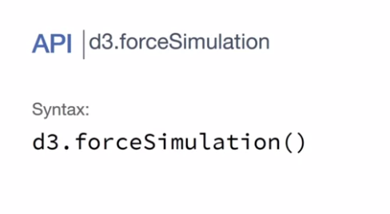

# Week 4 Layouts and Interaction

## Visualizing Networks

In this video, I want to talk with you how we can visualize **networks** using D3. By network, what we mean is the structure of the data that we are trying to communicate. So, if you think about, imagine a situation like this where we have John, and John may be friends with James and Maria, and then you'll have Mike that is friend with Maria. So, in this case is a more complex data that a simple table cannot cover it and then we're going to also have to think and how we can visualize those connections between these people. 

The important thing here is first the nomenclature that we give to those things. 

So every name header of a person or an object that has connection with something else is what we call **nodes**. So, those will be the nodes of our network and the connection between the nodes will be our **links**. Why are the most straight forward to visualize is similar to what we have here, where we have nodes and have links, those are not the only way to visualize networks. We have a matrix. We have charts diagrams, where you can show connections between elements, but here in this video, we're going to focus on the **node link diagram** that is very similar to what we have here that is basically a situation where we have nodes like these and then you have lines connecting them. 

So here, each circle will represent one of the nodes. So, if I'm trying to represent a network of friendship, then each node is going to represent one of the friends and the link is going to be people that know each other, for example. In order to create this, D3 going to provide us with many features and one of such features are **D3 layouts**. 

D3 layouts are not specifically only for networks. We can use also this feature to create other types of visualization but basically the idea is that the layout is going to compute for us positions and sizes of elements to help us to draw complex visualizations. So, we have seen one very simple version of this. That is the pie function that we use to create pie chart or R charts or donut charts, where we used pie to compute angles for the elements that we have in the data set. 

So, here we're going to use the layout to compute the positions of the nodes because that is one problem of visualization of networks if I'm trying to visualize another link diagram. That is, where I'm going to put my nodes and those layouts are going to help us to decide where the nodes should be arranged in order to provide a better view of the network. The way we do that in D3 is by using a technique called **force**. Force is basically the idea that _you have these objects and in this case are the nodes, and you have some forces operating on top of them._ 

So, those forces can either be, for example, _centering_. So, this forces push objects to the center. So, they try to bring objects to the center. While you can have _link_ forces where they try to keep a fixed distance between nodes that has some link. You can also have _Many-Body force_ that in this case is a force that simulates gravity. So, think about if these objects were able to have gravity so they would attract or repel objects around it and you can use that three forces to balance and end up with the node link version that we are looking for. 

So, by combining those forces, D3 is going to find a balance trying to not push too much, not push too close and trying to arrange elements in a way that's going to be easier to visualize. How do we do that? We do that through an object called **force simulation**. 

So, to create the force simulation, you just use `d3.forceSimulation` and that's going to be kind of our machine that's going to try to simulate these environmental forces and apply those forces on top of objects. _At the end of the day, what the force is doing is basically change X and Y positions of the elements and also changing the velocity that is how fast it's moving apart or closer to a specific position_. You can just add many forces by using the function force. You're going to give a _name_ with your force and then cause some force from D3 that I'm going to show in a minute and you can add as many as you need. 

Then finally, you have to tell which _nodes_, which elements are the nodes of my force layout. In this case what D3 will do is that these X and Y positions will be inserted on those nodes. So, every object that I give in these nodes or nodes and array, you're going to receive an X and Y position and also the velocity at the end or on each step of the simulation of the forces. So, finally, I can provide an **event** and I can capture for example one event that is called _tick_. That is every interaction of the force I get a new positions of the elements and it can update down on the screen and I'm going to have a function that's going to executed every time I have this interaction or I can use the event end[?] for example to run some function where the force simulation finishes. 

Also, we have our first simulator. We're going to need the force. So, for example here, we are showing one force in D3 that is called `forceLink`. That is a force that tries to keep the same distance between the object that has connections. So, in this way, is in our case is a way to try to put close objects that are related to each other by using this force to make sure that they are close and not too far or at least closer than others that are not related with the nodes that we are trying to visualize. In this force specifically, each force may have different features but the link one has two important things. First, you have to provide the _links_ and that's what we are providing here when we call the function and also you may want to provide an _ID_, that is basically a way to get an element. So, if you have a node and this node has some information that you want to map back to the link, so it's a way to know which nodes these links are linking. So, for example if my node has the variable ID, I can use the same ID on my links and then D3 is going to be used to link those together using this function. 

Finally, how can we put our objects together? So, imagine that I'm creating my first simulation here. The first step that I do is to assign my nodes. 

Those are the **nodes** that I want to run the force on top. Then finally, I can add my fourth **force** and in this case is the link force and I can create all the parameters of my link force. I can add a second force that is my charge force for example and the charge force is basically trying to push elements and to pull them so they're going to be far apart, but the links are going to try to attract them at the same time. So, we're going to try to balance between these two forces. Then finally, we can run a **function on every tick** to update the elements that we have in the page. So, remember, when we want to create a node link diagram, one strategy is to use the force layout and the reason is because force layout is going to help you through the force to position the nodes in a position that is easier to read. So, nodes that are related are going to be close. Nodes that are not related is going be far apart because of the balance that's going to happen between the force that you are applying. The order that you apply the force has some effect. So, you can try to change the order and see with different solutions you get when you apply the forces, because it's basically the order that D3 is going to compute each force. That is a very helpful visualization for networks but keep in mind that that's not the only one. It's the most straightforward to think, but we have all the alternatives that in some cases may be better or communicate better than information that we're looking for than using your Node-Link diagram.

### Visualizing Networks - Practice 1

In this video, I want to show you how you can use D3 to display networks. And more especially, I want to show you how we can create a node-link diagram. But in order to understand how draw a network is important for us to understand how the data looks like. So here, for example, we have a small data set. 

And this data set is break into two sections, nodes and links. So if you think about nodes, nodes are basically some circles that we're going to draw for each person. And here we have their names, so we have John, Marcus, Jane. So this could be John, this could be Marcus, Jane, and we could have others here. And then we the links. So, the links are going to be the connection between them. So, if we are saying that we have a link with a source John and the target Marcus, it means that if this is John and this is Marcos.

We're going to have a line that goes from John to Marcos. Know that even though in my visualization, I don't have any direction. In my data, I going to have this direction. So, I'm saying that I going to start from John and go to Marcus, and _it's up to me to decide if I want to draw just a line, or if I want to show this direction with an arrow_. 

So, **the problem here is how do we decide where to put each circle in "outer space"**. So if you want to show a 100 people, _how are we going to decide where to put each one_? If I just put those people in order, I may have a lot of __overlapping lines__. For example, I could have this thing here, where one line is crossing the other one. So in order to fix this problem, we use a technique called **Force Direct Layout**. 

So **a layout in d3 is going to compute information for you, basically position of elements and shapes of elements** so you can use this information later. We have seen this thing happen with arcs for example where d3 computes for us the angles of the arcs. But here we want d3 to compute the positions, and based on the links that we have between these people. And d3 is going to do that by trying to simulate some force that either push away nodes that are very dissimilar, that doesn't have much link. But I'll put together nodes that are more similar so we can avoid this kind of crossing that we have here. So, let's see how d3 help us to do this.

So here in our data, I just saw we have our nodes and we have our links.

The first step that we need to go through is to view those simulation force. Where d3's going to try to arrange the nodes for us based on just sort of gravitational force between the nodes. So to do that, we're going to create something here called simulation. And you going to create a `d3.forceSimulation`.

So, this is the first thing that we have to build. Just build the simulator that is going to simulate the force, but **now we have to choose which forces we want to use**. So as I said, one force that we are interested on is to pull apart things that does not have link, and a put together things that are related. So, we're going to create a **force called link** and we're going to use features from d3 called `forceLink`.

That's going to use the link of the object But now we need something that returns the id. So given the node, we need something that tells me what is the id of that node. So, you're going to use here function that's called id, that's going to return `d.id`. 

So this function basically takes a node as input, and returns the id of the node.

So _this is the first force that we have, but that's not enough because a force like this may put together things. But they may not be very well spaced or well centralized in my screen_, this kind of thing. So you may want to add new forces.

So a second force that we can add is charge. And this force simulates kind of elements pulling each other apart. So, we can do `d3.forceManyBody`. 

And then finally, I want to make sure that the resulting is more towards the center of my visualization. So, I'm going to use a force to put my elements in the center.

So remember that `bodyWidth` is my width, so we just divided by 2 to get the center, and then we have `bodyHeight`. There is the height and we also divide that by 2. So now, I created all the forces that I want.

My next step is to run those forces, and tell this simulator where the **nodes** come from and where the links come from. So remember that our data set we have two keys, _nodes_ and _links_. So we going to use that here, were going to say, `simulation.nodes(data.nodes)`. 

And you're going to also see that our links... So, `link` is the name of the force that we created on the top, and we going to say, that the links are `data.links`. 

Also I have my simulation, I can run it and get each steps. So, **this is a iterative process. So it going to run and give me a result, it's going to run again and give me a new result, and so on. So, I can capture that using a an event here called `tick`**.

So this means that every time I have a new update, I going to run this _function_. So `on("tick")`, this means that every time I have a new information, I just going to log my data here. 

So this simulation thing, it **updates the data** every time it runs [_it actually changes the data!_]. So this means that every time I go to this process, it going to change the elements that I have in my data, **adding new information**. So if I open all these nodes here, for example, you going to see that for now, for each node, I also have their position, their `x` and `y` position. This is the velocity [`vx` and `vy`], how they are moving in some direction. 

Now, I can just use use the x and y position to draw the dots on the screen, and the same thing is going to happen with my links. So if I open a link, I'm going to have information of the source, for example, where it starts. And I also have an x and y position where my line starts, and the target where my line is going to end. Now, I can use this information to actually draw my node link on the screen.

### Visualizing Networks - Practice 2

In our previous video we created our simulation, is basically our object that's going to simulate forces between our links and nodes in order to provide the layout on how we want to draw that on the screen. 

So in this video, _we actually want to draw that and see how it looks like once we have it on the screen and because this is an iterative process we're going to draw every new update that we get_. So, we're actually going to see the animation of the layout happening in real time. 

So, what we have here is that we load our data here on the top, and then we call it our show data where we created our simulator. 

So we have our **forces**, we defined our **data** but now the next step is to **draw** it. 

But what we're are going to do here is that we're going to break the drawing part in two steps: 

1. The first step is drawing the elements on the screen, is adding new elements. 
2. The second step is updating their position. 

Why we do that is because _adding elements on the screen we're going to do that only once, the first time we run the code_. The update is going to have multiple times, so _every time we have a new position of the elements, we're going to have to update everything_. So, that's the reason why we created two functions here on the top. One is the `createElements` that's going to create the elements that we need to see on the screen based on the data, and the other one is the one that's going to update and decide what's the position and other information of those elements. 

So let's start by creating. So here, before we run our simulation, we're going to call the function `createElements` with our data so we can add those elements to the screen, 

and here we're going to add our nodes. Those are going to be the circles, so _in order to separate the circles from the links in an easier way_, we're going to create a **group** for each of those. So this group is going to be my node groups and I'm going to use a class to make it easy to select this group later, and I'm going to call this class `nodes`. 

So those are my nodes. My next step is to actually bind the data. So you're going to select all, similar to what we have done before so we're going to select all the circles, so now I'm selecting out the circles that are inside my group, and then to those circles, I'm going to bind my data. And remember that my data-set has two keys; one is nodes that contains the people that I'm drawing, and the other one is links that contain the connection between these people. As I bind my data, I can say, enter basically every new element, we're going to append a circle.

Nothing very new here, we're just going to define also the radius of the circle,

and we're going to fill it up with black.

So this is going to create the circles on the screen but right now it doesn't really matter where we are going to position those circles, the only thing that we want to make sure is that those circles are there available later so I can position them. The next step is to create my links.

So I'm going to go to the same process, buddy.append. We're going to append the G. Then inside this G, we're going to also set it's class attribute and it's going to be link. Then we are going to select all lines, so links are basically straight lines for this specific case,so we can just use, straight lines. We don't really need with a path or a more complex solution. Then we are going to bind our data, and that's going to come from my links. Then finally, for each new one we enter, we append a new line.

That's it. Once again we are not concerned on how this line look, where it is, where it looks like. We just create, once you create the elements and then we're going to update them later. So now, we're going to use the update elements functions to update this data, and how we do that, we have our tick here and we want to say, every time we have real data we want to update the elements. So we're just going to call update elements here, and this means that every time a new data comes we're going to call this function the first thing that we have to do is to select our nodes, that contain the nodes, contain the circles. The next step is selecting out the circles.

After that, the next step is to actually position those circles based on the data. So when we run the force dialect layout, therefore each node, the algorithm is going to add X and Y, that is the position of the circle. So we are going to use that, we're going to say that CX of the circle, that is the X position of the circle, is going to be d.x, and we are going to say that CY of the circle, that is the Y position of the circle, is going to be d.y. So you see that now we already get the nodes here, and you'll see that they started from the center and spread because this is the force working.

The next step is to add the links. So let's update the links, we're going to say d3.select.links.

We're going to select all link, and then we're going to set their attribute. You're going to select all line, and you're going to set their attributes. So a line needs a start and an end. So we're going to set first X1, that is where the line starts, it's going to start from our D, then we're going to start from our source. So source.x. So remember that a link has source and target, so you're gonna start from the X of the source, and then we're going to do the same thing, for the Y position where the line starts. We're going to start from the Y of our source. If now we want to do the end where this line is going to end is basically the same thing, but now we're going to use instead of X1, X2 and instead of Y1, Y2 and instead of source, we have target.

Now we get our link. You see that we get our nodes that are basically the circle that we are updating here, and then we get the lines connecting them based on the links that we have, and you see that the forces are acting trying to get the best disposition of the elements. You can play by turning on and off forces for example, if you turn off the charge, you see that it's a little bit tilted, it's not really like where we spaced between then. If you turn off the center force, you're going to see that it is basically going to move away from the screen because it's outside right now. So those forces work together with the link force that makes sure that things that are related are close, you see that I've removed the link force, it starts to spread from each other. The combination of those three forces is what produces this result, and that's the force link, the force layout that we use in order to create a node link diagram. It is not specific only for network, if you have things that you want to dispose on the screen, and you have some distance between them as a measure, you can use forces to try to come up with a good layout or organic layout, that's going to help you to display this information on the screen.