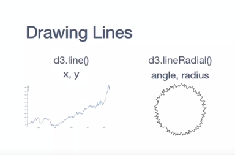
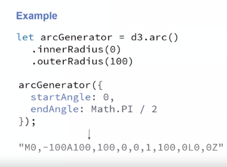

# Complex shapes

## Drawing Lines

SVG has one feature that helps us with that, that's called Path. What Path does is that it has it own languages and using this language, we are able to draw anything we want by basically telling where to start and where to move to.

But the problem is, so now I don't want really to learn this whole language on how to draw things, to draw my data. I need something to convert that and d3 is going to help us by creating what we call generators. So, a generator is going to basically take your data and produce something on this language of the path. 

see that I'm using the scales inside the function to convert the data values to actual visual values, points.

So, right here we're just specifying what we need. We are not really computing that yet. But here on the bottom, is where we're going to actually draw something on our screen. So, we basically going to append the new path and one important thing here is that, because we are adding only one line element. So, on our SVG is going to be just one line element not one for each data point that I have. You'll see that I'm using datum and not data instead of that. So, this means that d3 won't go through the process of doing the joint thing. So, we won't have enter, remove or is it or anything like that. So, we basically going to attach data to this object and that's going to be the data that we're going to provide at any moment to anything that we have. So, that's how for example, here when we are changing the D attribute of our path, we just use our line generator and this line generator is going to take this list of data, use the x and y function that we specified here to generate a line.

### Practice

So we want to add the range, but here there is one important thing. The range usually we create it from 0 to something but here we want to create it inverted. We want to create it from body height to 0, and why we do that is because the coordinates of SVG start 0,0 from the top. So as things grow, things go down, but in our chart, we want as things grows, we want them to go up because our line that is higher means that the price was higher. So we want to invert these coordinates and in order to do that, we just invert the range here. So now we're going to map 0 to the body height that is basically, a high number. So if the product has a price of 0, it's going to be exactly as low as the height that have. At the same time if the product has the maximum value, it's going to be as high as 0 because it's going to be the distance from the top to that point. So that's the reason why we invert the range. So now, we want to see the scale and see how it looks like.

**interessante esse exemplo em que só mostra o eixo, serve para mostrar que ser invertermos os valores do range, o eixo também se inverte.**

The next step is to get the second one. Here, there is a tricky. So, in the data, we are getting the dates and the dates are in string format. We need to convert the date to a JavaScript date object. So JavaScript knows how to compute difference and orders of those objects. So before doing anything here, we're going to transform our data, and we going to map it such that we're going to return a new object. So first we have the date and the date in our file is on the few dates. So it will be d.date, but we can just create a new date. So this is going to create a new date object to replace the original string and JavaScript is going to convert that to a real date and we're going to take this opportunity also to make sure that our price is always a number. So we do that by adding this plus on the beginning that's going to force JavaScript to convert this string to a number. So now, our data is ready. 

So this creates our scale that we can use to deal with time so we're going to give a time and now D3 is going to give you as a value of the X position of our data. So let's see how this looks like. We're just going to create now an axis so we can see the data. So our next step is body.append, same thing. We're going to create a group so we can put it there. Then we're going to call, then we're going to create a new axis. So this time is on the bottom. So we're going to go axis bottom and we're going to provide our scale and you see that it created here on the top. So we have to fix that by translating our group so we can just do, at transform and we want to translate it, 0. Here, we're going to have the width or the height of our data. So, right now, we're just going to concatenate here, body height. 

So you see that now we have the axis on the bottom that is just less step that we have to perform that is, right now, you have a lot of overlap here because the format is not really good. So you're going to fix this format by formatting our axis. 

So we're going to say tick format and you're going to provide a format. D3 has a time format so we can use that. So we can do D3 time format. So D3 knows how to format the time in this masks that you can give. So, for example, percentage B means to show the month in abbreviated form and that's what we want to use. So we're going to do percentage B. So you see that now in the bottom, we're going to get of the month in abbreviated form.

Line generator:

Append path, bind datum to it, and point the "d" attribute to the line generator.

For some reason, there is some black stuff here and there is a line crossing it. This happens for two reasons. So first, path is going to close automatically whatever thing you are drawing. So, I am drawing a line that goes up here to the end. When it gets to the end, since I don't close it, path is going to just close it back. Although it doesn't draw it, you won't see a line really here, but it's assuming that there is something crossing back. Then, we also have, by default, everything that we build with the fill of black.

So, what we need to do is to format the line to look the way we want. So the first thing, we could just set the style here. But sometimes if you are reusing this line throughout multiple places, you have a complex format, it's actually easier to just use CSS. So, you're going to associate a class here to this element that you're going to call line, and then it can go all the way on the top on our style tag and create a class for that. 

So, the last step that we have here is that we have those weird lows here. If you look in the data, the reason is because we don't have value for those month. So, we don't really want to show that. We want the user to know that we don't have value and not be fooled think that the price dropped during those month. So, d3 provide us a method to tell the line generator if a value is defined or not. If it's not defined, d3 is going to make sure to break this line and showed then as two separated lines so you know that in that period you don't have information.

So, d3 provide us a method to tell the line generator if a value is defined or not. If it's not defined, d3 is going to make sure to break this line and showed then as two separated lines so you know that in that period you don't have information. So to do that, we can just do.defined, and then provide a function that given a data point it's going to tell you if it's defined or not. So for us here, we're just going to use the price as the definition of defined or not, and those two exclamation points here on the beginning basically converts the price that we have to a Boolean value. What this means is if I have the price, it's going to become true. If I have any value other than zero, it's going to become true. But if I have zero or I have no value, it's going to become false. So, this is going to do exactly what's defined as punctual because it expect the true or false. 

## Arcs

when we are talking about inner radius, we are talking about this radius that go inside your arc. So, if you want for example a pie shape, you just set its value to zero because then this whole white whole in the middle is going to shrink and disappear, and then you're going to get the pie shape. If you want more of a doughnut shape then you can increase and play with it's value. 

The problem now is I have data and my data is note in angles, my data is in values. It can be prices, it can be sales or anything like that. So, how am I going to transform this data to angles? So, the tree provides us with another function. It's what we call pie. 

So, the pie generator doesn't really generate path information as we have seen so far. It's going to add the new information to your object and in this specific case is going to be the angles. So, you're going to give your data to the generator, the generator is going to split our new object that contains the start and the end angles and also our data key that contains the rest of your information that you had originally on your object. So, most of the time what you're going to do is you're going to create your pie and you're going to provide a function inside value that's going to tell which value is going to define the angles. 

So, it's basically like a map. So, if you want for example to create a pie chart for sales, this function is going to return the amount of sales for each element that you are drawing. Then d3 is going to take care of computing the proportions and getting the right angles so you can end up with a pie shape, although here we're just computing the data. 

So, remember that if you are drawing arcs, you're going to go to this two intermediate step. So, the first step is converting your data from the data original space to an angle data. So, where you have information about the size of the angles for each element that you have in your data. Once you have that, you're going to use the arc generator to transform this information about angles in the actual path information. Information on how SVG is going to draw this arc. Then you're going to use this information that arc generate outputs to set the D attribute of your path, such that it's going to look as you expect it. As an arc or as a piece of a pie, depends on how you set your radius.

### Practice

Where we have a country, and we have an amount of sales on that country.

So we going to do our pie = d3.pie, and then we basically going to tell the values that we're going to use. So we're going to do value, and it's going to be d.sales, because those are our sales. And if I now call, instead of just log(data) I call pie(data),

You're going to see that our data comes with additional information. So here you're going to see that we have our data, but also at the end, you have start angle and end angle. So those are the information of the angles of our pie. So now we're going to be able to create the chart and tell d3 to draw arcs based on those angles.

Also, we have that our data is ready, and you'll see that the original data comes here inside a data element. So every time we need it to access information from the original data, you're going to have to add `.data` in between. So if I want to add access for example, the sales, I'm going to have to do `d.data.sales`. 

So now instead of using a scale, I am using pie to translate this data. But still, if I want to use different colors, for example, I still can use another scale to change the color based on the country. And that's what we want to add here, so we want to basically set a new scale. 

So here, we created a pie object that basically transform our data to a version where we have angles, start and end angles. So, it's basically trying to create arcs from the data that we have. But it doesn't really draw the arcs on the screen. It just compute those arcs and give this information for us. We need to create the next step that is actually draw things. So, to draw the information that Pi returns, we can create an arc object. An arc object is similar to a line chart, a line object that transform data in lines. So here, we're going to transform data in arcs. To create that, we basically going to use the d3.arc API. So, this creates the arc object that knows how to transform the information, but we need to provide the radius. The radius is going to be outer radius.

So, this creates the arc object, and our next step is to actually use this arc to draw something on the screen. So, we're going to start by first selecting from my body all the arcs that I already have. So, remember that when you want to draw something, you first have to select everything that you have, and then based on the data, d3 is going to create a join between this. So, we're going to select everything that has the class arc. The reason is because they are going to add a "g" here, but maybe this "g" may mix with other "g"s in the future, so in order to avoid confusion and make sure that I only selected "g"s that I'm looking for, I'm going to use a class arc so we know that "g" is a arc. So, we're going to select all the arcs that we have, and then we're going to append some data, we're going to join some data here. 

The first thing that I to do is, **I cannot just use my original data that I have here, because this doesn't contain the information of the angles**. I need to compute this information. [which I already have, when I used the pie generator] So, to do that, we can use our pie object. So, this basically computed a new version of the data, where I have the start and end angles. 

The arc function knows how to use this information to actually based on the radius that you gave, draw the actual arcs that we need. So, once we have that, we can create this actual visualization or draw the actual arcs. So, we're gonna draw then inside a "g" as I said, so we're going to append this "g" here.

The reason why we use "g" and not directly the path that is actually the one that's going to draw the thing, is because later, if you want to add more information for example the labels, it's easier to just add to those "g"s because there's going to be in the right position. So, it's much easier to work with that than actually trying to add a text separator. So, we create a "g", and you're going to assign that to a variable that I'm going to call "g" here. 

Set colors.

So, the whole original information that we have, for example in this case the country name, is not on d anymore. I have to do d.data, and then do country in order to get the name. But I need to convert the name of this country to an actual color, and we have a function scale for that that we can use that is called colorScale.

Okay, so almost there. So, this is going to create one color for each country, but still you see that is not drawing the arcs correct. So, one thing that we have to define here is the inner radius of our arc. So, this radius is our outer radius, and now we need to define the radius of the inside. 

Donut chart:

## Maps

One of the problems when we want to visualize things that represents the Earth is the fact that the Earth is round and our paper and our screen and the monitor are flat. So, there is need that we need a way to transform the coordinates from a sphere to a plane so we can visualize the information that is there. To do that, what we're going to use is what we call Geo projections. Geo projections are basically ways to translate the points from latitude and longitude on Geo's fed space to a 2D space in our case using pixels for both x and y axis. 

You will have projections that satisfies different metrics that you are looking for. Each projection has one advantage or disadvantage.

How we use projections? So D3 has an API to create projections and these basically you're going to use d3. and the name of the projection that you want to create. 

So projections are the base that we're going to be using to create map visualizations that's going to help us to translate whatever information we have in latitude and longitude space to a pixel version but keep in mind that you're going to have some trade-off to decide because the fact of the sphere projection that we have the origin of the data comes from a sphere and we are trying to project that in a 2D plane.

### Drawing maps

if you're going to have to create visualization using geographic information or more specifically using a map, the first thing that you have to decide is how you're going to draw the background of your visualization.

But in order to create that (a map with borders), the first thing that you're going to need is actually data that inform us about those shapes and how the country looks like, and where they are positioned in the globe.

So to do that, we're going to use a format that's called GeoJSON.

A GeoJSON is a standard format. We're still using JSON that is how we have seen with loading data in the past, and it just follow some rules on how things should look like. More specifically, each element that we have in our page, so for example, now you can think each element as being a country is going to be represented by a **feature**. So, we're going to have thing on the top that says, "Okay what I'm building is a feature." Then, this feature, it may have some **geometry**. We need more information to know "Okay, now I know the border but I have no idea which element is it. Is it a country or whatever." So, you have the properties. The **properties** are free to use, you can add any information that you want. Later, use that to create visualization. 

So, what we're reading is not the data that I want to plot yet, it's just the data about how the countries look like. 

We're going to use the Geo Path that is a feature from D3, to translate those coordinates that are in geoJSON, to a version that is basically a path, a drawing on our screen, that we're going to use as base for our visualization. How we do that? We use the API GeoPath. 

One important thing about the GeoPath feature, is that you're going to have to provide A projection, and this projection can be any projection that we have in the three, that basically is going to tell you how to do the mapping from the sphere to your screen. Because remember, the data that we get in geoJSON is on latitude and longitude space in geographic information, and we want to translate that to pixel. So, to map the geoJSON to your visualization, you first going to need the projection. 

So, to map the geoJSON to your visualization, you first going to need the projection. So here for example, I'm creating a geoMercator. Once I have my projection, I'm going to create my path generator. So you can think of GeoPath, exactly the same way you think about line generators or arc generators that we have in the three. They're going to receive data and they're going to return some path information that we can add to a path element on my SVG. So, since that's the case, what we can do is we can select our path. So remember, we are going to create a path for each element that I have in my GeoJSON. So, if it's country, we're going to create one for each country, and we're going to select all those path, we're going to use data to bind as if it was a normal data. Since geoJSON often comes with a key called features, where all the features are, we're going to map these features as data, we're going to use this feature as data. Then finally, we're going to go through the same process we would go with any other data that we are visualizing. We're going to use.enter to check if things are new, we're going to append this new path, and then to generate the "d" feature of the path. 

That's basically that language that path uses to draw, we're going to use our geoPath function. That's going to receive a feature, and it's going to return a path that is able to draw that feature. As I said, the three knows how a GeoJSON work. So, this means that you don't have to say which key is the geometry, which key or other information, d3 knows how to read that and come up with the information that allows you to draw your path. 

So remember, to draw the base for map, you're going to need two things: 

the **projection**, that is basically how things are going to look, how are you going to map from io/sphere to a plane. 

Then finally, the **geoPath** that's going to take this new data that is mapped, and transform the actually path information that you can pass to a path element, and get the shape that you are looking for in your visualization.

### Practice

In this video, I want to show you a practical example on how we can draw the basis of our map. So remember that if we are creating a map visualization, one thing that we may need is actually the background, what tells people how the shapes look like or what's the map that we are looking at and then we can draw the data on top of that. So here our goal, we should draw this base first is basically drawing the borders of the regions that we are interested on and specifically for this example, what we want to do, we should draw the borders of a world map. So we want to have a world map with the countries and then the borders of each country. So to do that, one thing that we're going to need is the GeoJSON file that contains information for each country. This GeoJSON is going to have some data about this country but also the polygon or the shape of this country and that's what we're going to use to draw. So here, we have loaded this file already.

So we're using the same technique we would use to lower any other type of data and we are looking a JSON so we're still using d3.json. Then once this data is available, we're going to call showData. Here specifically, we are looking for the map info. _So this is not the data that I'm looking to getting insights of_, it is basically a map of the world, but it's based on this JSON file. So, if you want to take a look on how this JSON file looks like, we can do console.log(mapInfo). 

Then we can look what's the shape that we have in this specific type of file. So, here if you look on this file, what you see is basically that you have an object and inside this object, you have a thing called features, and then you have the type of this object. If I open features, what I'm going to get inside is basically my list of countries. So for each feature, you have a type that is basically a feature. You have the ID that is identifying my country here, and then finally, you're going to have properties and geometry. 

If you open one of these countries, you're going to see that in properties, we basically have the name of the country and then on the geometry is where comes the shape. So you have all the coordinates that define the shape of this country. So you don't really have to understand this file completely, but what you need to know is that the features are the thing that you want to visualize. 

Each feature is one country and those are the ones that I'm looking to draw. The details on how these file works and how we can transform this data to the actual graph thing, D3 is going to take care of it. So, as we notify when we know what we are looking to visualize, we can start to create our visualization. So the first thing you're going to need is the projection. So the projection is the one that's going to translate whatever information you have in latitudes and longitudes to your graphics space. But remember that there is a trade-off between each type of projection that you use. Some projections is going to have better representation of area but not really convenient representation in terms of space they're taking, or they may have a good distance measure but not measured the area correctly and that comes from the fact that the Earth is round and not just a plane. So, we are trying to show something that is actually a sphere but opened, and that's the reason why we have to make those decisions between different projections. Here we're going to start with a very simple one that is the Mercator projection. So, you're going to call projection and you're going to say that is equal. We're going to do d3.geoMercator().

So, this is going to create the projection. It's basically telling D3, **you can think of protection the same way we think about scales**. It's how we're going to transform the numbers from the data space to the graphical space, in this specification case to the map space. 

Once we have a projection, the next thing is to create the path. So, you can think of the path as aligned generator for a line chart. So, what we want to do is to create something that is able to take the projection and generate a path out of it. So we're going to do d3.geoPath. So, this is the one that we use when we are dealing with geographic information. Now what I can do is provide my projection.

So now the geoPath know which projection it's going to be using to draw the data. 

After that, now our next step is to draw the chart. So we already have our projection, we already have our path generator. So now we're going to visualize this data. So on the top here, I have my body that is already selected. So we're going to use this guy. We just do body.selectAll(), and since every time I find a country, I'm going to add a path that is basically a complex shape, I'm going to select all the path. So our journey is going to work correctly. We can associate the data now. So remember that when we looked on the GeoJSON file, all the countries were inside the features. So we have to use that here. We have to do mapInfo.features. 

So, this is basically telling D3 that what we want to visualize are the features inside that file. So up to now in this section, D3 doesn't really know that we are dealing with geographic information. It only think that we are trying to join some data and visualize some data. Our next step is to do enter. So, we can work with each new country that we have and every time we get a country, we're going to append a new path. So after that, we already have one path for each country. But the problem is that this path doesn't have real shape, it doesn't show anything. 

So our next step we should to tell what's the shape of this path. So we're going to do d is equal d. So, path is the element that we created here on the top. So, we're going to use it and we're going to say path(d).

So you see that now we start to get something that looks like a world map. So we get a few countries here like looks like the America, but sure we are missing the rest of the world, and also it's hard to distinguish between different countries. So, let's fix the distinguished part first. So what we want to do here is to change the properties of those parts. We want to make them white with just the border black. So if you want to do that, you can do "stroke" to make your border black and then you can say that the fill is going to be none. 

So now we just inverted. So now we have our borders in black and we have our countries in white. But now how do I deal with this problem that actually the map is much bigger than the region that I have? That's why we cannot see it here. So the first thing that we have to do is to change the size of the map. We can do that back in our projections. So we can tell our projection that we want to scale things down, and you can say for example that you want to scale to half of it, to 50. So you see that now it is smaller, but it's on the right here, is not really in the position that I want because the projection is to scale everything, but it doesn't translate it back to the original space. So we want to do that. We want to translate the center. So when you are translating a projection what you're doing is translating the center of your map. For that reason, I'm going to do translate,

and here I'm going to translate to the middle. So on the top here we have our body height and body width, so we're going to use that. We're going to say bodywidth divided by two is half in the horizontal axis, and bodyheight divided by two is height on the y-axis. So now we get the whole chart in just one place. So now we can see how the countries in the world, but one thing that you may see here is that this projection, in particular the top of the world here actually takes a big space. So the poles of the world is taking a large space and if your visualization is focused for example on the countries on the middle here, you are actually losing this space. So one way to fix that is to change your projection. So we can use a different one for example. You can use the geoNaturalEarth1.

So this is a different projection that has basically squashed the top. So now we are no longer having all these space taken by these ones on the top, same thing on the bottom. So you can increase the scale for example to get a bigger map. You can increase to 80 for example. So now you get a bigger map and you don't have all of this space that you weren't using for your visualization being used on the top. But remember to keep in mind that different projections are going to have different drawbacks and it's up to you to choose which option you want to use. D3 has many other types of projections and it depends on your goal, on what you want to visualize and what information you want to convey because here the rule is always, the interpretation has to be correct of what you are visualizing.

