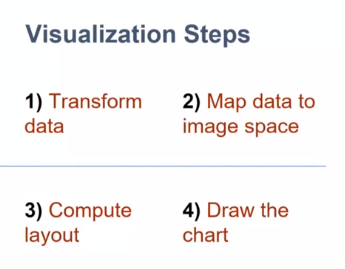

## Introduction to D3

D3:  javascript library that provides: 

* methods to manipulate the data, to transform the data to a format that is easy to visualize. * methods to create the actual visualization, to draw on the webpage

Visualization steps:

1) Transform Data
2) Map data to image space
3) Compute layout
4) Draw the chart

We use the APIs to perform each of those steps.

Some examples:

### d3.selection

We can chain selections:

And we can bind selections to variables:

Main methods that we will be using for selections:

I know that if you have been working with other libraries before, you can do that with jQuery. You can do that with Angular and many other variables in libraries. You even have native code that you can use to select those elements. 

But D3 has a difference. What we are returning here, is not the node itself, but a D3 wrapper that allow us to use functions that we wouldn't get if we were to do the same thing with other libraries. 

`selection.attr()` vs `selection.style()`
attribute if I want to change any attribute that is directly on the tag, and the style is a helper to change the style attribute much easier because then you can change properties inside style directly other than having to concatenate and do all the job yourself.